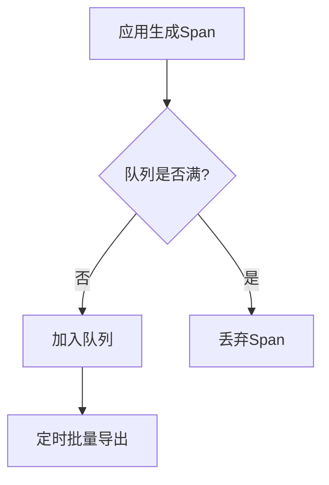

# OpenTelemetry 常见问题

## 介绍

OpenTelemetry 是用于生成、收集和导出遥测数据（如追踪、指标和日志）的开源工具集。作为初学者，在使用过程中可能会遇到各种问题。本文将覆盖最常见的问题场景，并提供逐步解决方案。

## 1. 数据未出现在后端系统中

### 问题现象
配置了 OpenTelemetry SDK 但数据未显示在 Jaeger/Prometheus 等后端。

### 排查步骤
1. **检查导出器配置**：
   ```javascript
   // 错误示例：未设置导出器端点
   const exporter = new ConsoleSpanExporter(); // 仅输出到控制台

   // 正确示例：配置Jaeger导出器
   const exporter = new JaegerExporter({
     endpoint: 'http://localhost:14268/api/traces',
   });
   ```

2. **验证网络连接**：
   ```bash
   curl -v http://localhost:14268/api/traces
   ```

3. **检查采样率**：
   ```python
   # 设置采样率为100%（默认可能过低）
   from opentelemetry.sdk.trace import TracerProvider
   from opentelemetry.sdk.trace.export import SimpleSpanProcessor

   provider = TracerProvider(sampler=AlwaysOnSampler())
   ```

:::tip
使用 `ConsoleExporter` 先验证基础数据是否生成，再排查网络问题。
:::

## 2. 高内存/CPU占用

### 典型场景
应用出现性能下降，监控显示OpenTelemetry相关进程资源占用过高。

### 解决方案
```java
// 限制批量处理大小（Java示例）
BatchSpanProcessor batchProcessor = BatchSpanProcessor.builder(exporter)
    .setMaxQueueSize(1000)  // 默认2048
    .setMaxExportBatchSize(512)  // 默认512
    .build();
```



:::caution
生产环境务必配置队列限制和批处理参数，避免OOM（内存溢出）！
:::

## 3. 跨服务追踪中断

### 问题描述
微服务间的调用链出现断裂，无法形成完整追踪。

### 修复方案
1. **确保上下文传播**：
   ```go
   // HTTP服务端（Go示例）
   propagator := propagation.TraceContext{}
   ctx := propagator.Extract(req.Context(), propagation.HeaderCarrier(req.Header))
   ```

2. **统一传播头**：
   ```bash
   # 必须包含的HTTP头
   traceparent: 00-0af7651916cd43dd8448eb211c80319c-b7ad6b7169203331-01
   ```

3. **验证中间件配置**：
   ```javascript
   // Express中间件示例
   app.use(openTelemetryMiddleware({
     propagators: [new W3CTraceContextPropagator()]
   }));
   ```

## 4. 指标数据异常

### 常见错误
- 指标值持续为0
- 单位不匹配导致数值过大/小

### 调试方法
```python
# 检查指标定义（Python示例）
meter.create_counter(
    "http_requests",
    unit="1",  # 明确单位
    description="Total HTTP requests"
)
```

:::note
使用Prometheus exporter时，检查 `/metrics` 端点原始数据：
```text
# HELP http_requests Total HTTP requests
# TYPE http_requests counter
http_requests_total 42
```
:::

## 实战案例：电商订单追踪

### 问题场景
用户投诉"下单后无响应"，但各服务日志显示正常。

### 排查过程
1. 发现支付服务与库存服务间的追踪断点
2. 检查到支付服务使用gRPC但未配置传播器
3. 修复代码：
   ```java
   // 添加gRPC客户端拦截器
   ManagedChannelBuilder.forAddress("inventory", 50051)
      .intercept(new OpenTelemetryClientInterceptor())
      .build();
   ```

## 总结与练习

### 关键检查清单
1. 导出器配置和网络连通性
2. 采样率和数据处理参数
3. 上下文传播配置
4. 指标单位定义

### 练习建议
1. 故意错误配置采样器，观察控制台输出
2. 在两个微服务间手动传递 `traceparent` 头
3. 使用Wireshark抓包分析导出器通信

### 扩展资源
- [OpenTelemetry官方文档](https://opentelemetry.io/docs/)
- [W3C Trace Context标准](https://www.w3.org/TR/trace-context/)
- [示例代码仓库](https://github.com/open-telemetry/opentelemetry-collector-contrib)