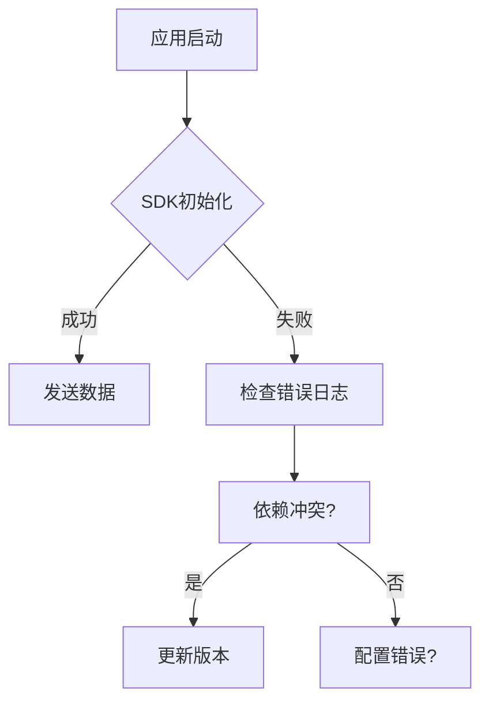

# OpenTelemetry 启动问题

## 介绍
OpenTelemetry是用于生成、收集和管理遥测数据（如指标、日志和追踪）的开源工具集。在初始化阶段，开发者常遇到配置错误、依赖冲突或连接失败等问题。本文将指导初学者识别和解决这些启动问题。

## 常见问题及解决方案

### 1. 依赖未正确安装
确保已安装核心SDK和必要的导出器（Exporter）：
```bash
# 正确安装示例（Node.js）
npm install @opentelemetry/sdk-node @opentelemetry/exporter-trace-otlp-http
```

:::caution 常见错误
若看到类似 `Cannot find module '@opentelemetry/api'` 的错误，说明依赖未安装或版本冲突。
:::

### 2. 配置错误
基础配置示例（JavaScript）：
```javascript
const { NodeSDK } = require('@opentelemetry/sdk-node');
const { OTLPTraceExporter } = require('@opentelemetry/exporter-trace-otlp-http');

const sdk = new NodeSDK({
  traceExporter: new OTLPTraceExporter({ url: 'http://localhost:4318/v1/traces' }),
  serviceName: 'my-service' // 必须字段
});

sdk.start(); // 启动失败时检查此处错误
```

:::warning 关键点
- `serviceName` 是必填字段
- 导出器URL需匹配后端服务地址（如Jaeger或Zipkin）
:::

### 3. 连接失败问题
使用诊断命令测试连接：
```bash
# 测试OLTP端点是否可达
curl -v http://localhost:4318/v1/traces
```



## 实际案例

### 案例：端口冲突
**现象**：应用启动时报错 `ECONNREFUSED`  
**解决步骤**：
1. 确认Collector是否运行：
   ```bash
   docker ps -f name=otel-collector
   ```
2. 检查端口映射：
   ```yaml
   # docker-compose.yml 正确配置示例
   ports:
     - "4317:4317" # OTLP gRPC端口
     - "4318:4318" # OTLP HTTP端口
   ```

## 总结
启动问题通常源于：
1. 缺失或版本错误的依赖
2. 不完整的配置（如未指定`serviceName`）
3. 后端服务不可达

## 扩展练习
1. 故意移除`serviceName`配置，观察错误信息
2. 使用错误的导出器URL，学习如何解读连接错误
3. 在本地部署Jaeger，验证追踪数据是否可见

## 附加资源
- [OpenTelemetry官方故障排查指南](https://opentelemetry.io/docs/concepts/troubleshooting)
- 使用 `diagnostic_channel`（Node.js专属）捕获初始化事件