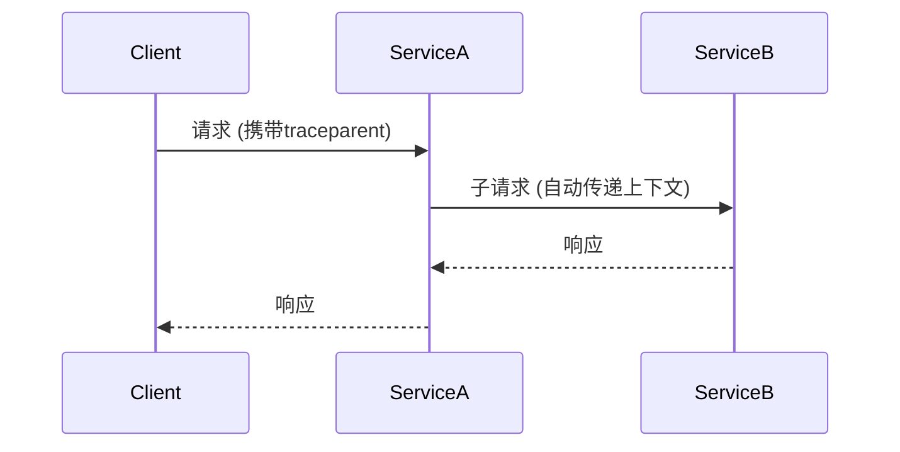

# OpenTelemetry 上下文传播问题

## 介绍

在分布式系统中，**上下文传播**是确保请求在不同服务间流动时保持追踪信息连贯的关键机制。OpenTelemetry通过`Context`对象实现这一功能，但配置不当或框架兼容性问题可能导致上下文丢失。本文将帮助你理解常见问题场景及其解决方案。

## 什么是上下文传播？

OpenTelemetry的上下文传播包含两种核心数据：
1. **Span上下文**：当前追踪的ID、Span ID和采样标志。
2. **Baggage**：用户自定义的键值对（如`user_id=123`）。

这些数据需要通过HTTP头或其他协议特定的载体在服务间传递。

## 常见问题场景

### 1. 上下文丢失
当中间件未正确注入或提取上下文时发生。例如：

```javascript
// 错误示例：未使用传播器
app.get('/api', (req, res) => {
  const span = tracer.startSpan('my_span');
  // ...业务逻辑
  span.end();
});
```

### 2. 框架兼容性问题
某些框架（如Express）需要手动中间件支持：

```javascript
// 正确示例：添加传播中间件
const { expressMiddleware } = require('@opentelemetry/express');
app.use(expressMiddleware());
```

## 诊断步骤

### 1. 验证传播器配置
确保SDK初始化时配置了传播器：

```javascript
const { W3CTraceContextPropagator } = require('@opentelemetry/core');
const { NodeTracerProvider } = require('@opentelemetry/node');

const provider = new NodeTracerProvider();
provider.register({
  propagator: new W3CTraceContextPropagator()
});
```

### 2. 检查HTTP头
使用开发者工具验证请求是否包含以下头：
```
traceparent: 00-0af7651916cd43dd8448eb211c80319c-b7ad6b7169203331-01
```

## 实际案例

### 场景：微服务调用链断裂
当服务A调用服务B时，如果未传递上下文，会导致两个独立的追踪记录。

**解决方案**：
```javascript
// 服务A：注入头部
const { context, propagation } = require('@opentelemetry/api');
const headers = {};
propagation.inject(context.active(), headers);
fetch('http://service-b', { headers });

// 服务B：提取头部
app.use((req, res, next) => {
  const ctx = propagation.extract(context.active(), req.headers);
  context.with(ctx, next);
});
```

## 可视化流程



## 总结

关键要点：
- 始终验证传播器配置
- 检查框架是否需要特殊中间件
- 通过HTTP头手动调试

## 扩展练习
1. 创建一个Express和Fastify的双服务Demo，观察上下文传递
2. 尝试通过`Baggage`传递自定义字段（如`tenant_id`）

## 附加资源
- [OpenTelemetry传播规范](https://github.com/open-telemetry/opentelemetry-specification/blob/main/specification/context/api-propagators.md)
- [Node.js上下文调试指南](https://opentelemetry.io/docs/instrumentation/js/troubleshooting/)