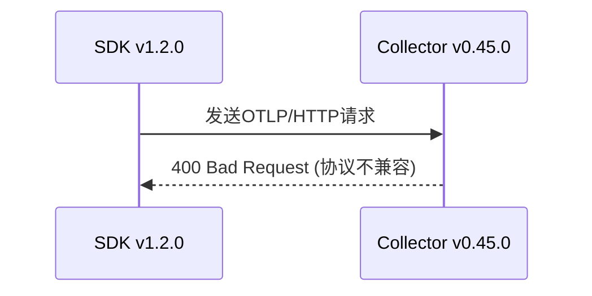

# OpenTelemetry 版本兼容性问题

## 介绍

OpenTelemetry（简称OTel）是一个开源的可观测性框架，用于生成、收集和管理遥测数据（如指标、日志和追踪）。由于其模块化设计和快速迭代，不同版本间的兼容性问题可能会影响数据采集或导出流程。本文将帮助初学者理解版本兼容性问题的常见表现、排查方法及解决方案。

---

## 为什么版本兼容性很重要？

OpenTelemetry由多个独立组件构成（如SDK、API、导出器），每个组件可能由不同团队维护。当组件版本不匹配时，可能出现以下问题：
- 数据丢失或格式错误
- 导出器无法识别SDK生成的遥测数据
- 运行时崩溃或静默失败

:::note
OpenTelemetry遵循[语义化版本控制](https://semver.org/)：
- **主版本号（Major）**：不兼容的API更改
- **次版本号（Minor）**：向后兼容的功能新增
- **修订号（Patch）**：向后兼容的问题修复
:::

---

## 常见兼容性问题场景

### 场景1：SDK与导出器版本不匹配

```python
# 错误示例：使用不兼容的版本组合
pip install opentelemetry-sdk==1.15.0
pip install opentelemetry-exporter-otlp==1.16.0  # 需要SDK>=1.16.0
```

运行时会报错：
```
AttributeError: 'Span' object has no attribute 'set_attribute'
```

**解决方案**：
检查[官方兼容性矩阵](https://opentelemetry.io/docs/reference/specification/compatibility/)，或使用匹配的版本：
```python
pip install "opentelemetry-sdk>=1.16.0,<2.0.0"
pip install "opentelemetry-exporter-otlp>=1.16.0,<2.0.0"
```

---

### 场景2：协议变更导致数据丢失

OpenTelemetry的OTLP协议可能在不同主版本间变更。例如：



**排查步骤**：
1. 检查Collector日志中的错误详情
2. 确认使用的OTLP协议版本：
   ```bash
   otelcol --feature-gates=telemetry.useOtelForInternalMetrics
   ```

---

## 实际案例：Python自动检测包冲突

假设您在使用`opentelemetry-instrumentation-flask`时遇到以下警告：

```
WARNING:opentelemetry.instrumentation:Instrumentation Flask conflicts with package versions: werkzeug>=2.0.0
```

**解决方法**：
1. 创建虚拟环境隔离依赖：
   ```bash
   python -m venv venv
   source venv/bin/activate
   ```
2. 使用兼容版本：
   ```bash
   pip install "flask<2.0.0" "opentelemetry-instrumentation-flask==0.30b0"
   ```

---

## 最佳实践

1. **锁定依赖版本**：
   ```python
   # requirements.txt 示例
   opentelemetry-api==1.16.0
   opentelemetry-sdk==1.16.0
   opentelemetry-exporter-otlp-proto-http==1.16.0
   ```

2. **逐步升级**：
   - 先升级测试环境的依赖
   - 使用`opentelemetry-bootstrap`工具检查兼容性

3. **监控升级过程**：
   ```bash
   OTEL_LOG_LEVEL=DEBUG python your_app.py
   ```

---

## 总结

OpenTelemetry版本兼容性问题通常表现为：
- 运行时错误或警告
- 数据导出失败
- 功能异常

通过以下方法预防：
✅ 使用版本范围约束<br />
✅ 查阅官方兼容性文档<br />
✅ 在隔离环境中测试升级

---

## 延伸资源

1. [官方版本支持政策](https://opentelemetry.io/docs/concepts/versioning-and-stability/)
2. [GitHub问题模板](https://github.com/open-telemetry/opentelemetry-python/issues/new?template=BUG_REPORT.md)
3. 练习：尝试在本地复现一个版本冲突并解决它

:::tip
使用`pip check`命令可以快速发现不兼容的包组合！
:::