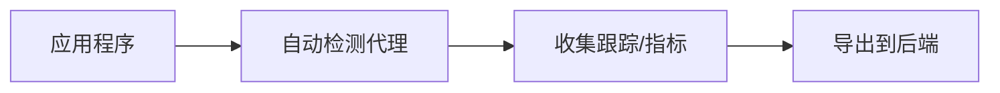

# OpenTelemetry 自动检测失败

## 介绍

OpenTelemetry的**自动检测（Auto-Instrumentation）**是通过代理或库自动收集应用程序的遥测数据（如跟踪、指标和日志）的功能。当自动检测失败时，开发者需要手动介入排查问题。本文将从原理出发，逐步讲解常见故障场景和解决方案。

---

## 自动检测工作原理

自动检测通常通过以下方式实现：
1. **Java Agent**：通过 `-javaagent` 参数加载代理JAR。
2. **语言SDK集成**：如Python的 `opentelemetry-instrument` 命令。
3. **环境变量配置**：例如 `OTEL_SERVICE_NAME`。



---

## 常见失败原因

### 1. 依赖未正确引入
自动检测需要特定的依赖包。例如Java应用中缺少 `opentelemetry-api` 或 `opentelemetry-sdk`。

:::warning
检查依赖版本冲突！例如同时引入 `opentelemetry-version:1.25.0` 和 `opentelemetry-version:1.30.0` 可能导致类加载问题。
:::

### 2. 环境变量未生效
自动检测依赖的环境变量（如 `OTEL_EXPORTER_OTLP_ENDPOINT`）必须正确设置。可通过以下命令验证：
```bash
# Linux/Mac
printenv | grep OTEL

# Windows
set OTEL
```

### 3. 导出目标不可达
如果导出后端（如Jaeger或Prometheus）未运行，数据会静默丢失。测试连通性：
```bash
curl -v http://jaeger:4317
```

---

## 排查步骤

### 步骤1：启用调试日志
在启动命令中添加日志参数：
```bash
# Java示例
java -javaagent:opentelemetry-javaagent.jar \
     -Dotel.javaagent.debug=true \
     -jar your-app.jar
```

### 步骤2：验证检测是否加载
检查应用启动日志中的关键行：
```
[otel.javaagent] Installed instrumentation: {jdbc, servlet}
```

### 步骤3：手动发送测试数据
使用SDK手动创建Span验证基础功能：
```python
from opentelemetry import trace
tracer = trace.get_tracer("test.tracer")
with tracer.start_as_current_span("manual-test"):
    print("Span created")
```

---

## 实际案例

### 案例1：Spring Boot应用无数据
**现象**：Spring Boot应用启动后，Jaeger中无数据。<br />
**排查过程**：
1. 发现启动命令缺少 `-javaagent` 参数
2. 添加参数后仍无效，日志显示 `Class not found: org/springframework/web/servlet/HandlerInterceptor`
3. 确认使用的是 `opentelemetry-javaagent-spring.jar` 而非通用版本

**解决方案**：
```bash
java -javaagent:opentelemetry-javaagent-spring.jar \
     -jar app.jar
```

---

## 总结

自动检测失败通常源于三类问题：
1. **配置问题**（环境变量/启动参数）
2. **依赖问题**（缺失或版本冲突）
3. **基础设施问题**（导出目标不可达）

:::tip 快速检查清单
- [ ] 代理JAR路径正确
- [ ] 环境变量已导出
- [ ] 后端服务可访问
- [ ] 调试日志已启用
:::

## 扩展资源
1. [OpenTelemetry官方故障排查指南](https://opentelemetry.io/docs/languages/java/automatic/troubleshooting/)
2. 练习：在本地Docker环境中部署Jaeger，并让一个Python Flask应用向其发送跟踪数据