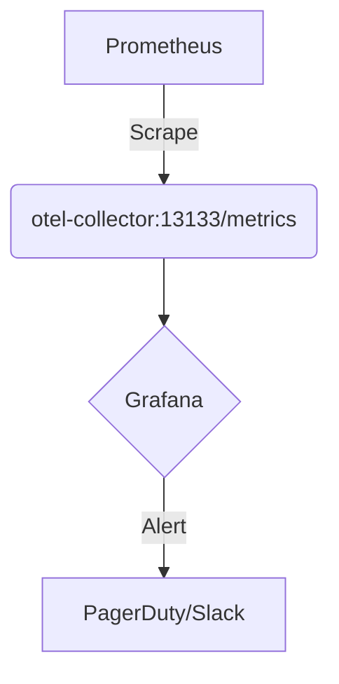

# OpenTelemetry 故障恢复策略

## 介绍

OpenTelemetry是一个开源的观测性框架，用于生成、收集和导出遥测数据（如指标、日志和追踪）。在生产环境中，OpenTelemetry组件可能因网络问题、配置错误或资源不足而出现故障。本文将介绍常见的故障恢复策略，帮助您快速诊断和解决问题。

:::note 适用场景
- 数据导出失败（如OTLP导出器超时）
- 采集器进程崩溃
- 资源（CPU/内存）耗尽
- 配置错误导致数据丢失
:::

## 1. 基础诊断流程

### 1.1 检查日志

OpenTelemetry组件通常会记录详细的运行日志。例如，使用以下命令查看OpenTelemetry Collector的日志：

```bash
docker logs otel-collector --tail 100
```

典型错误日志可能包含：
- `"Failed to export batches"`（导出失败）
- `"connection refused"`（网络连接问题）
- `"out of memory"`（内存不足）

### 1.2 验证配置

使用`otelcol`工具的`--validate`参数检查配置：

```bash
otelcol --config=config.yaml --validate
```

如果配置无效，输出会显示具体错误位置：

```
Error: cannot load configuration: invalid collector configuration: 
  receivers::otlp: expected type string but got int for endpoint
```

## 2. 自动恢复策略

### 2.1 重试机制

在导出器配置中添加重试逻辑（示例为OTLP导出器）：

```yaml
exporters:
  otlp:
    endpoint: "otel-collector:4317"
    retry_on_failure:
      enabled: true
      initial_interval: 5s
      max_interval: 30s
      max_elapsed_time: 5m
```

### 2.2 队列缓冲

使用批处理处理器和队列防止数据丢失：

```yaml
processors:
  batch:
    timeout: 5s
    send_batch_size: 1000

service:
  pipelines:
    traces:
      receivers: [otlp]
      processors: [batch]
      exporters: [otlp]
```

## 3. 手动恢复技术

### 3.1 数据持久化

启用文件存储备份未发送的数据：

```yaml
exporters:
  file:
    path: ./telemetry_data.json

service:
  pipelines:
    traces:
      receivers: [otlp]
      exporters: [file, otlp]  # 主导出失败时自动降级到文件
```

### 3.2 资源限制调整

通过内存限制器防止OOM：

```yaml
extensions:
  memory_ballast:
    size_mib: 500

service:
  extensions: [memory_ballast]
```

## 4. 真实案例

**案例：电商平台追踪数据丢失**

**现象**：用户下单后，追踪数据间歇性丢失。<br />
**诊断步骤**：
1. 发现Collector日志中有`"context deadline exceeded"`错误
2. 确认后端存储服务响应缓慢（P99延迟>2s）
3. 导出器配置无重试机制

**解决方案**：
```yaml
exporters:
  otlp:
    retry_on_failure:
      enabled: true
    sending_queue:
      enabled: true
      num_consumers: 4
```

调整后数据完整率从92%提升至99.9%。

## 5. 监控与告警

配置健康检查端点（默认在13133端口）：



关键监控指标：
- `otelcol_exporter_send_failed_requests`
- `otelcol_process_runtime_total_alloc_bytes`
- `otelcol_receiver_refused_spans`

## 总结

OpenTelemetry故障恢复需要结合预防（配置验证）、自动恢复（重试/队列）和手动干预（数据备份）策略。关键原则包括：

1. 始终启用批处理和队列
2. 为关键路径配置重试机制
3. 实施资源限制和监控
4. 准备降级方案（如本地存储）

## 延伸学习

- 练习：在本地部署中故意断开网络，观察重试机制的行为
- 官方文档：[OpenTelemetry Collector Troubleshooting](https://opentelemetry.io/docs/collector/troubleshooting/)
- 工具推荐：使用`jaeger`或`zipkin`临时存储追踪数据用于调试