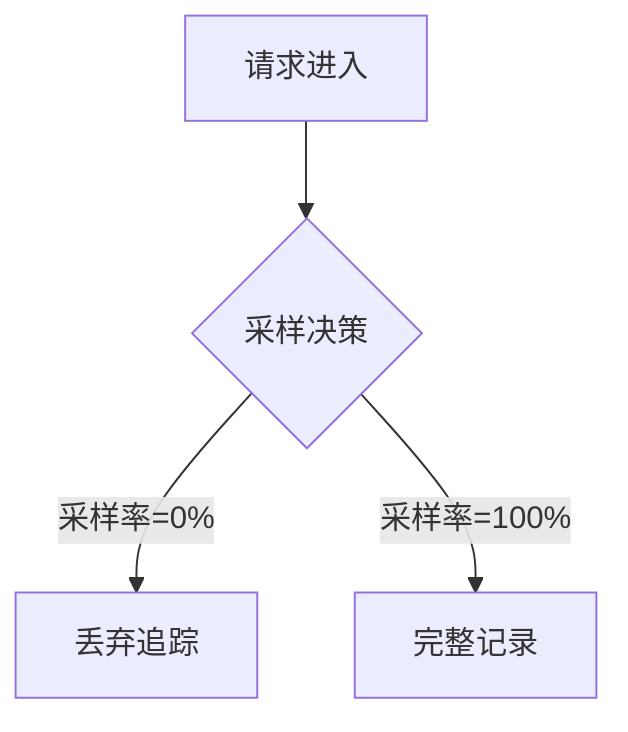

# OpenTelemetry 配置故障

OpenTelemetry是一个强大的可观测性框架，用于生成、收集和管理遥测数据（如指标、日志和追踪）。然而，配置错误可能导致数据丢失或功能异常。本文将指导初学者识别和修复常见的配置问题。

## 介绍

OpenTelemetry的配置涉及多个组件，包括SDK（客户端库）、导出器（Exporters）、处理器（Processors）和采样器（Samplers）。配置错误可能发生在任何环节，例如：
- 错误的端点或认证信息
- 采样率设置不当
- 资源（Resource）定义缺失
- 导出器未正确初始化

## 常见配置问题及解决方案

### 1. 导出器连接失败

**症状**：遥测数据未出现在后端系统（如Jaeger/Prometheus）中。

```javascript
// 错误示例：错误的Jaeger端点
const { JaegerExporter } = require('@opentelemetry/exporter-jaeger');
const exporter = new JaegerExporter({
  endpoint: 'http://localhost:14268/api/traces', // 如果Jaeger未运行在此端口则失败
});
```

**解决方案**：
1. 验证后端服务是否运行：
   ```bash
   curl http://localhost:14268/api/traces
   ```
2. 检查防火墙规则
3. 使用正确的协议（如`http` vs `https`）

:::tip
临时启用日志记录来调试导出器：
```javascript
exporter.export(spans).catch(err => console.error('导出失败:', err));
```
:::

### 2. 采样率配置错误

**症状**：生产环境中丢失大量追踪数据，或开发环境收集过多无用数据。



**解决方案**：
```javascript
// 正确的采样配置（示例）
const { ParentBasedSampler, TraceIdRatioBasedSampler } = require('@opentelemetry/core');
const sampler = new ParentBasedSampler({
  root: new TraceIdRatioBasedSampler(0.5) // 50%采样率
});
```

### 3. 资源属性缺失

**症状**：遥测数据中缺少服务名称、实例标识等关键信息。

```javascript
// 错误：未定义资源
const { NodeTracerProvider } = require('@opentelemetry/sdk-trace-node');
const provider = new NodeTracerProvider(); // 缺少resource配置
```

**修复方案**：
```javascript
const { Resource } = require('@opentelemetry/resources');
const { SemanticResourceAttributes } = require('@opentelemetry/semantic-conventions');

const resource = new Resource({
  [SemanticResourceAttributes.SERVICE_NAME]: 'payment-service',
  [SemanticResourceAttributes.SERVICE_VERSION]: '1.0.0'
});
const provider = new NodeTracerProvider({ resource });
```

## 实际案例研究

**场景**：电子商务网站突然停止在Jaeger中显示购物车服务的追踪数据。

**排查步骤**：
1. 检查服务日志发现错误：
   ```
   Export failed: ECONNREFUSED http://jaeger-collector:14268
   ```
2. 发现最近的基础设施变更将Jaeger服务迁移到了新端口
3. 更新配置：
   ```yaml
   # opentelemetry-config.yaml
   exporters:
     jaeger:
       endpoint: "http://new-jaeger-collector:14269/api/traces"
   ```
4. 验证数据恢复

:::caution
生产环境中，始终通过配置管理（如环境变量）指定端点，而非硬编码：
```javascript
endpoint: process.env.JAEGER_ENDPOINT || 'default-endpoint'
```
:::

## 总结

配置OpenTelemetry时需注意：
- 验证所有网络连接（导出器、收集器）
- 合理设置采样率（生产环境通常1-10%）
- 明确定义资源属性
- 启用日志记录辅助调试

## 扩展资源

1. [OpenTelemetry官方配置文档](https://opentelemetry.io/docs/concepts/configuration/)
2. 练习：在本地Docker环境中故意配置错误的Jaeger端点，观察错误日志
3. 使用`oteldesktop`工具可视化本地OpenTelemetry配置