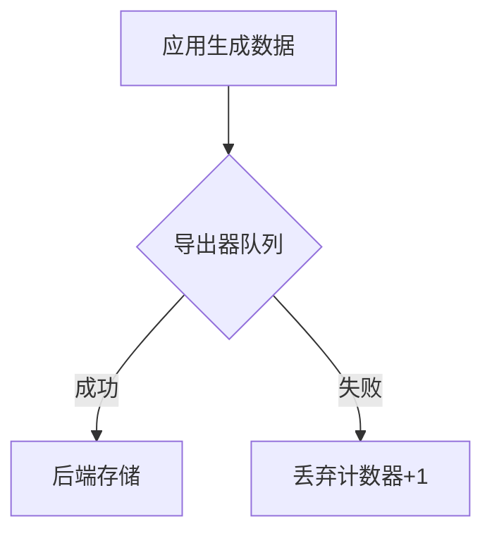

# OpenTelemetry 数据丢失调查

## 介绍

OpenTelemetry是云原生应用中广泛使用的可观测性框架，但在实际部署中可能会遇到**数据丢失**问题。本文将帮助你理解数据丢失的常见原因、诊断方法和解决方案，适合刚接触OpenTelemetry的开发者。

:::note 什么是数据丢失？
指通过OpenTelemetry收集的遥测数据（指标、日志、跟踪）未能按预期到达后端存储系统（如Jaeger/Prometheus）的现象。
:::

## 常见原因分析

### 1. 导出器(Exporter)配置错误
```javascript
// ❌ 错误示例：未指定端点
const exporter = new ConsoleSpanExporter();
// ✅ 正确示例：配置有效端点
const exporter = new OTLPTraceExporter({
  url: "http://collector:4318/v1/traces"
});
```

### 2. 资源限制
- **队列满**：内存队列达到`maxQueueSize`限制
- **带宽不足**：网络吞吐量低于数据生成速度

### 3. 采样率设置不当
```yaml
# 过度采样导致数据丢失
samplers:
  probability: 0.1 # 只保留10%的请求数据
```

## 诊断工具

### OpenTelemetry 诊断日志
启用调试日志查看内部处理流程：
```bash
export OTEL_LOG_LEVEL=debug
```

### 状态监控指标


通过以下指标监控健康状况：
- `otelcol_exporter_send_failed_requests`
- `otelcol_exporter_queue_size`

## 实战案例

### 案例：Kubernetes中的DNS解析问题
**现象**：数据间歇性丢失<br />
**排查步骤**：
1. 检查导出器日志发现连接超时
2. 确认Collector Service的DNS名称解析不稳定
3. 解决方案：改用ClusterIP直接访问

```yaml
# 原配置
endpoint: "http://otel-collector:4317"
# 修正后
endpoint: "http://10.96.123.45:4317"
```

## 解决方案

1. **缓冲队列调优**：
   ```javascript
   new BatchSpanProcessor(exporter, {
     maxQueueSize: 2048,  // 默认2048
     scheduledDelayMillis: 5000 // 批处理间隔
   });
   ```

2. **重试策略配置**：
   ```yaml
   exporters:
     otlp:
       retry_on_failure:
         enabled: true
         initial_interval: 1s
         max_interval: 30s
   ```

3. **资源扩容**：
   ```bash
   # Collector容器资源限制
   resources:
     limits:
       memory: 2Gi
       cpu: 1
   ```

## 总结

数据丢失问题通常源于配置、资源或网络问题。关键排查步骤包括：

1. 验证导出器配置
2. 监控队列和网络指标
3. 检查采样策略
4. 分析Collector日志

:::tip 练习建议
1. 故意配置错误的端点观察错误日志
2. 使用`docker-compose`搭建测试环境模拟网络分区
3. 调整采样率观察数据变化
:::

## 延伸阅读

- [OpenTelemetry官方故障排除指南](https://opentelemetry.io/docs/concepts/observability-primer/)
- 《分布式系统可观测性》第5章
- `opentelemetry-collector-contrib`仓库中的`examples/demo`案例