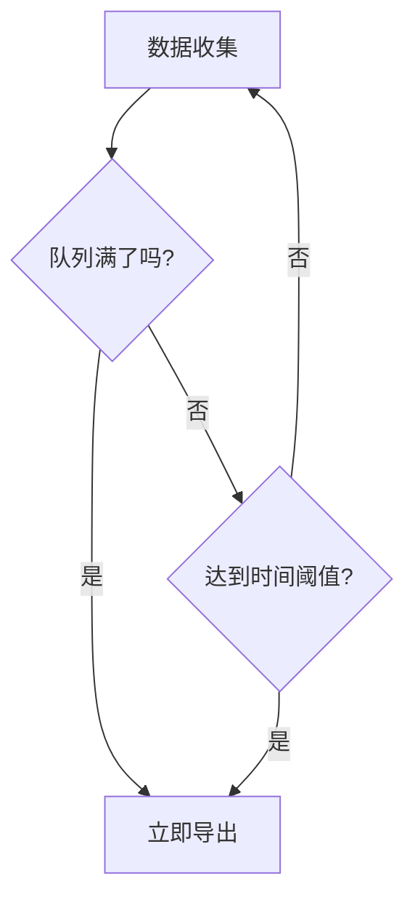

# OpenTelemetry 性能问题

## 介绍

OpenTelemetry是一个开源的观测性框架，用于生成、收集和管理遥测数据（如指标、日志和跟踪）。虽然它功能强大，但在实际部署中可能会遇到性能问题。本文将帮助你理解常见的性能瓶颈，并提供优化建议。

## 常见性能问题及解决方案

### 1. 高采样率导致的负载问题

**问题描述**：  
当采样率设置过高时，系统可能因处理大量跟踪数据而过载。

**解决方案**：  
使用动态采样策略，根据系统负载调整采样率。

```python
from opentelemetry.sdk.trace.sampling import DynamicSampler

sampler = DynamicSampler(
    rate=500,  # 每秒最大采样数
    capacity=1000  # 最大缓冲容量
)
```

:::tip
对于高流量应用，建议从低采样率（如10%）开始，逐步调整。
:::

### 2. 数据导出延迟

**问题描述**：  
当导出器（如OTLP导出器）配置不当时，可能导致数据积压。

**优化方案**：  
调整批处理参数和队列大小：

```javascript
const { BatchSpanProcessor } = require('@opentelemetry/sdk-trace-node');

const batchProcessor = new BatchSpanProcessor(exporter, {
  maxQueueSize: 2048,  // 最大队列大小
  maxExportBatchSize: 512,  // 每批最大数量
  scheduledDelayMillis: 5000  // 导出间隔(毫秒)
});
```

### 3. 资源密集型自动检测

**问题描述**：  
某些自动检测库可能消耗过多资源。

**解决方案**：  
选择性启用检测：

```java
// 在OpenTelemetry自动配置中指定需要的检测
System.setProperty("otel.instrumentation.http.enabled", "true");
System.setProperty("otel.instrumentation.jdbc.enabled", "false");
```

## 性能优化策略

### 1. 选择合适的导出间隔



### 2. 资源监控配置

```yaml
# OpenTelemetry Collector配置示例
receivers:
  otlp:
    protocols:
      grpc:
        endpoint: 0.0.0.0:4317
        max_recv_msg_size: 4MB  # 增加消息大小限制

processors:
  batch:
    timeout: 10s
    send_batch_size: 512
```

## 真实案例研究

**案例**：某电商平台在促销期间遇到OpenTelemetry Collector崩溃问题。

**问题根源**：
1. 默认批处理设置无法应对流量激增
2. 导出器使用同步模式导致阻塞

**解决方案**：
1. 调整批处理大小为1024
2. 启用异步导出模式
3. 增加Collector实例数量

优化后结果：系统稳定性提升，P99延迟从1200ms降至200ms。

## 总结

OpenTelemetry性能优化需要关注：
- 合理的采样策略
- 适当的批处理和队列配置
- 选择性启用自动检测
- 监控导出器性能

## 附加资源

1. [OpenTelemetry性能调优指南](https://opentelemetry.io/docs/concepts/performance-tuning/)
2. [分布式跟踪最佳实践](https://github.com/open-telemetry/opentelemetry-specification/blob/main/specification/trace/sdk.md)

## 练习

1. 在本地环境中配置一个BatchSpanProcessor，尝试不同的批处理大小并观察内存使用情况。
2. 使用动态采样器创建一个模拟高流量场景，测试不同采样率对系统性能的影响。