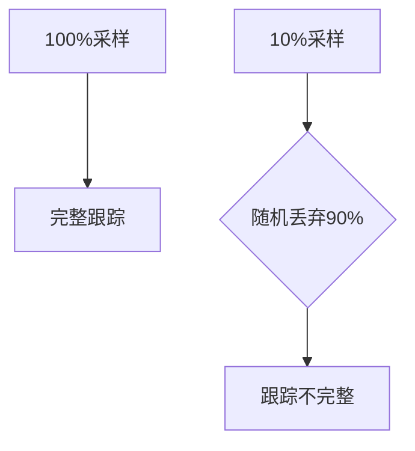
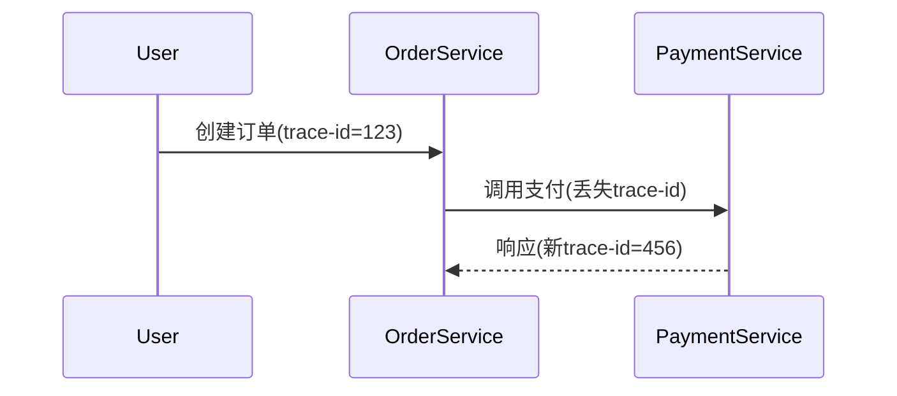

# OpenTelemetry 跟踪不完整

## 介绍

OpenTelemetry是用于生成、收集和导出遥测数据（如跟踪、指标和日志）的开源工具集。当跟踪数据不完整时（例如缺少部分跨度或上下文中断），会严重影响分布式系统的可观测性。本文将帮助你理解常见原因及解决方法。

:::note 关键概念
- **跟踪(Trace)**: 一个请求在分布式系统中的完整执行路径。
- **跨度(Span)**: 跟踪中的单个操作单元，包含开始/结束时间、状态和属性。
:::

## 常见原因及解决方案

### 1. 上下文传播失败

当跨服务边界传递跟踪上下文（如TraceID）失败时，新创建的跨度会生成新的跟踪树，而非延续原有跟踪。

#### 代码示例：手动修复HTTP传播
```python
from opentelemetry import trace
from opentelemetry.propagate import inject, extract

# 发送请求前注入上下文
headers = {}
inject(headers)  # 注入TraceID到headers字典

# 接收端提取上下文
context = extract(headers)
tracer = trace.get_tracer(__name__)
with tracer.start_as_current_span("child_span", context=context):
    # 正确处理子跨度
```

:::warning 注意
确保所有服务使用相同的传播器（如 `W3C TraceContext`），混合使用 `B3` 和 `W3C` 会导致上下文丢失。
:::

### 2. 采样率配置不当

过高的采样率可能导致部分跟踪被丢弃：



#### 动态采样配置示例
```yaml
# OpenTelemetry Collector配置示例
processors:
  probabilistic_sampler:
    sampling_percentage: 50  # 50%的跟踪会被保留
```

:::tip 实践建议
在生产环境中使用动态采样（如基于错误率或延迟的采样），而非固定比例。
:::

### 3. 导出器故障

当数据无法送达后端（如Jaeger/Prometheus）时，跟踪会静默丢失。添加导出器状态监控：

```go
import "go.opentelemetry.io/otel/exporters/jaeger"

exporter, err := jaeger.New(jaeger.WithCollectorEndpoint(
    jaeger.WithEndpoint("http://jaeger:14268/api/traces"),
))
if err != nil {
    log.Fatalf("导出器初始化失败: %v", err)
}

// 添加超时控制
ctx, cancel := context.WithTimeout(context.Background(), 5*time.Second)
defer cancel()
if err := exporter.ExportSpans(ctx, spans); err != nil {
    log.Printf("导出失败: %v", err)
}
```

## 真实案例：电商订单系统

**问题现象**：用户下单后，跟踪数据在支付服务处中断。

**诊断步骤**：
1. 确认支付服务接收到了正确的TraceID头部
2. 发现支付服务使用`AlwaysOffSampler`进行本地调试
3. 检查导出器日志发现证书过期导致TLS连接失败

**解决方案**：
1. 统一所有服务的采样策略
2. 更新Collector的TLS证书
3. 添加导出器重试机制



## 总结与练习

### 关键检查清单
- [ ] 验证上下文传播器在所有服务中一致
- [ ] 检查采样器配置是否符合预期
- [ ] 监控导出器连接状态
- [ ] 确保SDK和Collector版本兼容

### 练习任务
1. 在本地启动两个服务，故意移除HTTP头中的`traceparent`，观察跟踪树变化
2. 配置一个只保留错误请求的采样策略
3. 使用`otelcol-contrib --debug`模式分析导出的跟踪数据

## 扩展阅读
- OpenTelemetry官方文档《上下文传播协议》
- 《分布式跟踪：实践指南》第4章-采样策略
- GitHub上`open-telemetry/opentelemetry-collector`的Issue #3521（关于导出器重试）