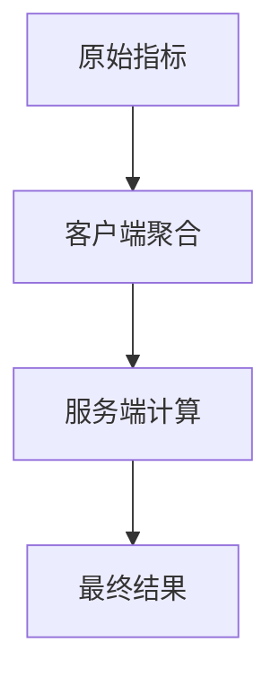

# OpenTelemetry 指标不准确

## 介绍

OpenTelemetry（简称OTel）是用于生成、收集和导出遥测数据（指标、日志、跟踪）的开源工具集。当指标数据不准确时，可能会影响监控系统的可靠性。本文将帮助初学者理解常见问题场景，并通过代码示例和案例演示排查方法。

---

## 为什么指标会不准确？

指标不准确通常由以下原因导致：
1. **采样率配置不当**：高频采样可能导致数据丢失或重复。
2. **聚合逻辑错误**：自定义聚合器未正确处理数据。
3. **时间同步问题**：客户端与服务端时钟不同步。
4. **资源限制**：队列溢出或网络丢包。

---

## 常见排查步骤

### 1. 检查采样配置
确保采样率（Sampling Rate）适合你的应用场景。例如，100%采样会记录所有数据，但可能消耗过多资源。

```javascript
// 错误示例：采样率过低导致数据丢失
const sampler = new AlwaysOffSampler(); // 关闭所有采样

// 正确示例：动态采样
const sampler = new ParentBasedSampler({
  root: new AlwaysOnSampler(), // 根采样始终开启
});
```

:::tip
使用 `AlwaysOnSampler` 调试时临时启用全采样，生产环境建议动态调整。
:::

---

### 2. 验证指标聚合
检查是否因自定义聚合器（如Prometheus的Histogram）导致数据偏差。



示例问题：Histogram的bucket边界设置不合理，导致百分位数计算错误。

```go
// 错误配置：bucket范围过大，丢失细节
histogram := meter.NewFloat64Histogram("request.latency",
    instrument.WithDescription("Request latency in seconds"),
    instrument.WithUnit("s"),
    instrument.WithExplicitBucketBoundaries([]float64{0, 10, 100}), // 不合理的边界
)

// 推荐配置：根据实际分布调整
instrument.WithExplicitBucketBoundaries([]float64{0.1, 0.5, 1, 2.5, 5})
```

---

### 3. 时间同步检查
使用NTP同步服务器时间，并在代码中验证时间戳：

```python
from opentelemetry import metrics
from datetime import datetime

meter = metrics.get_meter_provider().get_meter("time_check")
timestamp = datetime.utcnow().timestamp()
counter = meter.create_counter("time.sync")
counter.add(1, {"timestamp": timestamp})  # 导出时检查此时间戳
```

:::warning
如果导出的时间戳与采集时间差超过5秒，需排查时钟偏移问题。
:::

---

## 实际案例

### 场景：Prometheus中请求计数突降
**现象**：某服务的 `http.server.requests` 指标在高峰期突然下降50%。<br />
**排查过程**：
1. 检查采样配置 → 发现使用了 `ProbabilitySampler(rate=0.5)`。
2. 改为动态采样后问题依旧 → 检查导出器队列：
   ```bash
   otelcol_export_queue_size{exporter="prometheus"} 1000
   ```
3. 确认队列已满导致数据丢失，调整 `queue_size` 参数后解决。

---

## 总结

| 问题类型       | 工具/方法                  | 关键命令/配置              |
|----------------|---------------------------|---------------------------|
| 采样丢失       | Jaeger UI采样分析         | `AlwaysOnSampler`         |
| 聚合错误       | Prometheus直方图查询      | `histogram_quantile()`    |
| 时间不同步     | 节点NTP状态               | `ntpq -p`                 |

---

## 延伸练习
1. 在本地部署OpenTelemetry Collector，故意设置错误的采样率并观察指标变化。
2. 使用Wireshark捕获OTLP协议数据，验证时间戳字段。

:::note
参考资源：
- [OpenTelemetry官方文档](https://opentelemetry.io/docs/)
- 《Distributed Tracing in Practice》第4章
:::