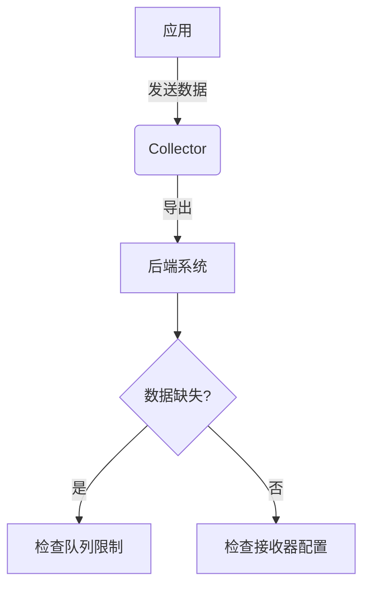

# OpenTelemetry Collector问题排查

## 介绍

OpenTelemetry Collector是一个用于接收、处理和导出遥测数据（如指标、日志和跟踪）的核心组件。作为初学者，你可能会遇到配置错误、数据丢失或性能问题。本文将帮助你理解常见问题的根源，并提供逐步解决方案。

## 常见问题分类

### 1. 配置错误
#### 症状
- Collector无法启动
- 数据未按预期导出

#### 示例配置问题
```yaml
receivers:
  otlp:
    protocols:
      grpc:
        endpoint: "0.0.0.0:4317" # 缺少引号会导致解析错误
```

:::caution
YAML对缩进和格式敏感，建议使用[YAML验证工具](https://yamlvalidator.com)检查配置。
:::

### 2. 数据丢失
#### 典型场景


#### 解决方案
1. 检查`memory_limiter`处理器配置：
```yaml
processors:
  memory_limiter:
    check_interval: 1s
    limit_mib: 4000
    spike_limit_mib: 800
```

### 3. 性能瓶颈
#### 诊断步骤
1. 监控Collector资源使用：
```bash
docker stats otel-collector  # 如果使用容器
```
2. 调整批处理参数：
```yaml
processors:
  batch:
    timeout: 5s
    send_batch_size: 10000
```

## 实际案例

### 案例1：数据未到达Jaeger
**现象**：应用发送跟踪数据，但Jaeger UI中无显示。

**排查过程**：
1. 检查Collector日志：
```bash
grep "ERROR" collector.log
```
2. 发现错误：
```
failed to push trace data: rpc error: code = Unavailable
```
3. 解决方案：验证Jaeger的gRPC端点可达性并更新配置：
```yaml
exporters:
  jaeger:
    endpoint: "jaeger:14250"
    tls:
      insecure: true
```

### 案例2：高内存使用
**现象**：Collector频繁重启。

**解决方法**：
1. 添加内存限制器
2. 减少批处理大小
3. 最终配置：
```yaml
service:
  pipelines:
    traces:
      receivers: [otlp]
      processors: [memory_limiter, batch]
      exporters: [logging]
```

## 调试技巧

1. **启用详细日志**：
```yaml
service:
  telemetry:
    logs:
      level: debug
```

2. **使用`logging`导出器**验证数据流：
```yaml
exporters:
  logging:
    logLevel: debug
```

3. **端口检查命令**：
```bash
netstat -tulnp | grep 4317  # 验证OTLP端口监听
```

## 总结

OpenTelemetry Collector问题通常集中在：
- 配置语法错误
- 资源限制（内存/CPU）
- 网络连接问题
- 数据处理管道配置

:::tip 最佳实践
1. 始终从最小配置开始测试
2. 逐步添加组件
3. 监控资源使用指标
4. 使用`logging`导出器进行初期验证
:::

## 扩展资源

1. [官方问题排查指南](https://opentelemetry.io/docs/collector/troubleshooting/)
2. 练习：尝试在本地复现数据丢失场景，并使用本文方法解决
3. 社区支持：[CNCF Slack #opentelemetry-collector频道](https://cloud-native.slack.com)