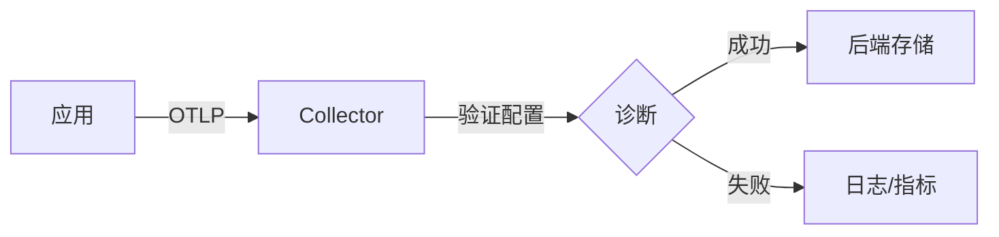

# OpenTelemetry 导出失败问题排查

## 介绍

OpenTelemetry是现代分布式系统中用于生成、收集和导出遥测数据（如指标、日志和追踪）的工具集。当数据**导出失败**时，可能导致监控中断或数据分析不完整。本文将帮助初学者理解常见导出失败原因及解决方法。

---

## 常见导出失败原因

### 1. 配置错误
最常见的导出问题源于错误的配置参数，例如：
- 错误的端点URL
- 缺失或无效的认证信息
- 协议不匹配（如gRPC/HTTP混淆）

```javascript
// 错误示例：缺少协议前缀的端点
const exporter = new OTLPTraceExporter({
  url: "localhost:4317" // 缺少http://或https://
});
```

### 2. 网络问题
:::caution
即使配置正确，网络问题也可能阻止数据到达收集器：
- 防火墙规则阻止出站连接
- DNS解析失败
- 目标服务不可用
:::

### 3. 数据格式不兼容
不同版本的OpenTelemetry Collector或后端服务可能对数据格式有特定要求。

---

## 诊断步骤

### 步骤1：检查导出器日志
OpenTelemetry SDK通常提供日志接口，启用DEBUG级别日志：

```javascript
const { diag, DiagConsoleLogger, DiagLogLevel } = require('@opentelemetry/api');
diag.setLogger(new DiagConsoleLogger(), DiagLogLevel.DEBUG);
```

典型错误日志示例：
```
[OTLP Exporter] Error: Failed to export spans. Server responded with status 401
```

### 步骤2：验证网络连接
使用命令行工具测试基础连接：

```bash
# 测试端口连通性
telnet otel-collector 4317

# 或使用curl测试HTTP端点
curl -v http://otel-collector:4318/v1/traces
```

### 步骤3：手动导出测试
通过代码片段验证最小可工作配置：

```javascript
const { BasicTracerProvider, SimpleSpanProcessor } = require('@opentelemetry/sdk-trace-base');
const { OTLPTraceExporter } = require('@opentelemetry/exporter-trace-otlp-grpc');

const exporter = new OTLPTraceExporter({ url: 'http://collector:4317' });
const provider = new BasicTracerProvider();
provider.addSpanProcessor(new SimpleSpanProcessor(exporter));
```

---

## 实际案例

### 案例1：HTTPS证书问题
**现象**：导出器日志显示`CERT_HAS_EXPIRED`错误。<br />
**解决方案**：
```javascript
// 开发环境中可临时禁用证书验证（生产环境不推荐！）
const exporter = new OTLPTraceExporter({
  url: 'https://collector:4317',
  credentials: {
    rejectUnauthorized: false // 仅用于测试
  }
});
```

### 案例2：批处理配置不当
**现象**：部分数据丢失，无错误日志。<br />
**解决方案**：调整批处理参数：
```javascript
const { BatchSpanProcessor } = require('@opentelemetry/sdk-trace-base');

provider.addSpanProcessor(
  new BatchSpanProcessor(exporter, {
    maxQueueSize: 2048,  // 默认1024
    scheduledDelayMillis: 5000 // 默认5000
  })
);
```

---

## 高级排查工具

### OpenTelemetry Collector诊断


使用Collector的`diagnostics`端口（默认8888）获取内部状态：

```bash
curl http://localhost:8888/metrics | grep otelcol_exporter
```

---

## 总结与练习

### 关键点总结
1. 始终先检查导出器配置和日志
2. 网络问题需要通过系统工具单独验证
3. 小批量测试配置可快速隔离问题

### 练习建议
1. 故意配置错误端点，观察日志输出
2. 使用Wireshark或tcpdump捕获OTLP协议流量
3. 模拟网络中断，测试SDK的重试机制

### 延伸阅读
- [OpenTelemetry官方故障排除指南](https://opentelemetry.io/docs/concepts/faq/)
- OTLP协议规范
- 各语言SDK的导出器实现文档