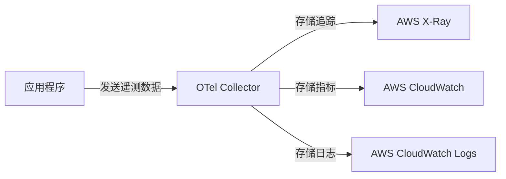

# OpenTelemetry 与AWS

## 介绍

OpenTelemetry（简称OTel）是一个开源的观测性框架，用于生成、收集和管理**遥测数据**（如追踪、指标和日志）。AWS作为领先的云服务提供商，与OpenTelemetry的集成可以帮助开发者轻松监控云原生应用的性能和行为。本教程将介绍如何在AWS环境中部署OpenTelemetry，并通过实际案例展示其应用场景。

:::note 关键概念
- **分布式追踪**：记录请求在微服务架构中的流转路径。
- **指标（Metrics）**：量化系统性能（如CPU使用率、请求延迟）。
- **日志（Logs）**：记录应用程序的详细运行信息。
:::

---

## 1. OpenTelemetry与AWS服务集成

OpenTelemetry可以通过以下方式与AWS服务协同工作：
- **AWS Distro for OpenTelemetry (ADOT)**：AWS官方提供的OpenTelemetry发行版，预集成AWS服务（如X-Ray、CloudWatch）。
- **Lambda函数监控**：通过OTel收集无服务器函数的运行数据。
- **ECS/EKS支持**：在容器化环境中部署OTel Collector。

### 示例：在Lambda中集成OpenTelemetry
以下是一个Python Lambda函数的代码片段，使用OpenTelemetry SDK发送追踪数据到AWS X-Ray：

```python
from opentelemetry import trace
from opentelemetry.sdk.trace import TracerProvider
from opentelemetry.sdk.trace.export import BatchSpanProcessor
from opentelemetry.exporter.otlp.proto.grpc.trace_exporter import OTLPSpanExporter

# 初始化Tracer
provider = TracerProvider()
processor = BatchSpanProcessor(OTLPSpanExporter(endpoint="http://adot-collector:4317"))
provider.add_span_processor(processor)
trace.set_tracer_provider(provider)

def lambda_handler(event, context):
    tracer = trace.get_tracer(__name__)
    with tracer.start_as_current_span("lambda_execution"):
        return {"statusCode": 200, "body": "Hello from OpenTelemetry!"}
```

:::tip
使用ADOT Collector时，无需手动配置`endpoint`，ADOT会自动将其指向本地代理。
:::

---

## 2. 架构示意图



---

## 3. 实际案例：电商订单追踪

假设一个电商平台使用AWS EKS运行微服务，以下是OpenTelemetry的应用场景：

1. **问题**：用户投诉“下单缓慢”，但无法定位具体是哪个服务（订单、支付或库存）导致延迟。
2. **解决方案**：
   - 使用OpenTelemetry在所有服务中注入追踪上下文。
   - 通过X-Ray可视化请求链路，发现支付服务的数据库查询耗时过长。
3. **修复**：优化支付服务的SQL查询后，延迟降低60%。

---

## 4. 总结与练习

### 总结
- OpenTelemetry与AWS的集成提供了**端到端的观测性**。
- ADOT简化了在AWS环境中部署OTel的流程。
- 实际案例中，OTel能快速定位性能瓶颈。

### 练习
1. 在AWS Lambda中部署上述Python示例，并验证X-Ray中是否出现追踪数据。
2. 尝试在ECS任务中配置ADOT Collector，将指标发送到CloudWatch。

### 附加资源
- [AWS ADOT官方文档](https://aws.amazon.com/otel/)
- [OpenTelemetry Python SDK文档](https://opentelemetry.io/docs/instrumentation/python/)