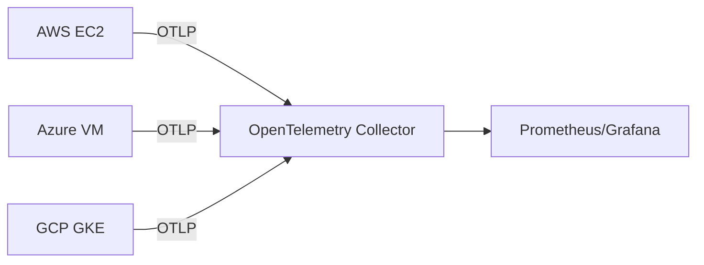
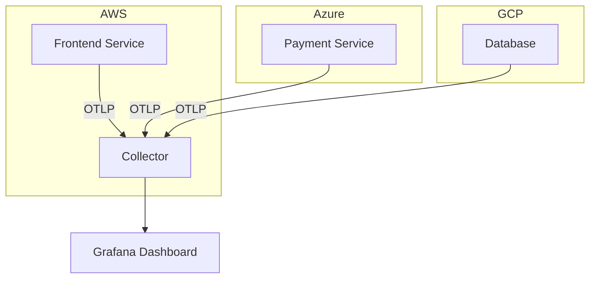

# OpenTelemetry 与多云策略

## 介绍

在多云（Multi-Cloud）环境中，应用可能同时运行在AWS、Azure、GCP等不同云平台上。这种架构带来了灵活性和冗余性，但也增加了观测（Observability）的复杂度。OpenTelemetry作为云原生观测的标准工具，能够统一收集、处理和导出遥测数据（指标、日志、追踪），帮助开发者实现跨云的端到端可观测性。

:::note 关键术语
- **多云策略**：同时使用多个公有云服务以避免供应商锁定或优化成本/性能。
- **OpenTelemetry**：CNCF项目，提供与供应商无关的遥测数据采集SDK和协议。
:::

---

## 为什么需要OpenTelemetry与多云集成？

1. **数据一致性**：不同云平台的监控工具（如CloudWatch、Azure Monitor）数据格式不兼容。
2. **统一视图**：避免在多个控制台间切换，降低运维复杂度。
3. **成本优化**：集中处理数据比使用多个云厂商的监控服务更经济。

---

## 核心组件

### 1. OpenTelemetry Collector
作为数据处理管道，支持多输入（从各云平台）和多输出（到统一存储如Prometheus）。



### 2. OTLP协议
OpenTelemetry的标准传输协议，确保跨平台数据兼容性。

---

## 实施步骤

### 步骤1：安装OpenTelemetry Agent
在所有云节点上部署Agent：

```bash
# 使用Docker安装（以AWS EC2为例）
docker run -d --name otel-collector \
  -p 4317:4317 \
  -v $PWD/otel-config.yaml:/etc/otel-config.yaml \
  otel/opentelemetry-collector \
  --config=/etc/otel-config.yaml
```

### 步骤2：配置多云数据采集
示例`otel-config.yaml`（同时接收AWS和Azure数据）：

```yaml
receivers:
  otlp:
    protocols:
      grpc:
      http:

exporters:
  logging:
    logLevel: debug
  prometheus:
    endpoint: "0.0.0.0:8889"

service:
  pipelines:
    metrics:
      receivers: [otlp]
      exporters: [logging, prometheus]
```

### 步骤3：验证数据
查询Prometheus验证数据是否统一：

```promql
sum(container_cpu_usage_seconds_total{cloud_provider=~"aws|azure"}) by (service_name)
```

---

## 实战案例：电商平台多云监控

**场景**：
- 前端服务运行在AWS EKS
- 支付服务部署在Azure AKS
- 数据库使用GCP Cloud SQL

**解决方案**：
1. 所有服务集成OpenTelemetry SDK
2. 数据通过OTLP发送到中心化Collector
3. Grafana展示跨云黄金指标（延迟、错误率、吞吐量）



---

## 总结与进阶

### 关键收获
- OpenTelemetry Collector是多云观测的"枢纽"
- OTLP协议消除了云厂商锁定
- 统一数据模型简化了告警和排障

### 推荐练习
1. 在AWS Lightsail和Azure App Service上部署Demo应用
2. 配置Collector同时接收两边的指标数据
3. 在Grafana中创建对比仪表盘

### 扩展阅读
- [OpenTelemetry官方文档](https://opentelemetry.io/docs/)
- CNCF多云白皮书