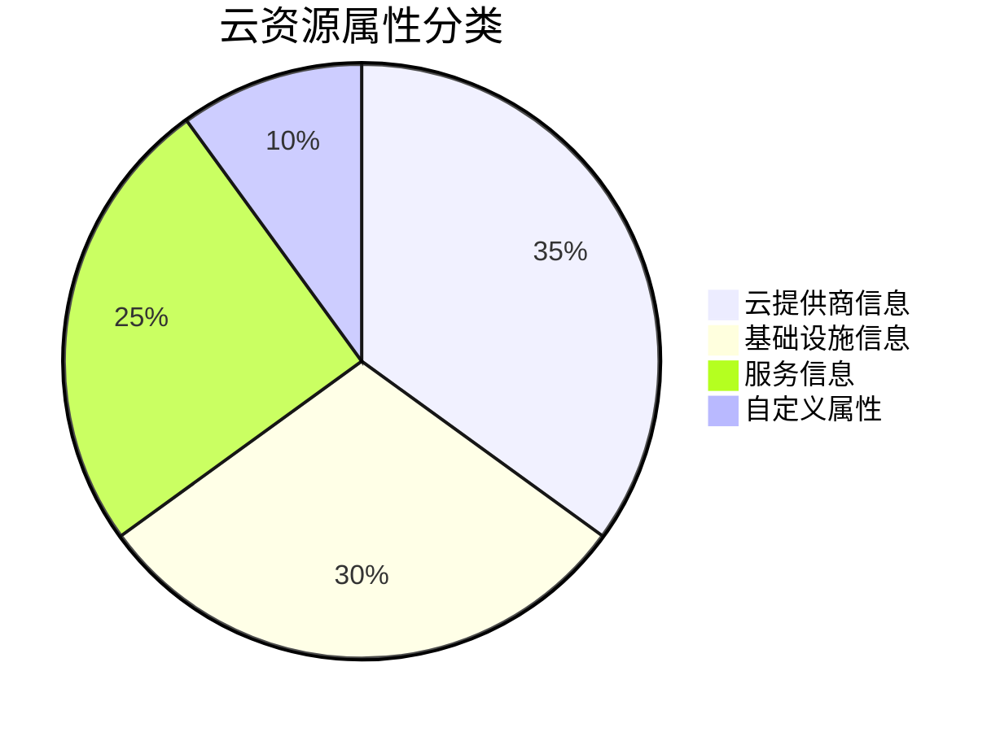

# OpenTelemetry 云资源属性

## 介绍

OpenTelemetry中的**资源属性(Resource Attributes)**是描述数据源(如主机、服务或云资源)的元数据。在云环境中，这些属性尤为重要，因为它们能帮助您：

1. 识别数据来源的云服务商(AWS/Azure/GCP等)
2. 定位特定的云资源(如EC2实例、Kubernetes集群)
3. 实现跨服务的关联分析

## 核心云资源属性

OpenTelemetry定义了标准化的云资源属性，主要包含在以下语义约定中：

```go
import (
    "go.opentelemetry.io/otel/sdk/resource"
    semconv "go.opentelemetry.io/otel/semconv/v1.20.0"
)

func createResource() *resource.Resource {
    return resource.NewWithAttributes(
        semconv.SchemaURL,
        semconv.CloudProvider("aws"),
        semconv.CloudRegion("us-west-2"),
        semconv.CloudAccountID("123456789012"),
    )
}
```

### 主要属性分类



## 详细属性说明

### 1. 云提供商属性

| 属性名 | 示例值 | 描述 |
|--------|--------|------|
| `cloud.provider` | "aws" | 云服务提供商 |
| `cloud.region` | "us-west-2" | 资源所在区域 |
| `cloud.account.id` | "123456789012" | 云账户ID |

### 2. 主机属性

```python
from opentelemetry.sdk.resources import Resource
from opentelemetry.semconv.resource import ResourceAttributes

resource = Resource.create({
    ResourceAttributes.HOST_NAME: "my-ec2-instance",
    ResourceAttributes.HOST_TYPE: "t3.large",
    ResourceAttributes.HOST_ID: "i-1234567890abcdef0"
})
```

### 3. 容器属性

:::note
Kubernetes环境下的典型属性：
:::

```yaml
# 在K8s部署中自动检测的属性示例
k8s.pod.name: "frontend-5dfd57f97c-lx9vw"
k8s.namespace.name: "production"
k8s.node.name: "ip-192-168-1-100.ec2.internal"
container.name: "user-service"
```

## 实际应用案例

### 场景：多云环境监控

假设您有服务部署在AWS和Azure上：

```javascript
// Node.js中的资源设置示例
const { Resource } = require('@opentelemetry/resources');
const { SemanticResourceAttributes } = require('@opentelemetry/semantic-conventions');

// AWS资源
const awsResource = new Resource({
  [SemanticResourceAttributes.CLOUD_PROVIDER]: 'aws',
  [SemanticResourceAttributes.CLOUD_REGION]: 'us-east-1',
  [SemanticResourceAttributes.HOST_ID]: 'i-0abcdef1234567890'
});

// Azure资源
const azureResource = new Resource({
  [SemanticResourceAttributes.CLOUD_PROVIDER]: 'azure',
  [SemanticResourceAttributes.CLOUD_REGION]: 'eastus',
  [SemanticResourceAttributes.HOST_ID]: 'vm-01'
});
```

### 查询示例

在监控系统中，您可以使用这些属性进行筛选：

```
# 查询所有AWS us-west-2区域的错误日志
cloud.provider="aws" AND cloud.region="us-west-2" AND severity="ERROR"
```

## 最佳实践

:::tip
1. **标准化优先**：尽量使用OpenTelemetry定义的语义约定属性
2. **自动检测**：利用SDK的自动检测功能获取云平台元数据
3. **合理扩展**：在标准属性不足时，添加自定义属性(前缀为`custom.`)
4. **避免敏感信息**：不要在属性中包含密码、密钥等敏感数据
:::

## 总结

OpenTelemetry云资源属性是云原生可观测性的基石，它们：

- 提供跨云环境的统一元数据格式
- 实现资源的精确定位和分类
- 支持复杂的监控查询和告警规则

## 延伸学习

1. [OpenTelemetry资源语义约定官方文档](https://opentelemetry.io/docs/specs/semconv/resource/)
2. 练习：在您的云环境中部署一个Demo应用，并检查自动收集的资源属性
3. 尝试使用`resourcedetection`处理器自动获取云平台信息

```bash
# 示例：使用resourcedetection处理器配置
exporters:
  logging:
    logLevel: debug

processors:
  resourcedetection:
    detectors: [env, gcp, aws, azure]
    timeout: 2s
```