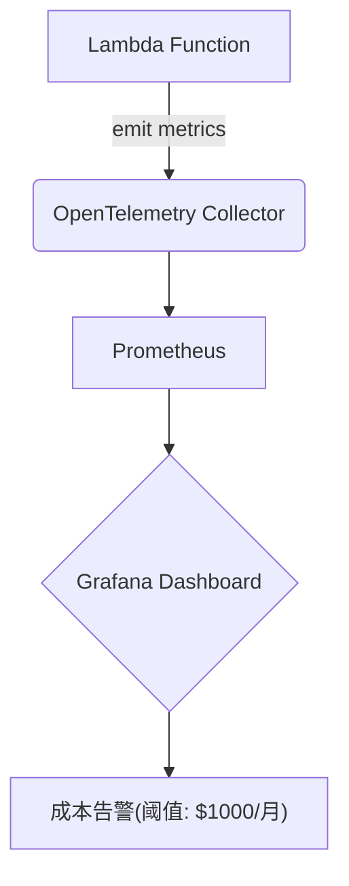

# OpenTelemetry 云服务成本监控

## 介绍

在现代云原生架构中，成本监控与优化是运维和开发团队的核心挑战之一。OpenTelemetry作为云原生可观测性标准，不仅能追踪应用性能，还能通过收集资源使用指标（如CPU、内存、网络流量等）与云服务商账单数据关联，实现精细化的成本监控。本文将介绍如何利用OpenTelemetry实现云服务成本的透明化管理。

## 核心概念

### 1. OpenTelemetry指标与成本关联
OpenTelemetry通过以下数据类型支持成本分析：
- **Metrics**：采集资源使用量（如`container.cpu.utilization`）
- **Resource Detectors**：标记云资源元数据（如AWS EC2实例ID）
- **Logs**：记录计费事件（如AWS Cost Explorer API响应）

### 2. 关键指标示例
以下PromQL查询可计算某Kubernetes命名空间的CPU成本（假设$0.000016/CPU秒）：
```promql
sum(
  rate(container_cpu_usage_seconds_total{namespace="production"}[1h])
) * 0.000016 * 3600
```

## 实现步骤

### 步骤1：配置OpenTelemetry Collector
在`otel-collector-config.yaml`中添加成本相关指标导出：
```yaml
receivers:
  prometheus:
    config:
      scrape_configs:
        - job_name: "cost-metrics"
          static_configs:
            - targets: ["cloud-billing-service:8080"]

processors:
  resource:
    attributes:
      - key: cloud.provider
        value: "aws"
        action: upsert

exporters:
  prometheusremotewrite:
    endpoint: "https://prometheus-cloud.example.com/api/v1/write"
```

### 步骤2：关联云账单数据
通过Python脚本将AWS Cost API数据转为OpenTelemetry指标：
```python
from opentelemetry import metrics
from opentelemetry.sdk.metrics import MeterProvider

meter = MeterProvider().get_meter("cost-monitor")
cost_counter = meter.create_counter(
    "cloud.cost.usd",
    description="Accumulated cloud cost in USD"
)

# 模拟从API获取数据
cost_counter.add(1250, {"service": "ec2", "environment": "production"})
```

## 实际案例：AWS Lambda成本监控

### 架构流程


### 关键指标公式
```
月度成本 = (总执行时间秒数 × 每GB-秒价格) + (请求次数 × 每次请求价格)
```

## 总结

通过OpenTelemetry实现成本监控的核心优势：
- **统一观测**：将性能指标与成本数据在同一仪表板展示
- **实时性**：比云服务商延迟的账单数据更快发现问题
- **细粒度**：可追踪到具体服务/团队/功能的成本

## 扩展练习

1. 尝试在本地OpenTelemetry demo中添加模拟成本指标
2. 使用Grafana创建包含成本指标的Dashboard
3. 配置当开发环境月成本超过$500时触发告警

## 附加资源

- [OpenTelemetry Metrics规范](https://opentelemetry.io/docs/specs/otel/metrics/)
- [AWS成本与使用报告API文档](https://docs.aws.amazon.com/awsaccountbilling/latest/aboutv2/cost-alloc-reports.html)
- [示例：Kubernetes成本分析工具](https://github.com/kubecost/opencost)