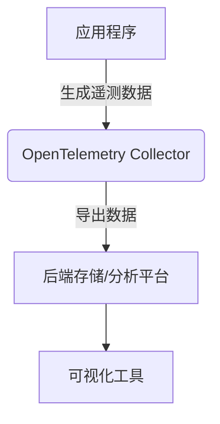

# OpenTelemetry 云环境最佳实践

## 介绍

OpenTelemetry 是一个开源的观测性框架，用于生成、收集和导出遥测数据（如指标、日志和跟踪）。在云环境中，OpenTelemetry 能帮助开发者监控分布式系统的性能和行为。本文将介绍在云环境中使用 OpenTelemetry 的最佳实践，帮助初学者快速上手。

## 为什么在云环境中使用 OpenTelemetry？

云环境通常是分布式的，服务可能跨多个区域或云提供商运行。OpenTelemetry 提供了一种标准化的方式来收集和传输遥测数据，无论你的服务运行在哪里。它的主要优势包括：

- **跨平台兼容性**：支持多种编程语言和云平台。
- **可扩展性**：能够处理大规模分布式系统的数据。
- **开源和社区支持**：由 CNCF（云原生计算基金会）支持，拥有活跃的社区。

## 最佳实践

### 1. 设计合理的遥测数据收集架构

在云环境中，建议采用以下架构设计：



- **应用程序**：通过 OpenTelemetry SDK 嵌入代码，生成遥测数据。
- **OpenTelemetry Collector**：作为代理，接收、处理和导出数据。
- **后端平台**：如 Prometheus、Jaeger 或 Elasticsearch，用于存储和分析数据。
- **可视化工具**：如 Grafana，用于展示数据。

### 2. 使用 OpenTelemetry Collector

OpenTelemetry Collector 是一个核心组件，负责接收、处理和导出数据。以下是一个简单的配置示例（`otel-collector-config.yaml`）：

```yaml
receivers:
  otlp:
    protocols:
      grpc:
      http:

processors:
  batch:
    timeout: 10s
    send_batch_size: 1000

exporters:
  logging:
    logLevel: debug
  prometheus:
    endpoint: "0.0.0.0:8889"

service:
  pipelines:
    traces:
      receivers: [otlp]
      processors: [batch]
      exporters: [logging]
    metrics:
      receivers: [otlp]
      processors: [batch]
      exporters: [prometheus]
```

:::tip
- `receivers`：定义数据接收方式（如 OTLP、Jaeger 等）。
- `processors`：对数据进行批处理或过滤。
- `exporters`：将数据导出到后端平台。
:::

### 3. 优化数据采样

在高流量的云环境中，全量采集遥测数据可能会导致性能问题。可以通过采样策略减少数据量：

```go
import (
	"go.opentelemetry.io/otel/sdk/trace"
)

func setupTracer() *trace.TracerProvider {
	sampler := trace.ParentBased(trace.TraceIDRatioBased(0.5)) // 采样率为 50%
	tp := trace.NewTracerProvider(
		trace.WithSampler(sampler),
	)
	return tp
}
```

### 4. 集成云原生工具

OpenTelemetry 可以与云原生工具（如 Kubernetes 或 AWS Lambda）无缝集成。例如，在 Kubernetes 中部署 Collector：

```yaml
apiVersion: apps/v1
kind: Deployment
metadata:
  name: otel-collector
spec:
  template:
    spec:
      containers:
      - name: otel-collector
        image: otel/opentelemetry-collector
        args: ["--config=/etc/otel-config.yaml"]
        volumeMounts:
        - name: otel-config
          mountPath: /etc/otel-config.yaml
      volumes:
      - name: otel-config
        configMap:
          name: otel-config
```

### 5. 监控和告警

将 OpenTelemetry 数据与监控工具（如 Prometheus）集成，并设置告警规则：

```yaml
groups:
- name: example
  rules:
  - alert: HighErrorRate
    expr: rate(http_requests_total{status="500"}[5m]) > 0.1
    labels:
      severity: critical
    annotations:
      summary: "High error rate detected"
```

## 实际案例

### 案例：电商平台的分布式追踪

一个电商平台使用 OpenTelemetry 追踪用户从下单到支付的完整流程：

1. **前端服务**：生成跟踪 ID 并传递给后端。
2. **订单服务**：记录订单创建时间。
3. **支付服务**：记录支付处理时间。
4. **Collector**：聚合所有数据并导出到 Jaeger。
5. **Jaeger UI**：可视化整个调用链，发现性能瓶颈。

## 总结

OpenTelemetry 是云环境中实现观测性的强大工具。通过合理设计架构、优化数据采样和集成云原生工具，可以高效监控分布式系统。以下是关键要点：

- 使用 Collector 作为中心化数据处理组件。
- 根据流量调整采样率。
- 与现有云原生工具集成。

## 附加资源

1. [OpenTelemetry 官方文档](https://opentelemetry.io/docs/)
2. [Jaeger 分布式追踪](https://www.jaegertracing.io/)
3. [Prometheus 监控指南](https://prometheus.io/docs/introduction/overview/)

## 练习

1. 部署一个 OpenTelemetry Collector，并配置其接收 OTLP 数据。
2. 在示例应用中嵌入 OpenTelemetry SDK，生成跟踪数据。
3. 使用 Jaeger 或 Grafana 可视化收集的数据。