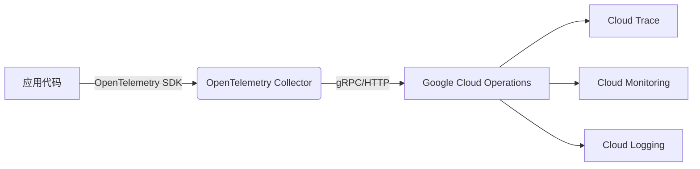

# OpenTelemetry 与Google Cloud

## 介绍

OpenTelemetry是一个开源的**可观测性框架**，用于生成、收集和管理**遥测数据**（如指标、日志和追踪）。Google Cloud提供了一系列工具（如Cloud Monitoring和Cloud Trace）来存储和分析这些数据。本指南将展示如何将两者结合，构建云环境下的全栈可观测性方案。

:::note 关键概念
- **OpenTelemetry**: 标准化SDK，支持多语言（Python/Go/Java等）。
- **Google Cloud Operations Suite**: 包含Cloud Monitoring（指标）、Cloud Logging（日志）和Cloud Trace（分布式追踪）。
:::

---

## 基础架构



## 配置步骤

### 1. 安装OpenTelemetry SDK

以Python为例：

```python
pip install opentelemetry-api opentelemetry-sdk \
    opentelemetry-exporter-gcp-trace \
    opentelemetry-exporter-gcp-metrics
```

### 2. 初始化追踪和指标

```python
from opentelemetry import trace
from opentelemetry.sdk.trace import TracerProvider
from opentelemetry.sdk.trace.export import BatchSpanProcessor
from opentelemetry.exporter.cloud_trace import CloudTraceSpanExporter

# 设置追踪
trace.set_tracer_provider(TracerProvider())
tracer = trace.get_tracer(__name__)
cloud_trace_exporter = CloudTraceSpanExporter()
trace.get_tracer_provider().add_span_processor(
    BatchSpanProcessor(cloud_trace_exporter)
)

# 示例追踪
with tracer.start_as_current_span("google_cloud_demo"):
    print("追踪数据将发送到Cloud Trace")
```

### 3. 配置Google Cloud认证

确保已设置**服务账号密钥**并导出环境变量：

```bash
export GOOGLE_APPLICATION_CREDENTIALS="/path/to/service-account.json"
```

:::caution 权限要求
服务账号需要包含以下角色：
- `roles/cloudtrace.agent`
- `roles/monitoring.metricWriter`
:::

---

## 实际案例：监控HTTP服务

### 代码示例

```python
from flask import Flask
from opentelemetry.instrumentation.flask import FlaskInstrumentor

app = Flask(__name__)
FlaskInstrumentor().instrument_app(app)  # 自动追踪HTTP请求

@app.route("/")
def home():
    return "Hello Google Cloud!"

if __name__ == "__main__":
    app.run(port=8080)
```

### 在Cloud Trace中的效果
请求完成后，您将在Google Cloud Console中看到：
- 请求延迟分析
- 跨服务依赖图
- 错误率统计

---

## 高级功能

### 1. 自定义指标上报

```python
from opentelemetry import metrics
from opentelemetry.exporter.cloud_monitoring import CloudMonitoringMetricsExporter

metrics.set_meter_provider(MeterProvider())
meter = metrics.get_meter(__name__)
exporter = CloudMonitoringMetricsExporter()
metrics.get_meter_provider().start_pipeline(meter, exporter)

request_counter = meter.create_counter(
    "http_requests",
    description="Total HTTP requests"
)

# 在请求处理中递增
request_counter.add(1, {"route": "/home"})
```

### 2. 日志关联追踪

通过`trace_id`将日志与追踪关联：

```python
import logging
from opentelemetry.trace import get_current_span

span = get_current_span()
logging.info("处理请求", extra={
    "trace_id": span.get_span_context().trace_id
})
```

---

## 总结

通过本指南，您已学会：
✅ 将OpenTelemetry数据导出到Google Cloud<br />
✅ 自动追踪Web应用请求<br />
✅ 上报自定义业务指标<br />
✅ 实现日志与追踪的关联

---

## 扩展资源

1. [Google Cloud Trace文档](https://cloud.google.com/trace)
2. [OpenTelemetry Python SDK](https://opentelemetry.io/docs/instrumentation/python/)
3. 练习：尝试在Google Kubernetes Engine(GKE)中部署带OpenTelemetry的应用

:::tip 调试技巧
在本地开发时，使用`google-cloud-emulator`模拟云服务：
```bash
docker run -p 8080:8080 google/cloud-sdk:latest gcloud beta emulators trace start
```
:::