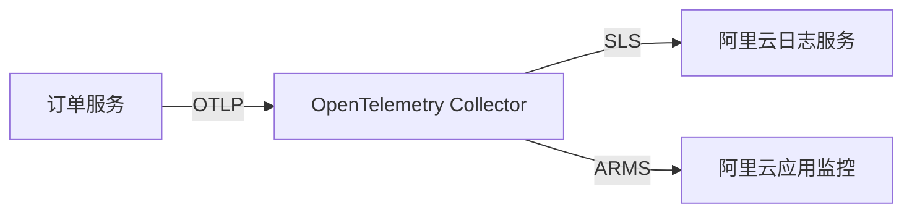

## 介绍

OpenTelemetry 是一个开源的观测性框架，用于生成、收集和导出遥测数据（如指标、日志和追踪）。它帮助开发者监控分布式系统的性能和行为。阿里云作为领先的云服务提供商，提供了多种服务（如日志服务SLS、应用实时监控服务ARMS）与OpenTelemetry集成，实现端到端的可观测性。

本文将介绍如何将OpenTelemetry与阿里云服务结合使用，包括配置、代码示例和实际应用场景。

---

## 核心概念

### 1. OpenTelemetry 组件
OpenTelemetry 主要包含以下组件：
- **Tracing**：记录请求在分布式系统中的流转路径。
- **Metrics**：收集系统性能指标（如CPU使用率、请求延迟）。
- **Logs**：存储应用程序的日志数据（需与OpenTelemetry Logs SDK结合使用）。

### 2. 阿里云服务集成
阿里云支持通过以下方式接入OpenTelemetry数据：
- **日志服务SLS**：存储和分析日志。
- **应用实时监控服务ARMS**：可视化追踪和指标。
- **消息队列Kafka**：传输遥测数据（需通过OpenTelemetry Collector）。

---

## 配置OpenTelemetry与阿里云

### 步骤1：安装依赖
首先安装OpenTelemetry的SDK和导出器：
```bash
pip install opentelemetry-api opentelemetry-sdk opentelemetry-exporter-otlp
```

### 步骤2：配置OTLP导出器
将数据发送到阿里云的OTLP端点（需替换为实际阿里云服务地址）：
```python
from opentelemetry import trace
from opentelemetry.sdk.trace import TracerProvider
from opentelemetry.sdk.trace.export import BatchSpanProcessor
from opentelemetry.exporter.otlp.proto.grpc.trace_exporter import OTLPSpanExporter

# 初始化Tracer
provider = TracerProvider()
processor = BatchSpanProcessor(OTLPSpanExporter(endpoint="https://aliyun-otel-endpoint:4317"))
provider.add_span_processor(processor)
trace.set_tracer_provider(provider)

# 创建一个简单的Span
tracer = trace.get_tracer(__name__)
with tracer.start_as_current_span("aliyun-integration"):
    print("Trace data sent to Alibaba Cloud!")
```

:::note
阿里云的OTLP端点需在ARMS或SLS控制台中获取，并配置对应的鉴权信息（如AccessKey）。
:::

---

## 实际案例：电商应用监控

### 场景描述
一个电商应用使用阿里云Kubernetes服务（ACK），需要监控订单服务的延迟和错误率。

### 实现步骤
1. **部署OpenTelemetry Collector**：在ACK集群中部署Collector，配置OTLP接收器和阿里云SLS导出器。
2. **代码埋点**：在订单服务中添加OpenTelemetry的Python或Java SDK。
3. **数据可视化**：在ARMS控制台中查看服务拓扑和延迟热力图。



---

## 总结

通过OpenTelemetry与阿里云的集成，开发者可以：
- 统一收集追踪、指标和日志数据。
- 利用阿里云的托管服务（如ARMS）快速分析问题。
- 减少自建监控系统的复杂度。

---

## 扩展资源
1. [阿里云ARMS官方文档](https://help.aliyun.com/document_detail/42781.html)
2. [OpenTelemetry Collector配置指南](https://opentelemetry.io/docs/collector/)
3. 练习：尝试在阿里云函数计算（FC）中部署一个OpenTelemetry自动埋点的Python函数。