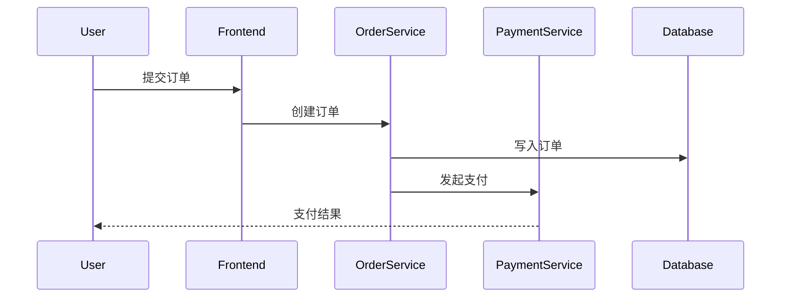

# OpenTelemetry 与腾讯云

## 介绍

OpenTelemetry 是一个开源的观测性框架，用于生成、收集和导出遥测数据（如指标、日志和追踪）。它帮助开发者理解应用程序的性能和行为。腾讯云提供了一系列云服务，可以与 OpenTelemetry 集成，实现全面的监控和分析。

在本教程中，你将学习如何将 OpenTelemetry 与腾讯云服务（如腾讯云 CLS 日志服务、TAPM 应用性能监控）结合使用，以提升分布式系统的可观测性。

## OpenTelemetry 基础

OpenTelemetry 主要由以下组件构成：
- **Tracing**：记录请求在分布式系统中的流转路径。
- **Metrics**：收集系统性能指标（如 CPU 使用率、请求延迟）。
- **Logs**：存储应用程序的日志数据。

### 核心概念
- **Span**：表示一个操作或工作单元（例如，一个 HTTP 请求）。
- **Trace**：一组相关的 Span，表示一个完整的请求流程。
- **Exporter**：将遥测数据发送到后端（如腾讯云 CLS）。

## 腾讯云与 OpenTelemetry 集成

腾讯云支持通过 OpenTelemetry 协议（OTLP）接收遥测数据。以下是常见的集成方式：

### 1. 将 OpenTelemetry 数据导出到腾讯云 CLS

腾讯云日志服务（CLS）可以存储和分析日志数据。以下是一个 Python 示例，展示如何将 OpenTelemetry 日志发送到 CLS：

```python
from opentelemetry import trace
from opentelemetry.sdk.trace import TracerProvider
from opentelemetry.sdk.trace.export import BatchSpanProcessor
from opentelemetry.exporter.otlp.proto.grpc.trace_exporter import OTLPSpanExporter

# 设置 TracerProvider
trace.set_tracer_provider(TracerProvider())

# 创建 OTLP Exporter（替换为腾讯云 CLS 的端点）
otlp_exporter = OTLPSpanExporter(endpoint="https://cls.tencentcloudapi.com")

# 将 Exporter 添加到处理器
span_processor = BatchSpanProcessor(otlp_exporter)
trace.get_tracer_provider().add_span_processor(span_processor)

# 生成一个 Span
tracer = trace.get_tracer(__name__)
with tracer.start_as_current_span("tencent-cloud-operation"):
    print("Sending data to Tencent Cloud CLS...")
```

### 2. 使用腾讯云 TAPM 进行应用性能监控

腾讯云应用性能监控（TAPM）支持 OpenTelemetry 数据导入。配置步骤如下：
1. 在 TAPM 控制台创建应用。
2. 获取数据上报地址和 Token。
3. 在代码中配置 OTLP Exporter。

```yaml
# opentelemetry-collector-config.yaml
receivers:
  otlp:
    protocols:
      grpc:
exporters:
  otlp/tapm:
    endpoint: "tapm.tencentcloudapi.com:443"
    headers:
      "api-token": "YOUR_TAPM_TOKEN"
service:
  pipelines:
    traces:
      receivers: [otlp]
      exporters: [otlp/tapm]
```

## 实际案例：电商系统的可观测性

假设你运营一个电商平台，使用腾讯云服务器和数据库。以下是 OpenTelemetry 的应用场景：

1. **追踪订单流程**：从用户下单到支付完成的完整链路。
2. **监控数据库性能**：记录查询延迟和错误率。
3. **日志集中管理**：将所有微服务的日志发送到腾讯云 CLS。



## 总结

通过 OpenTelemetry 和腾讯云的集成，你可以实现：
- 端到端的分布式追踪。
- 实时性能指标监控。
- 集中化的日志管理。

:::tip 下一步
尝试在腾讯云上部署一个 OpenTelemetry Collector，并将数据导出到 TAPM 或 CLS。
:::

## 附加资源

1. [OpenTelemetry 官方文档](https://opentelemetry.io/docs/)
2. [腾讯云 CLS 文档](https://cloud.tencent.com/document/product/614)
3. [腾讯云 TAPM 指南](https://cloud.tencent.com/document/product/1349)