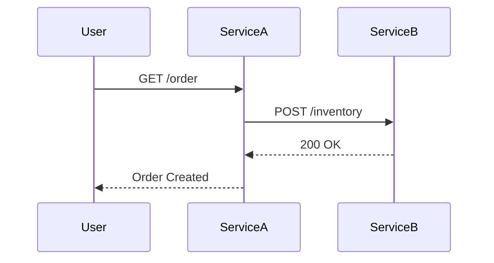

# OpenTelemetry 与华为云

## 介绍

OpenTelemetry 是一个开源的**可观测性框架**，用于生成、收集和管理遥测数据（如指标、日志和追踪）。华为云作为主流云服务提供商，提供了与OpenTelemetry深度集成的解决方案，帮助开发者快速构建云原生应用的监控体系。

:::note 关键概念
- **分布式追踪**：记录请求在微服务间的流转路径
- **自动埋点**：通过SDK无侵入式采集数据
- **统一数据模型**：支持多种后端系统（如华为云APM）
:::

## 华为云环境准备

### 1. 开通相关服务
在华为云控制台启用以下服务：
- **应用性能管理 APM**
- **云日志服务 LTS**
- **云监控服务 CES**

### 2. 创建IAM权限
为OpenTelemetry Collector配置具有以下权限的IAM账号：
```bash
# 示例策略
{
  "Version": "1.1",
  "Statement": [
    {
      "Action": [
        "apm:*",
        "lts:*",
        "ces:*"
      ],
      "Effect": "Allow"
    }
  ]
}
```

## 集成OpenTelemetry

### 1. 安装SDK
以Node.js应用为例：
```bash
npm install @opentelemetry/sdk-node \
            @opentelemetry/auto-instrumentations-node \
            @opentelemetry/exporter-trace-otlp-http
```

### 2. 基础配置
创建`tracing.js`初始化文件：
```javascript
const { NodeSDK } = require('@opentelemetry/sdk-node');
const { getNodeAutoInstrumentations } = require('@opentelemetry/auto-instrumentations-node');
const { OTLPTraceExporter } = require('@opentelemetry/exporter-trace-otlp-http');

const sdk = new NodeSDK({
  traceExporter: new OTLPTraceExporter({
    url: 'https://apm.{region}.myhuaweicloud.com/v1/traces'
  }),
  instrumentations: [getNodeAutoInstrumentations()]
});

sdk.start();
```

### 3. 华为云APM配置
在APM控制台获取：
- **接入地址**：替换上述代码中的`{region}`
- **Token**：通过环境变量`OTEL_EXPORTER_OTLP_HEADERS=auth-token=YOUR_TOKEN`

## 数据可视化

### 追踪数据示例


在华为云APM中可以看到：
1. 请求的完整调用链
2. 每个Span的耗时和状态码
3. 服务间的依赖关系图

## 实战案例：电商订单系统

### 场景描述
当用户提交订单时，追踪以下操作：
1. 订单服务创建记录
2. 库存服务扣减库存
3. 支付服务处理付款

### 关键代码
手动创建Span：
```javascript
const api = require('@opentelemetry/api');

async function createOrder(ctx) {
  const tracer = api.trace.getTracer('order-service');
  return tracer.startActiveSpan('createOrder', async (span) => {
    try {
      span.setAttribute('user.id', ctx.userId);
      // 业务逻辑...
    } finally {
      span.end();
    }
  });
}
```

## 总结

### 核心优势
- **统一观测**：合并指标/日志/追踪三套系统
- **多云支持**：华为云与其他云平台数据互通
- **降低成本**：利用华为云原生服务减少运维开销

### 后续学习
1. 尝试在华为云CCE容器环境中部署OpenTelemetry Collector
2. 配置基于指标的自动告警规则
3. 结合华为云函数工作流实现无服务器监控

:::tip 调试技巧
使用本地测试时，可以先配置导出到控制台：
```javascript
new ConsoleSpanExporter()
```
:::