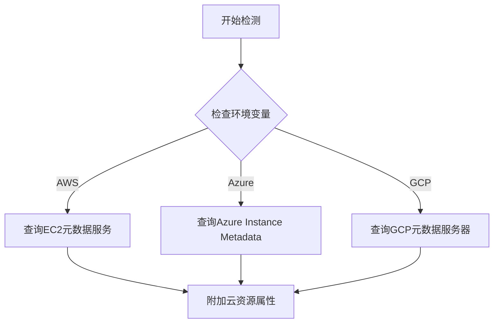

# OpenTelemetry 云提供商检测

## 介绍

在现代云原生应用中，了解应用运行在哪个云提供商环境（如AWS、Azure或GCP）对监控和故障排查至关重要。OpenTelemetry的**云提供商检测**功能可以自动识别运行环境，并收集云平台特有的元数据（如实例ID、可用区等），这些数据会作为资源属性附加到所有遥测数据中。

:::tip 为什么需要云提供商检测？
- 在混合云或多云环境中快速定位问题来源
- 关联云平台指标（如CPU配额）与应用性能数据
- 实现基于云环境的动态采样策略
:::

## 工作原理

OpenTelemetry通过检测环境变量和云提供商特有的元数据服务来识别运行环境。以下是主要云平台的检测逻辑：



## 配置方法

### 基础配置

在OpenTelemetry SDK中启用云提供商检测（以Node.js为例）：

```javascript
const { NodeSDK } = require('@opentelemetry/sdk-node');
const { getNodeAutoInstrumentations } = require('@opentelemetry/auto-instrumentations-node');
const { awsEc2Detector } = require('@opentelemetry/resource-detector-aws');

const sdk = new NodeSDK({
  resourceDetectors: [awsEc2Detector], // 添加云检测器
  instrumentations: [getNodeAutoInstrumentations()]
});

sdk.start();
```

### 检测结果示例

成功检测AWS环境后，资源属性将包含：

```json
{
  "cloud.provider": "aws",
  "cloud.platform": "aws_ec2",
  "cloud.region": "us-west-2",
  "host.id": "i-1234567890abcdef0",
  "cloud.availability_zone": "us-west-2a"
}
```

## 实际应用案例

### 案例：多云故障诊断

某电商平台在AWS和Azure同时部署服务，当出现高延迟时：

1. OpenTelemetry自动附加云提供商标签
2. 在监控系统中过滤 `cloud.provider="azure"` 的数据
3. 发现只有Azure区域的延迟升高
4. 检查Azure健康仪表板，确认是该区域网络问题

:::note 多语言支持
所有OpenTelemetry语言SDK都支持云检测，但配置方式略有不同：
- Java: `AwsEc2ResourceProvider`
- Python: `AzureResourceDetector`
- Go: `gcp.NewDetector()`
:::

## 高级配置

### 自定义属性

可以扩展默认的云检测属性：

```python
from opentelemetry.sdk.resources import Resource
from opentelemetry.resource.aws import AwsEcsResourceDetector

custom_resource = Resource.create({"service.version": "1.0.0"})
aws_resource = AwsEcsResourceDetector().detect()

final_resource = custom_resource.merge(aws_resource)
```

### 故障排除

如果检测失败，检查：

1. 云实例是否配置了IAM角色（AWS）
2. 元数据服务端点是否可访问（通常 `169.254.169.254`）
3. 安全组是否允许访问元数据服务

## 总结

OpenTelemetry的云提供商检测功能为多云环境提供了：

✓ 自动环境识别  
✓ 标准化云资源属性  
✓ 与云平台监控系统无缝集成  

## 延伸学习

1. 尝试在不同云平台部署示例应用并观察检测结果
2. 在Grafana中创建基于 `cloud.region` 的仪表板
3. 阅读各云平台的元数据服务API文档

:::warning 安全提示
元数据服务可能包含敏感信息，确保：
- 不要将元数据服务暴露到公网
- 在Span中过滤敏感字段
:::