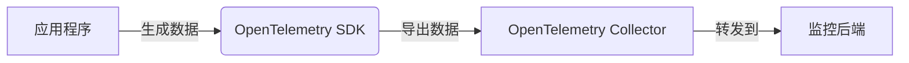
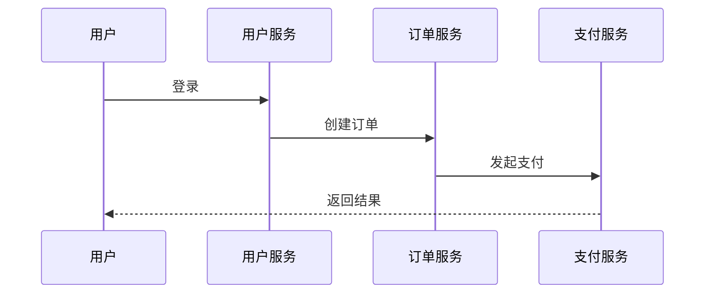

## 介绍

OpenTelemetry 是一个开源的观测性框架，用于生成、收集和管理遥测数据（如指标、日志和追踪）。在云原生环境中，服务通常是分布式的，传统的监控方法难以满足需求。OpenTelemetry 通过标准化数据采集和传输，帮助开发者实现跨服务的端到端监控。

:::note
**关键术语**：
- **遥测数据（Telemetry）**：包括指标（Metrics）、日志（Logs）和追踪（Traces）。
- **云原生（Cloud-Native）**：基于容器化、微服务和动态编排的应用架构。
:::

## 核心组件

OpenTelemetry 的核心组件包括：
1. **API**：定义如何生成遥测数据。
2. **SDK**：实现 API 并提供配置选项。
3. **导出器（Exporters）**：将数据发送到后端（如 Prometheus、Jaeger）。
4. **收集器（Collector）**：接收、处理和转发遥测数据。



## 代码示例：基础追踪

以下是一个使用 OpenTelemetry 的 Python 示例，展示如何生成和导出追踪数据：

```python
from opentelemetry import trace
from opentelemetry.sdk.trace import TracerProvider
from opentelemetry.sdk.trace.export import ConsoleSpanExporter, SimpleSpanProcessor

# 设置追踪提供者
trace.set_tracer_provider(TracerProvider())
tracer = trace.get_tracer(__name__)

# 添加控制台导出器
exporter = ConsoleSpanExporter()
span_processor = SimpleSpanProcessor(exporter)
trace.get_tracer_provider().add_span_processor(span_processor)

# 生成一个追踪 span
with tracer.start_as_current_span("example_span"):
    print("Hello, OpenTelemetry!")
```

**输出**：
```
{
  "name": "example_span",
  "context": {"trace_id": "xyz123", "span_id": "abc456"},
  "status": "OK"
}
```

:::tip
运行前需安装依赖：`pip install opentelemetry-api opentelemetry-sdk`
:::

## 实际案例：微服务监控

假设一个云原生电商应用包含以下服务：
1. **用户服务**：处理登录和注册。
2. **订单服务**：管理订单创建。
3. **支付服务**：处理支付流程。

通过 OpenTelemetry，可以追踪一次下单请求的完整路径：



## 总结

OpenTelemetry 为云原生监控提供了标准化解决方案，支持：
- **分布式追踪**：可视化跨服务请求流。
- **灵活导出**：兼容多种监控后端。
- **多语言支持**：包括 Python、Go、Java 等。

## 附加资源

1. [官方文档](https://opentelemetry.io/docs/)
2. 练习：尝试将上述 Python 示例改为导出到 Jaeger。
3. 扩展阅读：OpenTelemetry 与 Prometheus 的指标集成。