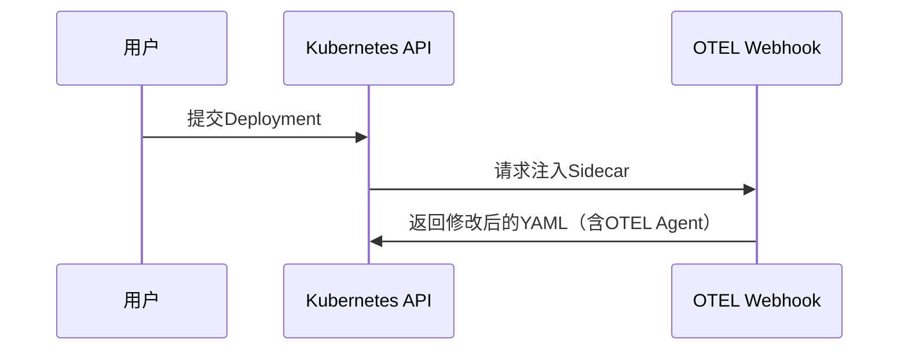

# OpenTelemetry 与容器编排

## 介绍

在现代云原生应用中，容器编排工具（如Kubernetes）和可观测性工具（如OpenTelemetry）是两大核心技术。OpenTelemetry作为CNCF的标准化观测框架，能够无缝集成到容器编排平台中，帮助开发者收集、分析和可视化应用的** traces（追踪）**、**metrics（指标）**和**logs（日志）**。本文将介绍如何将OpenTelemetry与容器编排结合使用。

:::note 关键概念
- **容器编排**：自动化管理容器的部署、扩展和网络（如Kubernetes）。
- **OpenTelemetry**：跨语言的观测数据（追踪、指标、日志）收集和导出框架。
:::

---

## 为什么需要OpenTelemetry + 容器编排？

在动态的容器化环境中，服务实例可能随时被创建或销毁。传统监控工具难以跟踪这种动态性，而OpenTelemetry通过以下方式解决问题：
1. **自动注入探针**：通过Sidecar或Init容器动态注入OpenTelemetry Collector。
2. **统一数据格式**：所有服务使用OTLP（OpenTelemetry Protocol）格式上报数据。
3. **上下文传播**：跨服务的请求链路追踪（Trace Context Propagation）。

---

## 核心组件

### 1. OpenTelemetry Collector
作为数据处理的中间层，部署在集群内或集群外：
```yaml
# Kubernetes中部署Collector的示例（Deployment片段）
containers:
- name: otel-collector
  image: otel/opentelemetry-collector
  ports:
    - containerPort: 4317  # OTLP gRPC端口
```

### 2. 自动Instrumentation
通过Kubernetes Admission Controller自动注入SDK：


:::tip 实践建议
使用OpenTelemetry Operator可简化Instrumentation注入过程：
```bash
kubectl apply -f https://github.com/open-telemetry/opentelemetry-operator/releases/latest/download/opentelemetry-operator.yaml
```
:::

---

## 实战案例：追踪Kubernetes中的微服务

### 场景描述
一个由`frontend`和`backend`服务组成的应用，需要追踪跨服务的HTTP请求。

### 步骤1：注入SDK
通过注解启用自动Instrumentation：
```yaml
# frontend-deployment.yaml
annotations:
  instrumentation.opentelemetry.io/inject-sdk: "true"
```

### 步骤2：配置Exporter
环境变量指定OTLP端点：
```yaml
env:
- name: OTEL_EXPORTER_OTLP_ENDPOINT
  value: "http://otel-collector:4317"
```

### 步骤3：验证追踪数据
在Jaeger或Zipkin中查看生成的追踪链：
```
frontend (HTTP GET /api) → backend (POST /process)
```

---

## 常见问题

:::warning 注意
1. **性能开销**：高频采样可能影响性能，建议动态调整采样率。
2. **数据存储**：确保后端存储（如Prometheus、Jaeger）有足够资源。
:::

---

## 总结

通过OpenTelemetry与容器编排的集成，开发者可以：
- 实现**端到端追踪**，快速定位跨服务问题。
- 动态监控**容器生命周期**中的指标变化。
- 标准化观测数据，避免厂商锁定。

---

## 扩展资源

1. [OpenTelemetry官方文档](https://opentelemetry.io/docs/)
2. [Kubernetes Operator for OpenTelemetry](https://github.com/open-telemetry/opentelemetry-operator)
3. 练习：在Minikube中部署一个带OpenTelemetry的Nginx服务并导出指标。