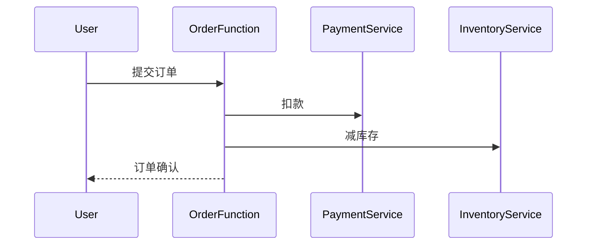

# OpenTelemetry 与无服务器环境

## 介绍

无服务器（Serverless）架构通过事件驱动的方式运行代码，无需管理底层基础设施。然而，这种高度动态的环境使得传统的监控工具难以追踪请求流和性能问题。OpenTelemetry作为云原生的可观测性框架，能够无缝集成无服务器环境，提供**分布式追踪**、**指标收集**和**日志记录**能力。

:::note 关键概念
- **无服务器环境**：AWS Lambda、Azure Functions等。
- **OpenTelemetry**：CNCF项目，统一了追踪、指标和日志的采集标准。
:::

---

## 为什么需要OpenTelemetry？

在无服务器架构中，函数实例的短暂生命周期和自动扩缩容特性导致：
1. 请求链路难以追踪。
2. 跨服务依赖不透明。
3. 性能瓶颈定位困难。

OpenTelemetry通过以下方式解决这些问题：
- **自动注入追踪上下文**（如TraceID）。
- **轻量级SDK**适配函数运行时。
- **与后端解耦**（支持Jaeger、Prometheus等）。

---

## 代码示例：AWS Lambda集成

以下是一个Node.js AWS Lambda函数集成OpenTelemetry的示例：

```javascript
const { NodeTracerProvider } = require('@opentelemetry/sdk-trace-node');
const { AWSXRayPropagator } = require('@opentelemetry/propagator-aws-xray');
const { SimpleSpanProcessor } = require('@opentelemetry/sdk-trace-base');
const { OTLPTraceExporter } = require('@opentelemetry/exporter-trace-otlp-http');

// 初始化Tracer
const provider = new NodeTracerProvider();
provider.register({
  propagator: new AWSXRayPropagator(),
});

// 配置导出到Jaeger
const exporter = new OTLPTraceExporter({ url: 'http://jaeger:4318/v1/traces' });
provider.addSpanProcessor(new SimpleSpanProcessor(exporter));

// Lambda处理函数
exports.handler = async (event) => {
  const tracer = provider.getTracer('lambda-tracer');
  return tracer.startActiveSpan('main-handler', (span) => {
    try {
      span.setAttribute('event', JSON.stringify(event));
      // 业务逻辑
      return { statusCode: 200, body: 'Success' };
    } finally {
      span.end();
    }
  });
};
```

**输出效果**：
在Jaeger UI中可以看到完整的调用链，包括Lambda冷启动时间、事件内容和函数执行耗时。

---

## 实际案例：电商订单处理

假设一个无服务器架构的电商系统：
1. 用户下单触发`OrderFunction`。
2. 该函数调用`PaymentService`和`InventoryService`。



通过OpenTelemetry追踪，可以清晰看到：
- 哪个服务导致延迟（如PaymentService超时）。
- 错误源头（如库存不足时的错误日志关联到TraceID）。

---

## 配置要点

1. **采样率控制**：无服务器环境下需降低采样率以避免成本过高。
   ```yaml
   # opentelemetry-config.yaml
   sampler:
     type: parentbased_traceidratio
     ratio: 0.1
   ```

2. **上下文传播**：确保跨函数调用时TraceID正确传递。
   ```javascript
   const { context } = require('@opentelemetry/api');
   const headers = {};
   inject(context.active(), headers); // 注入HTTP头
   ```

3. **冷启动监控**：通过`aws.lambda.cold_start`属性标记冷启动。

---

## 总结

OpenTelemetry为无服务器环境提供了：
- **端到端可视化**：跨函数/服务的请求链路。
- **低侵入性**：通过SDK自动集成。
- **多后端支持**：灵活对接现有监控系统。

:::tip 练习建议
1. 在AWS Lambda中部署上述代码示例。
2. 使用Jaeger查询包含`cold_start=true`的追踪记录。
3. 尝试为Lambda错误配置警报（基于OpenTelemetry指标）。
:::

**扩展阅读**：
- [OpenTelemetry官方无服务器指南](https://opentelemetry.io/docs/concepts/serverless/)
- 《Distributed Tracing in Practice》第6章