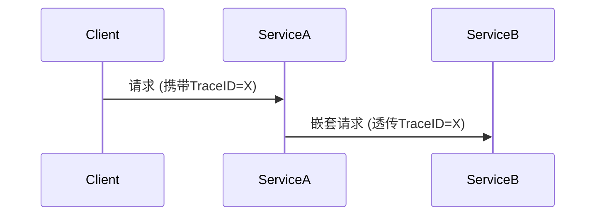

# OpenTelemetry API概述

## 介绍

OpenTelemetry（简称OTel）是一个**开源的可观测性框架**，用于生成、收集和管理**遥测数据**（如指标、日志和追踪）。其API层是开发者直接交互的核心接口，允许应用程序以供应商中立的方式**嵌入观测代码**。无论你使用什么后端系统（如Prometheus、Jaeger等），OpenTelemetry API都能保持一致性。

:::note 关键术语
- **Span**：代表一个工作单元（例如一次函数调用）。
- **Trace**：一组关联的Span，描述请求的完整生命周期。
- **Meter**：创建和记录指标的接口。
:::

## 核心组件

OpenTelemetry API包含以下主要模块：

### 1. 追踪（Tracing）
用于记录请求在分布式系统中的流动。例如，跟踪HTTP请求从前端到后端服务的路径。

```javascript
// JavaScript示例：创建Span
const { trace } = require('@opentelemetry/api');
const tracer = trace.getTracer('my-service-tracer');

// 开始一个Span
const span = tracer.startSpan('handle-request');
span.setAttribute('http.method', 'GET');
// ...执行操作...
span.end(); // 结束Span
```

### 2. 指标（Metrics）
用于记录数值型数据，如请求速率、错误计数等。

```python
# Python示例：记录指标
from opentelemetry import metrics

meter = metrics.get_meter("my.meter")
counter = meter.create_counter("requests.count")
counter.add(1, {"route": "/home"})  # 记录一次访问
```

### 3. 上下文传播（Context Propagation）
跨服务传递追踪上下文（如TraceID），确保分布式链路完整。



## 实际应用场景

### 案例：电商订单流程
假设用户下单时，系统需要调用：
1. 库存服务
2. 支付服务
3. 物流服务

通过OpenTelemetry API，你可以：
- 为整个订单流程创建**Trace**。
- 每个服务调用生成独立**Span**。
- 记录关键指标（如支付耗时）。

:::tip 调试技巧
在开发环境中，使用`ConsoleSpanExporter`直接打印追踪数据：
```go
// Go示例：控制台输出
import "go.opentelemetry.io/otel/exporters/stdout/stdouttrace"

exporter, _ := stdouttrace.New(stdouttrace.WithPrettyPrint())
```
:::

## 总结

OpenTelemetry API通过标准化接口：
- 解耦观测代码与具体实现
- 支持多语言（JavaScript/Python/Go等）
- 提供**追踪、指标、上下文**三大核心功能

## 延伸资源
1. [官方文档](https://opentelemetry.io/docs/)
2. 练习：尝试在本地启动一个Jaeger实例，并导出追踪数据。
3. 进阶：探索`Baggage`（跨服务传递自定义元数据）的用法。
