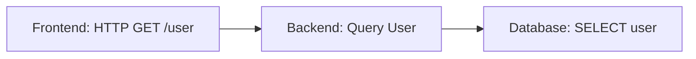

# OpenTelemetry 跟踪API

## 介绍

OpenTelemetry跟踪API是OpenTelemetry项目的一部分，它提供了一套标准化的工具和接口，用于在分布式系统中生成、收集和管理**跟踪数据**（traces）。跟踪数据帮助开发者理解请求在多个服务间的流转路径，从而诊断延迟问题和性能瓶颈。

对于初学者来说，跟踪API的核心概念包括：
- **Span**：代表一个操作或工作单元（例如，一个HTTP请求或数据库查询）。
- **Trace**：一组相关的Span，代表一个完整的请求流程。
- **Context Propagation**：在服务间传递跟踪信息（例如Trace ID）。

:::tip
OpenTelemetry是**云原生计算基金会（CNCF）**的项目，旨在统一分布式追踪、指标和日志的收集。
:::

---

## 核心概念

### 1. Span
**Span**是跟踪的基本单位，代表一个操作。每个Span包含：
- 操作名称（如 `"HTTP GET /users"`）
- 开始和结束时间戳
- 键值对形式的属性（如 `{"http.method": "GET"}`）
- 状态（成功、失败或未设置）

#### 示例：创建一个Span
```javascript
const { trace } = require('@opentelemetry/api');

// 获取Tracer
const tracer = trace.getTracer('my-service-tracer');

// 启动一个Span
const span = tracer.startSpan('fetch-user-data');

// 添加属性
span.setAttribute('user.id', 123);

// 模拟一个操作
setTimeout(() => {
  // 结束Span
  span.end();
}, 1000);
```

### 2. Trace
**Trace**是一组关联的Span，表示一个端到端的请求。例如，一个用户请求从前端到后端，再到数据库的所有Span会组成一个Trace。



### 3. Context Propagation
为了关联跨服务的Span，OpenTelemetry使用**上下文传播**（Context Propagation）。常见的传播方式包括：
- **W3C Trace Context**（通过HTTP头传递）
- **B3 Propagation**（Zipkin兼容）

---

## 实际案例：跟踪HTTP请求

假设你有一个Node.js服务，需要跟踪用户请求的延迟：

```javascript
const express = require('express');
const { trace } = require('@opentelemetry/api');

const app = express();
const tracer = trace.getTracer('http-tracer');

app.get('/users/:id', async (req, res) => {
  // 启动一个Span
  const span = tracer.startSpan('GET /users/:id');
  span.setAttribute('http.route', '/users/:id');
  
  try {
    // 模拟数据库查询
    const user = await getUserFromDB(req.params.id);
    span.setStatus({ code: trace.SpanStatusCode.OK });
    res.json(user);
  } catch (err) {
    span.setStatus({ code: trace.SpanStatusCode.ERROR });
    res.status(500).send('Error');
  } finally {
    span.end();
  }
});

app.listen(3000);
```

:::note
实际项目中，OpenTelemetry的**自动 instrumentation**（如 `@opentelemetry/instrumentation-express`）可以自动生成Span，无需手动编码。
:::

---

## 总结

OpenTelemetry跟踪API的核心功能包括：
1. **生成Span**：记录操作的开始、结束和元数据。
2. **关联Trace**：通过上下文传播链接跨服务的Span。
3. **导出数据**：将跟踪数据发送到后端（如Jaeger或Zipkin）。

---

## 附加资源

1. [OpenTelemetry官方文档](https://opentelemetry.io/docs/)
2. 练习：尝试用OpenTelemetry跟踪一个Express路由的延迟。
3. 扩展阅读：学习如何将跟踪数据导出到Jaeger。

:::caution
确保在生产环境中合理采样（Sampling），避免生成过多跟踪数据导致性能问题！
:::