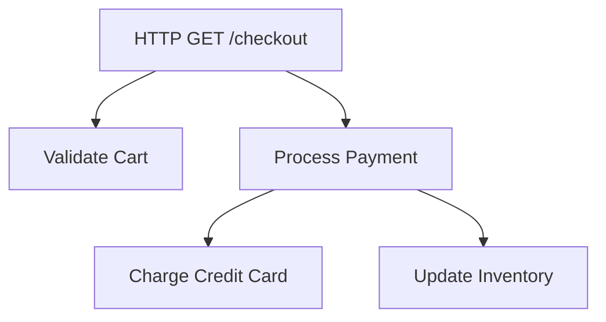

# OpenTelemetry API最佳实践

## 介绍

OpenTelemetry是一组用于生成、收集和管理遥测数据（指标、日志和追踪）的API、SDK和工具。作为CNCF毕业项目，它已成为云原生可观测性的标准解决方案。本文将重点介绍**OpenTelemetry API**的核心使用模式和实践建议。

:::tip 关键概念
OpenTelemetry API提供与供应商无关的接口，允许你：
- 生成追踪数据（Traces）
- 收集应用指标（Metrics）
- 记录结构化日志（Logs）
:::

## 基础配置最佳实践

### 1. 初始化设置

始终在应用启动时初始化全局的`TracerProvider`和`MeterProvider`：

```javascript
const { NodeTracerProvider } = require('@opentelemetry/sdk-trace-node');
const { MeterProvider } = require('@opentelemetry/sdk-metrics');

const tracerProvider = new NodeTracerProvider();
tracerProvider.register();

const meterProvider = new MeterProvider();
```

### 2. 资源定义

为你的服务明确定义资源属性，这些元数据将附加到所有遥测数据：

```javascript
const { Resource } = require('@opentelemetry/resources');
const { SemanticResourceAttributes } = require('@opentelemetry/semantic-conventions');

const resource = new Resource({
  [SemanticResourceAttributes.SERVICE_NAME]: 'payment-service',
  [SemanticResourceAttributes.SERVICE_VERSION]: '1.0.0',
  'deployment.environment': 'production'
});
```

## 追踪(Tracing)最佳实践

### 1. 创建有意义的Span

```javascript
const tracer = trace.getTracer('shop-api');

// 不好的实践 - 无意义的span名称
tracer.startSpan('process-data');

// 好的实践 - 具体操作和业务上下文
tracer.startSpan('process_payment', {
  attributes: {
    'payment.amount': 100,
    'payment.currency': 'USD'
  }
});
```

### 2. 合理的Span层次结构



对应的代码实现：

```javascript
async function checkout(req, res) {
  const parentSpan = tracer.startSpan('HTTP GET /checkout');
  
  try {
    const cartSpan = tracer.startSpan('Validate Cart', {
      parent: parentSpan
    });
    // 验证逻辑...
    cartSpan.end();

    const paymentSpan = tracer.startSpan('Process Payment', {
      parent: parentSpan
    });
    await processPayment(paymentSpan);
    paymentSpan.end();
    
    parentSpan.setStatus({ code: SpanStatusCode.OK });
  } catch (err) {
    parentSpan.recordException(err);
    parentSpan.setStatus({ 
      code: SpanStatusCode.ERROR,
      message: err.message 
    });
  } finally {
    parentSpan.end();
  }
}
```

## 指标(Metrics)最佳实践

### 1. 定义有业务意义的指标

```javascript
const meter = meterProvider.getMeter('shop-api');
const requestCounter = meter.createCounter('http.server.requests', {
  description: 'Count of incoming HTTP requests',
  unit: '1'
});

// 在请求处理中记录
requestCounter.add(1, {
  'http.method': 'GET',
  'http.route': '/checkout',
  'http.status_code': 200
});
```

### 2. 使用直方图记录延迟

```javascript
const responseTimeHistogram = meter.createHistogram('http.server.response_time', {
  description: 'Response time in milliseconds',
  unit: 'ms'
});

// 记录响应时间
const startTime = Date.now();
// ...处理请求...
responseTimeHistogram.record(Date.now() - startTime, {
  'http.route': '/api/products'
});
```

## 上下文传播最佳实践

### 1. 跨服务传播上下文

```javascript
// 客户端发送请求
const { context, propagation } = require('@opentelemetry/api');

const outgoingRequest = new Request('http://inventory/update');
propagation.inject(context.active(), outgoingRequest.headers);

// 服务端接收请求
const incomingContext = propagation.extract(context.active(), incomingRequest.headers);
context.with(incomingContext, () => {
  // 在此上下文中创建的所有span将自动关联
});
```

## 错误处理实践

### 1. 正确记录异常

```javascript
try {
  // 业务逻辑
} catch (err) {
  const activeSpan = trace.getActiveSpan();
  if (activeSpan) {
    activeSpan.recordException(err);
    activeSpan.setStatus({ code: SpanStatusCode.ERROR });
  }
  throw err;
}
```

## 真实案例：电商订单流程

以下是一个电商系统中订单处理流程的完整示例：

```javascript
const { trace, context } = require('@opentelemetry/api');

async function createOrder(userId, items) {
  const tracer = trace.getTracer('order-service');
  const span = tracer.startSpan('create_order', {
    attributes: {
      'user.id': userId,
      'order.item_count': items.length
    }
  });

  try {
    // 1. 验证库存
    await verifyInventory(items, span);
    
    // 2. 计算总价
    const total = calculateTotal(items);
    span.setAttribute('order.total_amount', total);
    
    // 3. 处理支付
    await processPayment(userId, total, span);
    
    // 4. 创建订单记录
    const orderId = await saveOrderToDB(userId, items, span);
    
    span.setStatus({ code: SpanStatusCode.OK });
    return orderId;
  } catch (error) {
    span.recordException(error);
    span.setStatus({ 
      code: SpanStatusCode.ERROR,
      message: error.message 
    });
    throw error;
  } finally {
    span.end();
  }
}
```

## 总结

遵循这些OpenTelemetry API最佳实践将帮助你：

- 生成更有价值的遥测数据
- 保持跨服务的一致性
- 降低对特定供应商的依赖
- 简化故障排查过程

:::note 关键要点
1. 始终为span和指标提供有意义的名称和属性
2. 正确处理上下文传播以实现端到端追踪
3. 记录足够的业务上下文，但避免敏感数据
4. 统一错误处理模式
:::

## 附加资源

1. [OpenTelemetry官方文档](https://opentelemetry.io/docs/)
2. [语义约定(Semantic Conventions)](https://github.com/open-telemetry/opentelemetry-specification/tree/main/specification)
3. [CNCF可观测性白皮书](https://github.com/cncf/tag-observability)

## 练习

1. 为你的现有服务添加OpenTelemetry instrumentation
2. 创建一个包含至少3个嵌套span的业务流程
3. 定义一个记录关键业务指标的计数器
4. 实现跨两个微服务的上下文传播

通过实践这些练习，你将更好地掌握OpenTelemetry API的实际应用。