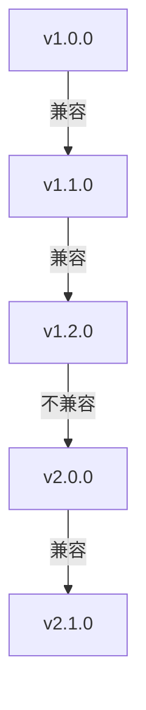

## 介绍

OpenTelemetry是一个开源的观测性框架，用于生成、收集和导出遥测数据（如指标、日志和追踪）。随着项目的演进，API的版本控制变得至关重要，以确保向后兼容性并平滑过渡到新功能。本文将介绍OpenTelemetry API的版本控制机制，帮助初学者理解如何管理版本变更。

## 为什么需要版本控制？

API版本控制允许开发者在引入新功能或修复问题时，不影响现有代码的稳定性。OpenTelemetry采用[语义化版本控制（SemVer）](https://semver.org/)，即版本号格式为`MAJOR.MINOR.PATCH`：

- **MAJOR**：不兼容的API变更
- **MINOR**：向后兼容的功能新增
- **PATCH**：向后兼容的问题修复

:::tip
始终检查OpenTelemetry的[官方发布说明](https://github.com/open-telemetry/opentelemetry-specification/releases)以了解版本变更细节。
:::

## 版本控制策略

### 1. 包版本管理
OpenTelemetry的每个组件（如`opentelemetry-api`、`opentelemetry-sdk`）独立发布版本。例如：

```bash
# 安装特定版本的API包
npm install @opentelemetry/api@1.4.1
```

### 2. API稳定性级别
OpenTelemetry标记API的稳定性级别：
- **Stable**：主版本≥1.0，保证向后兼容
- **Experimental**：可能在未来版本中变更
- **Deprecated**：即将移除的API

```typescript
// 示例：标记为Experimental的API
import { metrics } from '@opentelemetry/api';
const meter = metrics.getMeter('experimental-demo');
```

## 版本迁移示例

### 从v1.3.0迁移到v1.4.0
假设我们需要更新一个简单的追踪示例：

```typescript
// v1.3.0
import { trace } from '@opentelemetry/api';
const tracer = trace.getTracer('old-version');

// v1.4.0（新增了span属性）
const tracer = trace.getTracer('new-version', '1.4.0');
```

:::note
MINOR版本更新通常只需检查新功能，而MAJOR版本更新可能需要代码修改。
:::

## 实际案例：电商平台升级

某电商平台从OpenTelemetry JavaScript v1.2.0升级到v1.6.0的步骤：

1. **测试环境验证**：
   ```bash
   npm install @opentelemetry/api@1.6.0 --save-exact
   ```
2. **检查废弃警告**：
   ```bash
   npm run test | grep "deprecated"
   ```
3. **更新配置**：
   ```javascript
   // 新版本支持环境变量自动配置
   new NodeTracerProvider({
     resource: Resource.default().merge(new Resource({
       'service.version': process.env.APP_VERSION
     }))
   });
   ```

## 版本兼容性图表



## 总结

OpenTelemetry的版本控制机制帮助开发者：
- 清晰识别API变更影响
- 平滑过渡到新版本
- 保持生产环境稳定性

## 附加资源

1. [官方版本控制规范](https://github.com/open-telemetry/opentelemetry-specification/blob/main/specification/versioning-and-stability.md)
2. 练习：尝试在本地项目中升级一个MINOR版本并测试兼容性
3. 使用`npm outdated`检查依赖版本