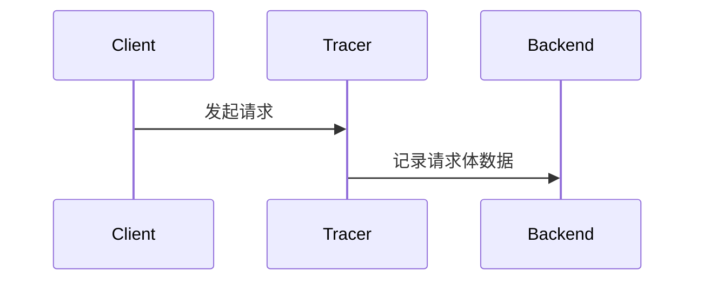

# OpenTelemetry API扩展

OpenTelemetry是一个开源的观测性框架，用于生成、收集和管理遥测数据（如指标、日志和跟踪）。通过扩展其API，开发者可以定制数据收集行为，适配特定业务需求。本文将介绍如何利用OpenTelemetry API扩展功能。

## 什么是API扩展？

OpenTelemetry API扩展允许开发者通过以下方式增强默认行为：
1. **自定义采样策略**：决定哪些请求需要记录。
2. **添加上下文信息**：在跟踪和指标中注入业务相关数据。
3. **修改导出流程**：过滤或转换数据后再发送到后端。

---

## 基础扩展示例

### 1. 自定义采样器
以下是一个拒绝所有请求的简单采样器实现：

```javascript
const { Sampler, SamplingDecision } = require('@opentelemetry/api');

class DenyAllSampler extends Sampler {
  shouldSample(context, traceId, spanName) {
    return { decision: SamplingDecision.NOT_RECORD };
  }
}

// 使用自定义采样器
const tracerProvider = new NodeTracerProvider({
  sampler: new DenyAllSampler(),
});
```

**输入**：任何跟踪请求<br />
**输出**：所有请求均不被记录

:::tip 实际场景
在测试环境中使用此采样器可减少无关数据。
:::

---

### 2. 添加上下文属性
通过`SpanProcessor`在跨度创建时添加固定信息：

```javascript
const { SimpleSpanProcessor } = require('@opentelemetry/sdk-trace-base');

class EnvSpanProcessor extends SimpleSpanProcessor {
  onStart(span) {
    span.setAttribute('deployment.env', process.env.NODE_ENV);
  }
}

// 注册处理器
tracerProvider.addSpanProcessor(new EnvSpanProcessor());
```

---

## 进阶扩展：跟踪增强

### 案例：记录HTTP请求体
通过拦截器捕获HTTP请求数据：

```javascript
const api = require('@opentelemetry/api');

function setupBodyCapture() {
  api.diag.setLogger(new api.DiagConsoleLogger(), api.DiagLogLevel.DEBUG);
  
  api.trace.getTracer('http-tracer')
    .startActiveSpan('http-request', span => {
      const reqBody = getRequestBody(); // 自定义获取逻辑
      span.setAttribute('http.request.body', reqBody);
    });
}
```



---

## 总结

| 扩展类型       | 适用场景                  | 关键API                 |
|----------------|--------------------------|-------------------------|
| 自定义采样器   | 控制数据量                | `Sampler`               |
| 上下文处理器   | 添加环境信息              | `SpanProcessor`         |
| 拦截器         | 捕获业务数据              | `getTracer().startSpan` |

:::note 练习建议
1. 创建一个采样器，仅记录包含特定HTTP头的请求。
2. 实现一个处理器，在跨度中添加当前用户ID。
:::

**扩展阅读**：
- [OpenTelemetry官方文档](https://opentelemetry.io/docs/)
- 《分布式系统可观测性》第三章