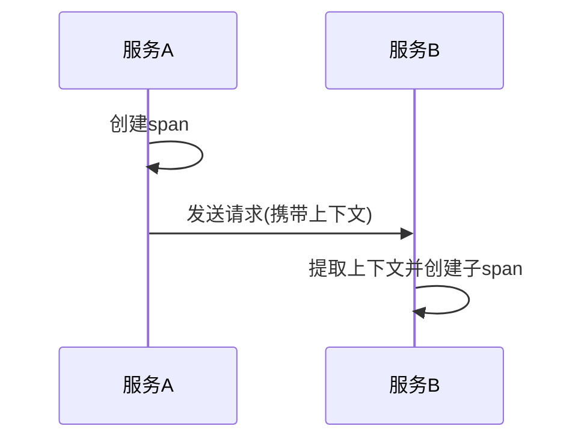
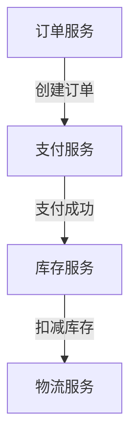

# OpenTelemetry API高级用法

## 介绍

OpenTelemetry是一个开源的观测性框架，用于生成、收集和管理遥测数据（如指标、日志和追踪）。在掌握了基础用法后，你可能需要更高级的功能来满足复杂场景的需求。本文将介绍OpenTelemetry API的一些高级用法，帮助你更有效地利用这个强大的工具。

## 自定义指标

OpenTelemetry不仅支持基础的计数器（Counter）和测量值（Gauge），还允许你创建自定义的指标。

### 示例：创建自定义计数器

```python
from opentelemetry import metrics
from opentelemetry.sdk.metrics import MeterProvider

# 初始化MeterProvider
metrics.set_meter_provider(MeterProvider())
meter = metrics.get_meter(__name__)

# 创建自定义计数器
request_counter = meter.create_counter(
    "requests.count",
    description="统计请求次数",
    unit="1"
)

# 使用计数器
request_counter.add(1, {"endpoint": "/api/users"})
```

**输出结果**：
这个计数器会记录每个端点的请求次数，数据可以被导出到Prometheus或其他监控系统。

:::tip
自定义指标时，确保为每个指标添加清晰的描述和单位，这有助于后续的数据分析。
:::

## 分布式追踪上下文传播

在微服务架构中，追踪一个请求跨多个服务的路径至关重要。OpenTelemetry提供了上下文传播机制来实现这一点。

### 示例：手动传播上下文

```python
from opentelemetry import trace
from opentelemetry.propagate import inject, extract
from opentelemetry.trace.propagation.tracecontext import TraceContextTextMapPropagator

# 服务A：生成并传播上下文
def service_a():
    tracer = trace.get_tracer(__name__)
    with tracer.start_as_current_span("service_a_span") as span:
        headers = {}
        inject(headers)  # 将上下文注入到headers中
        # 将headers发送给服务B
        service_b(headers)

# 服务B：接收并使用上下文
def service_b(headers):
    ctx = extract(headers)
    tracer = trace.get_tracer(__name__)
    with tracer.start_as_current_span("service_b_span", context=ctx):
        print("在服务B中继续追踪")
```

**工作原理**：
1. 服务A创建一个span并生成追踪上下文。
2. 上下文通过HTTP头传播到服务B。
3. 服务B提取上下文并继续追踪。



## 日志增强

OpenTelemetry可以与日志系统集成，为日志添加丰富的追踪信息。

### 示例：将追踪ID添加到日志

```python
import logging
from opentelemetry import trace

logger = logging.getLogger(__name__)

def handle_request():
    current_span = trace.get_current_span()
    if current_span:
        trace_id = current_span.get_span_context().trace_id
        logger.info("处理请求", extra={"trace_id": trace_id})
    else:
        logger.info("处理请求（无追踪上下文）")
```

**输出日志**：
```
INFO:__main__:处理请求 {'trace_id': 'abc123...'}
```

## 实际应用场景

### 电商平台的订单处理

在一个电商平台中，订单处理涉及多个服务：
1. 订单服务
2. 支付服务
3. 库存服务
4. 物流服务

使用OpenTelemetry的高级功能可以实现：
- 跨服务追踪订单状态
- 监控各服务的性能指标
- 关联系统日志与特定订单



## 总结

OpenTelemetry API的高级功能可以帮助你：
- 创建自定义指标监控特定业务数据
- 实现跨服务的分布式追踪
- 增强日志信息以便于问题排查

## 进一步学习

1. 官方文档：[OpenTelemetry Python文档](https://opentelemetry.io/docs/instrumentation/python/)
2. 练习：尝试在你的微服务项目中实现跨服务追踪
3. 扩展阅读：《分布式系统观测性实践》

:::caution
在生产环境使用前，务必测试所有自定义指标和追踪配置，确保它们不会对系统性能产生负面影响。
:::