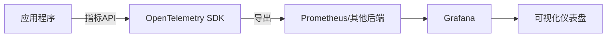

# OpenTelemetry 指标API

## 介绍

OpenTelemetry指标API是OpenTelemetry项目的一部分，用于收集、处理和导出应用程序的指标数据。指标是系统行为的量化测量，例如请求速率、错误率或资源使用情况。通过指标API，开发者可以轻松监控应用程序的性能和健康状况。

:::note
OpenTelemetry是一个开源的观测性框架，提供了一套统一的API、SDK和工具，用于收集、处理和导出遥测数据（指标、日志和追踪）。
:::

## 基本概念

### 指标类型

OpenTelemetry指标API支持以下主要指标类型：

1. **计数器（Counter）**：单调递增的数值，例如请求计数。
2. **上下计数器（UpDownCounter）**：可增可减的数值，例如当前活跃连接数。
3. **直方图（Histogram）**：记录值的分布，例如请求延迟。
4. **测量值（Gauge）**：异步收集的瞬时值，例如CPU使用率。

### 核心组件

1. **MeterProvider**：创建和管理`Meter`实例的工厂。
2. **Meter**：用于创建指标工具（如计数器、直方图等）。
3. **指标工具（Instrument）**：具体的指标类型实例（如`Counter`、`Histogram`等）。

## 代码示例

### 初始化MeterProvider

以下示例展示了如何初始化一个简单的`MeterProvider`：

```javascript
const { MeterProvider } = require('@opentelemetry/metrics');
const meterProvider = new MeterProvider();

// 设置全局MeterProvider
const { metrics } = require('@opentelemetry/api');
metrics.setGlobalMeterProvider(meterProvider);
```

### 创建和使用计数器

```javascript
const meter = metrics.getMeter('example-meter');

// 创建一个计数器
const requestCounter = meter.createCounter('requests', {
  description: 'Count of incoming requests'
});

// 在请求处理中递增计数器
function handleRequest() {
  requestCounter.add(1);
  // 处理请求...
}
```

### 记录直方图数据

```javascript
const responseTimeHistogram = meter.createHistogram('response_time', {
  description: 'Response time in milliseconds',
  unit: 'ms',
  boundaries: [0, 100, 200, 500, 1000] // 自定义桶边界
});

function processRequest() {
  const startTime = Date.now();
  // 处理请求...
  const duration = Date.now() - startTime;
  responseTimeHistogram.record(duration);
}
```

## 实际应用场景

### 监控Web应用性能

假设你有一个Express.js应用，可以使用指标API监控：

1. 请求速率
2. 响应时间分布
3. 错误率

```javascript
const express = require('express');
const app = express();

const meter = metrics.getMeter('express-meter');
const requestCounter = meter.createCounter('http_requests');
const errorCounter = meter.createCounter('http_errors');
const latencyHistogram = meter.createHistogram('http_latency');

app.use((req, res, next) => {
  const start = Date.now();
  requestCounter.add(1);
  
  res.on('finish', () => {
    if(res.statusCode >= 400) {
      errorCounter.add(1);
    }
    latencyHistogram.record(Date.now() - start);
  });
  
  next();
});
```

### 系统资源监控

```javascript
const os = require('os');
const meter = metrics.getMeter('system-monitor');

// 创建Gauge来监控CPU使用率
const cpuUsage = meter.createObservableGauge('cpu_usage', {
  description: 'CPU usage percentage'
});

cpuUsage.addCallback((observableResult) => {
  const cpuLoad = os.loadavg()[0]; // 1分钟平均负载
  observableResult.observe(cpuLoad * 100);
});
```

## 数据可视化

收集的指标数据可以通过Prometheus、Grafana等工具进行可视化和告警。以下是OpenTelemetry指标数据的典型流向：



## 总结

OpenTelemetry指标API提供了一套强大而灵活的工具来收集和导出应用程序指标。通过本文，你学会了：

1. 指标API的基本概念和组件
2. 如何创建和使用不同类型的指标
3. 在实际应用中的典型使用场景

## 进一步学习

1. [OpenTelemetry官方文档](https://opentelemetry.io/docs/)
2. [Prometheus指标格式规范](https://prometheus.io/docs/concepts/data_model/)
3. [Grafana可视化指南](https://grafana.com/docs/grafana/latest/)

## 练习

1. 创建一个简单的Node.js应用，使用指标API记录请求计数和响应时间。
2. 配置OpenTelemetry将指标导出到控制台或Prometheus。
3. 尝试为你的应用添加自定义业务指标（如订单处理数量）。

:::tip
在实际项目中，考虑将指标收集与业务逻辑分离，使用中间件或装饰器模式来减少代码侵入性。
:::