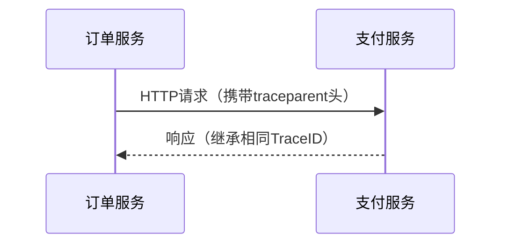

## 介绍

OpenTelemetry上下文API是分布式追踪的核心组件之一，用于在服务间传递**上下文信息**（如TraceID、SpanID、自定义元数据）。它解决了跨进程、跨线程的数据一致性问题，确保分布式系统中的操作能够正确关联。

:::note 关键概念
- **上下文（Context）**：存储当前执行环境的状态（如追踪信息、日志标签）。
- **传播（Propagation）**：将上下文跨服务边界传递（通常通过HTTP头或消息队列属性）。
:::

---

## 核心API与用法

### 1. 创建与获取上下文
使用 `Context` 类管理上下文数据：

```javascript
const { context } = require('@opentelemetry/api');

// 创建空上下文
const emptyContext = context.active();

// 添加键值对到上下文
const key = Symbol('user');
const ctxWithUser = context.setValue(emptyContext, key, { id: '123' });

// 从上下文中读取值
const user = context.getValue(ctxWithUser, key);
console.log(user); // 输出: { id: '123' }
```

### 2. 上下文传播
通过 `propagation` 模块实现跨服务传递：

```javascript
const { propagation } = require('@opentelemetry/api');

// 注入上下文到HTTP请求头
const carrier = {};
propagation.inject(context.active(), carrier, {
  set: (carrier, key, value) => {
    carrier[key.toLowerCase()] = value;
  }
});
console.log(carrier); // 输出包含追踪信息的头（如traceparent）

// 从HTTP头提取上下文
const incomingContext = propagation.extract(
  context.active(),
  carrier,
  {
    get: (carrier, key) => carrier[key.toLowerCase()]
  }
);
```

---

## 实际案例：跨服务追踪

假设有一个订单处理流程，涉及**订单服务**和**支付服务**：



代码实现：
```javascript
// 订单服务（发起请求）
const axios = require('axios');
const { trace, context, propagation } = require('@opentelemetry/api');

async function createOrder() {
  const span = trace.getTracer('order-service').startSpan('create-order');
  const ctx = trace.setSpan(context.active(), span);

  const headers = {};
  propagation.inject(ctx, headers); // 注入追踪头

  await axios.post('https://payment-service/pay', { amount: 100 }, { headers });
  span.end();
}
```

---

## 总结

- **上下文API的作用**：维护分布式系统中的执行状态，确保追踪信息跨服务传递。
- **关键操作**：`context.setValue()`、`propagation.inject()`、`propagation.extract()`。
- **典型场景**：微服务调用链追踪、日志关联、跨线程数据共享。

:::tip 练习建议
1. 尝试在本地启动两个服务，模拟上下文传播过程。
2. 使用 `console.log` 输出上下文内容，观察不同服务的TraceID是否一致。
:::

**扩展阅读**：
- [OpenTelemetry官方文档：Context](https://opentelemetry.io/docs/concepts/context/)
- [W3C Trace Context标准](https://www.w3.org/TR/trace-context/)