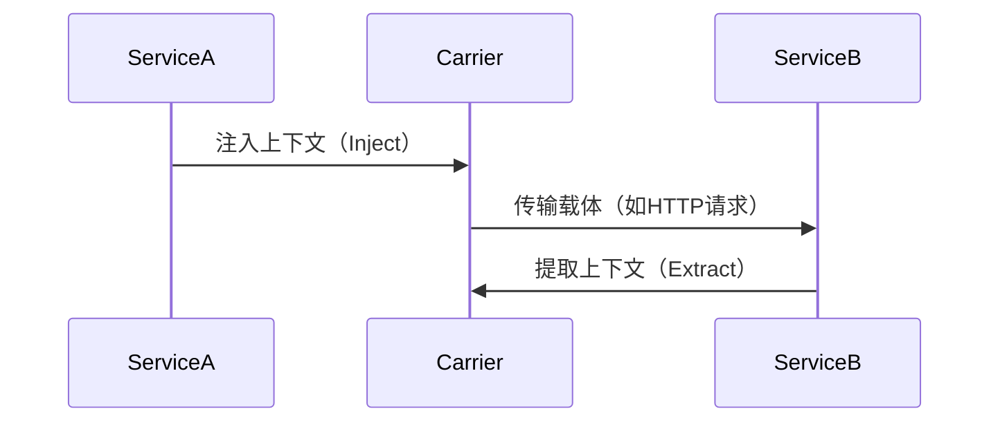

# OpenTelemetry 传播器API

## 介绍

OpenTelemetry传播器API（Propagator API）是OpenTelemetry的核心组件之一，用于在分布式系统中跨服务边界**传递上下文信息**（如Trace ID、Span ID和Baggage）。它解决了微服务架构中**请求链路跟踪**和**上下文共享**的关键问题。

:::tip 为什么需要传播器？
在分布式系统中，一个用户请求可能涉及多个服务。传播器确保这些服务共享相同的跟踪上下文，从而在监控工具中形成完整的调用链。
:::

## 传播器的工作原理

传播器API主要处理两种操作：
1. **注入（Inject）**：将上下文信息写入到传输载体（如HTTP头部）
2. **提取（Extract）**：从传输载体中读取上下文信息



## 核心接口

OpenTelemetry提供了`TextMapPropagator`接口，包含两个关键方法：

```java
public interface TextMapPropagator {
    // 将上下文注入到载体
    <C> void inject(Context context, C carrier, TextMapSetter<C> setter);
    
    // 从载体提取上下文
    <C> Context extract(Context context, C carrier, TextMapGetter<C> getter);
}
```

## 内置传播器类型

OpenTelemetry提供了两种标准传播器：

1. **W3C Trace Context**（推荐）
   - 标准格式：`traceparent`和`tracestate`头部
   - 示例：`traceparent: 00-0af7651916cd43dd8448eb211c80319c-b7ad6b7169203331-01`

2. **B3 Propagation**（Zipkin兼容）
   - 包含`X-B3-TraceId`、`X-B3-SpanId`等头部

## 代码示例

### 1. 设置传播器

```java
// 使用W3C传播器
OpenTelemetrySdk.builder()
    .setPropagators(
        ContextPropagators.create(
            W3CTraceContextPropagator.getInstance()
        )
    )
    .build();
```

### 2. 上下文注入示例

```java
// 创建HTTP请求
HttpURLConnection connection = (HttpURLConnection) url.openConnection();

// 注入上下文
TextMapSetter<HttpURLConnection> setter = (carrier, key, value) -> {
    carrier.setRequestProperty(key, value);
};
propagator.inject(
    Context.current(),
    connection,
    setter
);
```

### 3. 上下文提取示例

```java
TextMapGetter<HttpServletRequest> getter = new TextMapGetter<>() {
    public String get(HttpServletRequest carrier, String key) {
        return carrier.getHeader(key);
    }
    
    public Iterable<String> keys(HttpServletRequest carrier) {
        return Collections.list(carrier.getHeaderNames());
    }
};

Context context = propagator.extract(
    Context.current(),
    request,
    getter
);
```

## 实际应用场景

### 微服务调用链追踪

假设有一个电商系统：
1. 用户服务接收请求，创建初始Span
2. 通过HTTP头部将`traceparent`传播到订单服务
3. 订单服务继续传播到支付服务


### 跨进程消息队列

在Kafka消息中传播上下文：

```java
// 生产者端
Headers headers = new RecordHeaders();
TextMapSetter<Headers> setter = (carrier, key, value) -> {
    carrier.add(key, value.getBytes());
};
propagator.inject(Context.current(), headers, setter);

// 消费者端
TextMapGetter<Headers> getter = new TextMapGetter<>() {
    public String get(Headers carrier, String key) {
        Header header = carrier.lastHeader(key);
        return header != null ? new String(header.value()) : null;
    }
};
Context context = propagator.extract(Context.current(), headers, getter);
```

## 总结

OpenTelemetry传播器API的关键要点：
- 实现了分布式系统中的**上下文传播**机制
- 支持**标准协议**（W3C TraceContext）和**传统协议**（B3）
- 通过**注入/提取**模式与各种传输协议集成
- 是构建完整可观测性系统的**基础组件**

:::caution 常见错误
1. 忘记设置全局传播器（导致上下文丢失）
2. 混合使用不同传播标准（导致解析失败）
3. 未正确处理编码/解码（导致数据损坏）
:::

## 扩展学习

### 推荐练习
1. 尝试实现一个自定义的传播器（如基于gRPC元数据）
2. 比较W3C和B3传播器的头部格式差异
3. 在消息队列（如RabbitMQ）中集成上下文传播

### 官方资源
- [W3C Trace Context规范](https://www.w3.org/TR/trace-context/)
- [OpenTelemetry传播器文档](https://opentelemetry.io/docs/concepts/sdk-configuration/general-sdk-configuration/#propagators)