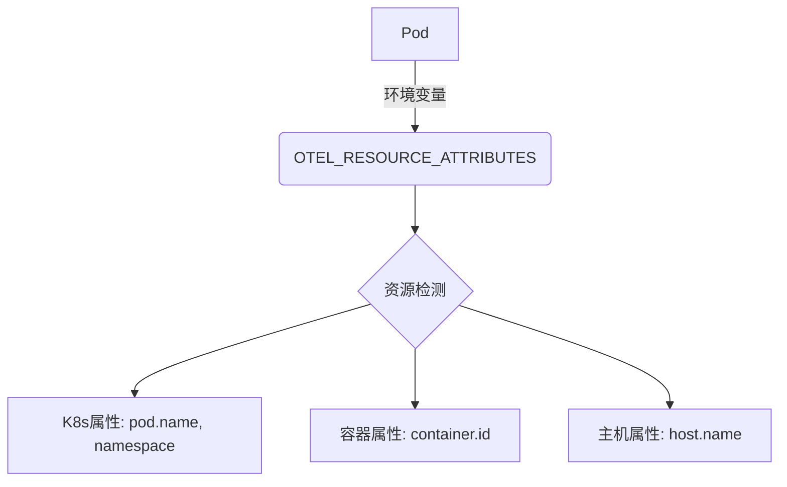

# OpenTelemetry 资源API

## 介绍

OpenTelemetry资源API是OpenTelemetry生态系统中的一个关键组件，它允许你为你的应用程序、服务或基础设施组件添加**标识信息**和**描述性属性**。这些信息会附加到所有生成的遥测数据（如追踪、指标和日志）上，帮助你更好地理解和分析数据来源。

资源（Resource）本质上是一组键值对（attributes），用于描述生成遥测数据的实体。例如：
- 运行服务的云提供商
- 服务名称和版本
- 部署环境（如生产、开发等）
- 主机信息

## 为什么需要资源API？

在分布式系统中，当遥测数据来自多个服务时，如果没有明确的标识，很难确定：
- 哪些数据属于哪个服务
- 数据来自哪个环境或版本
- 基础设施的上下文信息

资源API解决了这些问题，为所有遥测数据提供了统一的上下文。

## 基本用法

### 创建资源

以下是一个基本示例，展示如何创建一个简单的资源：

```javascript
const { Resource } = require('@opentelemetry/resources');
const { SemanticResourceAttributes } = require('@opentelemetry/semantic-conventions');

const resource = new Resource({
  [SemanticResourceAttributes.SERVICE_NAME]: 'shopping-cart',
  [SemanticResourceAttributes.SERVICE_VERSION]: '1.0.0',
  [SemanticResourceAttributes.DEPLOYMENT_ENVIRONMENT]: 'production',
  'custom.attribute': 'custom-value'
});

console.log(resource.attributes);
```

**输出示例**：
```json
{
  "service.name": "shopping-cart",
  "service.version": "1.0.0",
  "deployment.environment": "production",
  "custom.attribute": "custom-value"
}
```

:::note
我们使用了`SemanticResourceAttributes`中的标准属性键，但也可以添加自定义属性。
:::

### 资源检测

OpenTelemetry提供了**资源检测器**来自动发现环境信息：

```javascript
const { detectResources, envDetector, hostDetector } = require('@opentelemetry/resources');

async function setupResource() {
  const resource = await detectResources({
    detectors: [envDetector, hostDetector],
  });
  console.log('Detected resource:', resource.attributes);
}

setupResource();
```

**可能的输出**：
```json
{
  "host.name": "my-host",
  "os.type": "LINUX",
  "cloud.provider": "aws",
  "cloud.region": "us-west-2"
}
```

## 资源合并

当从多个来源获取资源信息时，OpenTelemetry可以合并这些资源：

```javascript
const { Resource } = require('@opentelemetry/resources');

const resource1 = new Resource({ 'service.name': 'auth-service' });
const resource2 = new Resource({ 'service.version': '2.1.0' });

const mergedResource = Resource.merge(resource1, resource2);
console.log(mergedResource.attributes);
```

**输出**：
```json
{
  "service.name": "auth-service",
  "service.version": "2.1.0"
}
```

:::caution
如果合并的资源有相同的键，后合并的资源会覆盖先前的值。
:::

## 实际应用场景

### 场景1：微服务环境

在一个由多个微服务组成的电商平台中，每个服务可以这样配置资源：

```javascript
const { NodeTracerProvider } = require('@opentelemetry/sdk-trace-node');
const { Resource } = require('@opentelemetry/resources');
const { SemanticResourceAttributes } = require('@opentelemetry/semantic-conventions');

const serviceName = 'payment-service';
const serviceVersion = '1.3.2';

const provider = new NodeTracerProvider({
  resource: new Resource({
    [SemanticResourceAttributes.SERVICE_NAME]: serviceName,
    [SemanticResourceAttributes.SERVICE_VERSION]: serviceVersion,
    [SemanticResourceAttributes.DEPLOYMENT_ENVIRONMENT]: process.env.ENV || 'development',
    'team.owner': 'payment-team@company.com'
  }),
});

provider.register();
```

### 场景2：Kubernetes部署

在Kubernetes环境中，可以自动检测并添加集群信息：



```javascript
const { k8sDetector } = require('@opentelemetry/resource-detector-k8s');

async function setupK8sResource() {
  const resource = await detectResources({
    detectors: [k8sDetector],
  });
  console.log('K8s resource:', resource.attributes);
}

setupK8sResource();
```

## 最佳实践

1. **使用语义约定**：尽可能使用`SemanticResourceAttributes`中定义的标准化属性名
2. **包含版本信息**：总是包含服务版本，便于问题排查
3. **环境区分**：明确标识部署环境（production/staging/development）
4. **避免敏感信息**：不要在资源属性中包含密码、密钥等敏感数据
5. **合理合并**：组合使用自动检测和手动指定的资源

## 总结

OpenTelemetry资源API是一个强大工具，可以：

- 为所有遥测数据添加上下文
- 帮助识别数据来源
- 支持更好的数据分析和问题排查
- 通过标准属性实现跨团队一致性

通过合理使用资源API，你可以大大提升分布式系统可观测性的效果。

## 进一步学习

1. 尝试为你的项目添加资源定义
2. 探索不同的资源检测器（AWS、GCP、Azure等）
3. 研究如何在你的观测后端（如Jaeger、Prometheus）中利用资源属性
4. 查看OpenTelemetry官方文档中的[资源语义约定](https://opentelemetry.io/docs/reference/specification/resource/semantic_conventions/)