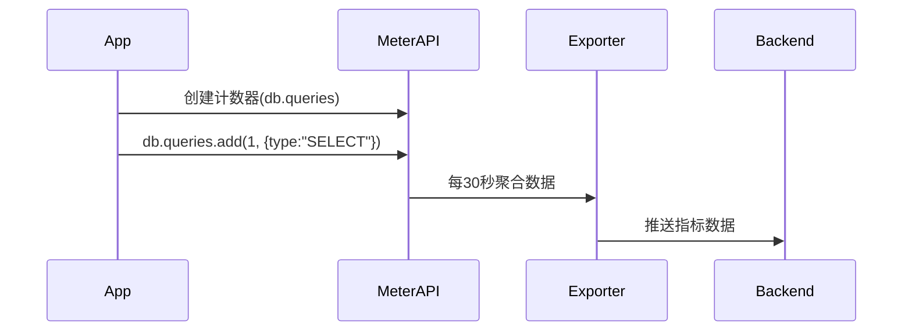

# OpenTelemetry 仪表API

## 简介

OpenTelemetry仪表API（Meter API）是用于生成**指标（Metrics）**的核心工具，它帮助开发者监控应用程序的性能和健康状况。与追踪（Tracing）和日志（Logging）不同，指标专注于聚合数值数据（如请求速率、错误计数等），适用于实时监控和告警。

:::note 关键术语
- **Meter**: 创建指标的工厂对象
- **Instrument**: 具体的指标类型（如计数器、直方图）
- **Measurement**: 指标的单个数据点
:::

---

## 核心概念

### 1. Meter的创建
通过`GetMeter`方法获取Meter实例，通常按库/模块命名：

```javascript
const { metrics } = require('@opentelemetry/api');
const meter = metrics.getMeter('my-service-meter');
```

### 2. 指标类型（Instruments）
OpenTelemetry提供五种基础指标：

| 类型           | 用途                     | 示例                |
|----------------|--------------------------|---------------------|
| Counter        | 累加值（只增不减）       | HTTP请求总数        |
| UpDownCounter  | 可增减的计数器           | 当前活跃连接数      |
| Histogram      | 记录值的分布情况         | 请求延迟分布        |
| ObservableGauge| 回调式获取当前值         | CPU使用率           |
| ObservableCounter | 回调式累加计数器      | 磁盘读取字节数      |

---

## 代码示例

### 计数器（Counter）使用

```javascript
// 创建计数器
const requestCounter = meter.createCounter('http.requests', {
  description: 'Total HTTP requests'
});

// 记录指标
requestCounter.add(1, { route: '/api/users', status: 200 });
```

**输出效果**：
```
http.requests{route="/api/users",status="200"} 1
```

### 直方图（Histogram）示例

```javascript
const responseTimeHistogram = meter.createHistogram('http.response_time', {
  unit: 'ms',
  description: 'Response time distribution'
});

// 记录请求处理时间
const start = Date.now();
// ...处理请求...
responseTimeHistogram.record(Date.now() - start, { method: 'GET' });
```

---

## 实际应用场景

### 场景1：Web服务监控
```javascript
// 中间件示例（Express.js）
app.use((req, res, next) => {
  const start = Date.now();
  requestCounter.add(1, { path: req.path });

  res.on('finish', () => {
    responseTimeHistogram.record(Date.now() - start, {
      status: res.statusCode,
      method: req.method
    });
  });

  next();
});
```

### 场景2：数据库操作监控


---

## 最佳实践

:::tip 指标设计原则
1. **命名规范**：使用`domain.measurement`格式（如`http.requests.count`）
2. **标签（Attributes）**：避免高基数标签（如用户ID）
3. **单位**：始终明确单位（`ms`, `MB`等）
:::

:::caution 常见错误
```javascript
// 错误：标签值动态生成（高基数）
requestCounter.add(1, { user_id: getUserID() });

// 正确：使用有限枚举值
requestCounter.add(1, { user_type: 'premium' });
```
:::

---

## 总结

OpenTelemetry仪表API提供了：
- 标准化的指标生成方式
- 多种基础指标类型
- 灵活的标签系统
- 与导出器（Exporters）的无缝集成

**延伸学习**：
1. 尝试集成Prometheus导出器
2. 创建包含3种指标类型的完整示例
3. 在Grafana中可视化生成的指标

:::warning 提醒
实际部署时需配置指标导出器（如PrometheusExporter）才能看到数据！
:::