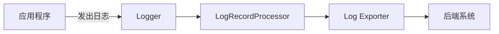

# OpenTelemetry 日志API

## 介绍

OpenTelemetry日志API是OpenTelemetry项目的一部分，用于标准化应用程序的日志记录。它允许开发者以结构化的方式收集、处理和导出日志数据，与其他可观测性信号（如指标和追踪）无缝集成。对于初学者来说，理解日志API是构建可观测性系统的关键第一步。

:::note
**日志**是应用程序运行时产生的文本或结构化记录，用于调试、监控和审计。
:::

## 核心概念

### 1. 日志记录器（Logger）
日志记录器是日志API的核心组件，负责创建和发出日志记录。在OpenTelemetry中，日志记录器通过`LoggerProvider`创建。

### 2. 日志记录（LogRecord）
一条日志记录包含以下字段：
- **时间戳**：日志产生的时间。
- **严重性**（Severity）：如`DEBUG`、`INFO`、`ERROR`等。
- **消息体**：日志的文本内容。
- **属性**（Attributes）：键值对形式的附加元数据。

### 3. 日志导出（Log Exporter）
日志导出器将日志数据发送到后端系统（如Loki、Elasticsearch或控制台）。

## 代码示例

### 初始化日志记录器
以下示例展示如何初始化一个控制台日志记录器：

```javascript
const { diag, DiagConsoleLogger, DiagLogLevel } = require('@opentelemetry/api');
const { LoggerProvider, SimpleLogRecordProcessor } = require('@opentelemetry/sdk-logs');
const { ConsoleLogExporter } = require('@opentelemetry/sdk-logs');

// 启用诊断日志（可选）
diag.setLogger(new DiagConsoleLogger(), DiagLogLevel.DEBUG);

// 创建LoggerProvider并配置导出器
const loggerProvider = new LoggerProvider();
const exporter = new ConsoleLogExporter();
loggerProvider.addLogRecordProcessor(new SimpleLogRecordProcessor(exporter));

// 获取日志记录器
const logger = loggerProvider.getLogger('my-logger');
```

### 记录日志
使用日志记录器发出不同严重级别的日志：

```javascript
logger.emit({
  severityNumber: SeverityNumber.INFO,
  severityText: 'INFO',
  body: 'User logged in successfully',
  attributes: { userId: '123', ip: '192.168.1.1' }
});
```

**输出示例**：
```plaintext
{
  "severityNumber": 9,
  "severityText": "INFO",
  "body": "User logged in successfully",
  "attributes": { "userId": "123", "ip": "192.168.1.1" },
  "timestamp": 1620000000000
}
```

## 实际应用场景

### 场景：电子商务订单处理
假设有一个订单处理服务，需要记录以下事件：
1. 订单创建成功
2. 支付失败
3. 库存不足警告

```javascript
// 订单创建
logger.emit({
  severityText: 'INFO',
  body: 'Order created',
  attributes: { orderId: '456', amount: 99.99 }
});

// 支付失败
logger.emit({
  severityText: 'ERROR',
  body: 'Payment failed',
  attributes: { orderId: '456', error: 'Insufficient funds' }
});
```

## 日志流水线示意图



## 总结

OpenTelemetry日志API提供了一种标准化的方式记录应用程序日志，具有以下优势：
- 结构化日志格式
- 与追踪和指标集成
- 灵活的导出选项

:::tip 练习
1. 尝试将日志导出到文件而非控制台。
2. 为你的Web应用添加错误请求的日志记录。
:::

## 扩展资源
- [OpenTelemetry日志规范](https://github.com/open-telemetry/opentelemetry-specification/blob/main/specification/logs/overview.md)
- [Node.js日志SDK文档](https://github.com/open-telemetry/opentelemetry-js/tree/main/packages/opentelemetry-sdk-logs)