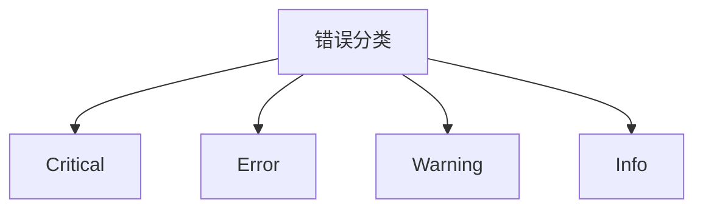

# OpenTelemetry 错误处理

## 介绍

在分布式系统中，错误处理是确保系统稳定性的关键环节。OpenTelemetry作为云原生观测框架，提供了标准化的错误记录和传播机制。本指南将介绍如何通过OpenTelemetry API捕获错误，并将其关联到追踪(trace)和指标(metrics)中。

## 错误记录基础

OpenTelemetry通过两种主要方式处理错误：

1. **Span状态标记**：将Span标记为错误状态
2. **事件记录**：在Span中添加错误事件详情

### 基本错误标记示例

```javascript
const { trace } = require('@opentelemetry/api');

function riskyOperation() {
  const tracer = trace.getTracer('error-demo');
  const span = tracer.startSpan('riskyOperation');
  
  try {
    // 可能抛出异常的操作
    throw new Error('Database connection failed');
  } catch (err) {
    // 标记Span为错误状态
    span.setStatus({
      code: trace.StatusCode.ERROR,
      message: err.message
    });
    
    // 记录错误事件
    span.recordException(err);
    
    throw err;
  } finally {
    span.end();
  }
}
```

## 错误处理进阶技巧

### 1. 错误属性增强

为错误添加自定义属性，便于后续分析：

```javascript
span.recordException(err, {
  'error.type': err.constructor.name,
  'error.stack': err.stack,
  'service.version': '1.0.1'
});
```

### 2. 错误严重度分级



### 3. 跨服务错误传播

在分布式系统中，错误需要跨服务边界传播：

```javascript
// 客户端
const span = tracer.startSpan('clientCall');
try {
  await service.call();
} catch (err) {
  span.setStatus({ code: trace.StatusCode.ERROR });
  span.recordException(err);
  throw err;
} finally {
  span.end();
}

// 服务端
const ctx = propagation.extract(context.active(), carrier);
const span = tracer.startSpan('serverProcess', { kind: SpanKind.SERVER }, ctx);
```

## 实际应用案例

### 案例：电商订单处理

```javascript
async function processOrder(orderId) {
  const span = tracer.startSpan('processOrder');
  
  try {
    const payment = await chargeCreditCard(orderId);
    span.addEvent('payment_processed', { amount: payment.amount });
    
    const inventory = await updateInventory(orderId);
    span.addEvent('inventory_updated');
    
    await sendConfirmationEmail(orderId);
  } catch (err) {
    span.setStatus({ code: trace.StatusCode.ERROR });
    
    // 根据错误类型添加不同属性
    const attributes = {
      'order.id': orderId,
      'error.retryable': isRetryableError(err)
    };
    
    span.recordException(err, attributes);
    logger.error(`Order ${orderId} failed`, { error: err });
    
    // 重试逻辑
    if (isRetryableError(err)) {
      await retryOrder(orderId);
    }
  } finally {
    span.end();
  }
}
```

:::note 最佳实践
1. 始终在错误处理中调用`span.recordException()`
2. 为错误添加业务上下文属性
3. 保持错误消息简洁但信息丰富
4. 避免记录敏感信息
:::

## 总结

OpenTelemetry的错误处理能力可以帮助开发者：

- 可视化错误在分布式系统中的传播路径
- 分析错误发生的上下文环境
- 建立错误与业务指标的关联
- 实现更精准的告警机制

## 扩展资源

1. [OpenTelemetry错误规范文档](https://github.com/open-telemetry/opentelemetry-specification/blob/main/specification/trace/semantic_conventions/exceptions.md)
2. 练习：为你的应用添加错误追踪，并比较添加前后的调试效率差异
3. 进阶：实现错误自动分类和告警集成