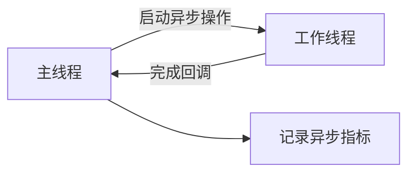

# OpenTelemetry 异步API

## 介绍

OpenTelemetry异步API是用于在非阻塞I/O或并发操作中记录遥测数据的关键组件。它允许开发者在异步代码路径（如回调、Promise或协程）中高效收集追踪（Traces）、指标（Metrics）和日志（Logs），而不会阻塞主线程。这对于现代微服务架构和高性能应用至关重要。

:::note 关键区别
同步API会阻塞调用线程直到操作完成，而异步API通过事件驱动模型实现非阻塞操作。
:::

## 核心概念

### 1. 异步上下文传播
在异步操作中，OpenTelemetry使用`Context`对象跨线程/任务传递追踪上下文。例如：

```javascript
const { context, trace } = require('@opentelemetry/api');

async function asyncOperation() {
  const span = trace.getTracer('example').startSpan('async-work');
  
  await context.with(trace.setSpan(context.active(), span), async () => {
    // 异步操作代码
    span.addEvent('Async event');
    span.end();
  });
}
```

### 2. 异步仪器类型
OpenTelemetry提供专门的异步仪器：

- `Asynchronous Counter`
- `Asynchronous UpDownCounter`
- `Asynchronous Gauge`



## 实际案例

### 案例：Node.js中的数据库查询
```javascript
const { meter } = require('@opentelemetry/api');

// 创建异步计数器
const requestCounter = meter.createObservableCounter('async.requests');

requestCounter.addCallback((result) => {
  result.observe(1, { route: '/data' }); // 异步记录指标
});

async function fetchData() {
  return new Promise((resolve) => {
    setTimeout(() => resolve("Data loaded"), 100);
  });
}
```

## 最佳实践

1. **上下文管理**：始终使用`context.with()`确保上下文正确传播
2. **资源清理**：在异步操作完成后及时结束Span
3. **错误处理**：在Promise.catch中记录错误Span

:::warning 注意
避免在异步回调中直接修改父Span状态，应创建新的子Span
:::

## 总结

OpenTelemetry异步API通过：

- 上下文传播机制保持追踪连续性
- 专用异步仪器记录指标
- 非阻塞设计保障应用性能

## 扩展资源

1. [OpenTelemetry JavaScript文档](https://opentelemetry.io/docs/instrumentation/js/)
2. 练习：尝试在Express中间件中实现异步Span创建
3. 进阶：研究`AsyncHooks`在Node.js中的实现原理