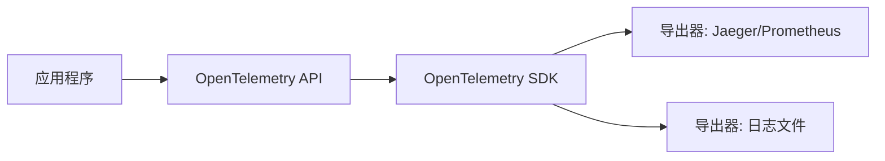
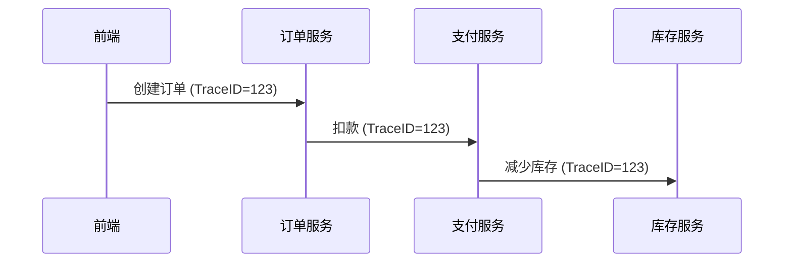

## 介绍

OpenTelemetry SDK 是 [OpenTelemetry](https://opentelemetry.io/) 项目的核心组件之一，用于在应用程序中**自动或手动生成、收集和导出遥测数据**（如 traces、metrics 和 logs）。它为开发者提供了统一的 API 和工具，帮助监控分布式系统的性能和健康状况。

:::note 关键术语
- **Traces（追踪）**：记录请求在分布式系统中的流转路径。
- **Metrics（指标）**：量化系统性能（如 CPU 使用率、请求延迟）。
- **Logs（日志）**：记录离散事件（如错误信息）。
:::

---

## 核心组件

OpenTelemetry SDK 包含以下主要模块：

1. **API 层**：定义遥测数据的生成接口（如创建 Span、记录 Metric）。
2. **SDK 实现层**：提供 API 的具体实现，包括数据处理和导出逻辑。
3. **导出器（Exporters）**：将数据发送到后端（如 Jaeger、Prometheus）。
4. **上下文传播（Context Propagation）**：在服务间传递追踪上下文（如 HTTP Headers）。



---

## 代码示例：基础追踪

以下是一个使用 OpenTelemetry SDK 的 Python 示例，展示如何手动创建一条追踪记录（Trace）：

```python
from opentelemetry import trace
from opentelemetry.sdk.trace import TracerProvider
from opentelemetry.sdk.trace.export import ConsoleSpanExporter, SimpleSpanProcessor

# 1. 初始化 SDK
trace.set_tracer_provider(TracerProvider())
tracer = trace.get_tracer(__name__)

# 2. 添加控制台导出器
exporter = ConsoleSpanExporter()
span_processor = SimpleSpanProcessor(exporter)
trace.get_tracer_provider().add_span_processor(span_processor)

# 3. 创建 Span（表示一个操作单元）
with tracer.start_as_current_span("example_span") as span:
    span.set_attribute("http.method", "GET")
    span.add_event("Processing started")
    print("Hello, OpenTelemetry!")  # 模拟业务逻辑
```

**输出示例**：
```plaintext
{
  "name": "example_span",
  "attributes": {"http.method": "GET"},
  "events": [{"name": "Processing started"}]
}
```

:::tip 实际场景
- 在微服务中，SDK 会自动将多个服务的 Span 关联为完整的 Trace。
- 结合导出器（如 Jaeger）可可视化调用链路。
:::

---

## 实际应用案例

### 案例：监控电商订单流程
假设有一个分布式电商系统，订单流程涉及以下服务：
1. **前端服务** → 2. **订单服务** → 3. **支付服务** → 4. **库存服务**

通过 OpenTelemetry SDK：
1. 每个服务生成 Span，并通过上下文传递 Trace ID。
2. 最终在 Jaeger 中看到完整的订单处理链路和耗时。



---

## 总结

OpenTelemetry SDK 的核心价值在于：
- **标准化**：统一 Traces、Metrics、Logs 的生成方式。
- **灵活性**：支持多种编程语言和导出后端。
- **可观测性**：帮助开发者快速定位分布式系统中的问题。

---

## 延伸学习
1. 官方文档：[OpenTelemetry Python SDK](https://opentelemetry.io/docs/instrumentation/python/)
2. 动手实验：尝试将 SDK 集成到你的 Web 框架（如 Flask/Django）。
3. 进阶话题：了解自动插桩（Auto-instrumentation）以减少手动代码。

:::warning 注意
不同语言的 SDK 实现可能略有差异，请始终参考对应语言的文档。
:::