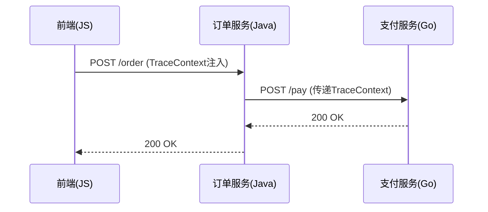

## 引言

OpenTelemetry SDK 是用于生成、收集和导出遥测数据（如追踪、指标、日志）的工具包。其**多语言支持**特性允许开发者在不同编程语言中使用统一的API和规范，实现跨平台的可观测性。本文将介绍多语言支持的核心机制、代码示例及实际应用。

---

## 多语言支持的核心机制

OpenTelemetry 通过以下方式实现多语言一致性：

1. **规范统一**：所有语言的SDK遵循相同的[OpenTelemetry规范](https://opentelemetry.io/docs/specs/)。
2. **组件分离**：
   - **API层**：定义统一的接口（如创建Span、记录指标）。
   - **SDK层**：实现语言特定的功能（如数据处理、导出）。
3. **语义约定**：跨语言的标准化属性命名（如 `http.method`、 `error.message`）。

:::tip
多语言支持的关键在于**规范优先**，而非实现优先。所有语言的功能更新需先通过规范评审。
:::

---

## 代码示例：多语言基础用法

### Python 示例：创建Span
```python
from opentelemetry import trace
from opentelemetry.sdk.trace import TracerProvider

# 初始化SDK
trace.set_tracer_provider(TracerProvider())
tracer = trace.get_tracer("my.tracer")

# 创建Span
with tracer.start_as_current_span("hello") as span:
    span.set_attribute("language", "python")
    print("Hello, OpenTelemetry!")
```

### Java 示例：创建Span
```java
import io.opentelemetry.api.trace.Tracer;
import io.opentelemetry.api.trace.TracerProvider;

// 初始化SDK
TracerProvider provider = OpenTelemetrySdk.getGlobalTracerProvider();
Tracer tracer = provider.get("my.tracer");

// 创建Span
Span span = tracer.spanBuilder("hello").startSpan();
span.setAttribute("language", "java");
System.out.println("Hello, OpenTelemetry!");
span.end();
```

:::note
虽然语法不同，但两者均遵循相同的Span生命周期模型（创建→属性设置→结束）。
:::

---

## 实际案例：跨语言微服务追踪

假设一个订单处理系统包含：
- **前端**（JavaScript）
- **订单服务**（Java）
- **支付服务**（Go）



通过OpenTelemetry的多语言SDK：
1. **TraceContext** 自动跨服务传递。
2. 所有Span使用相同的Trace ID关联。
3. 后端使用统一的数据格式（如OTLP）导出到收集器。

---

## 总结

OpenTelemetry SDK的多语言支持通过以下方式简化了分布式系统的可观测性：
- **一致性**：统一的API和语义约定。
- **灵活性**：支持主流编程语言（Python、Java、Go等）。
- **互操作性**：跨服务上下文无缝传递。

---

## 附加资源

1. [官方多语言支持列表](https://opentelemetry.io/docs/languages/)
2. 练习：尝试在两种语言中创建关联的Span并导出到Jaeger。
3. 进阶阅读：OpenTelemetry的[上下文传播机制](https://opentelemetry.io/docs/concepts/signals/traces/#context-propagation)。