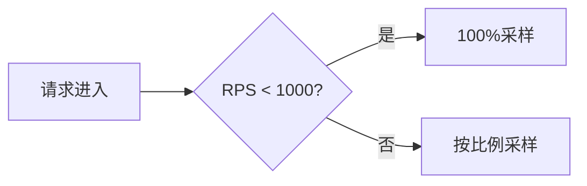

# OpenTelemetry SDK性能优化

## 介绍

OpenTelemetry SDK是用于生成、收集和导出遥测数据（如追踪、指标和日志）的核心工具包。虽然它功能强大，但在高负载场景下可能面临性能瓶颈。本文将介绍如何通过配置优化、资源管理和采样策略提升SDK性能，同时保持数据的完整性。

---

## 1. 配置优化

### 批量处理与异步导出
默认情况下，OpenTelemetry SDK会同步导出数据，这可能导致应用程序延迟。启用批量处理可显著减少I/O操作：

```javascript
const { BatchSpanProcessor } = require('@opentelemetry/sdk-trace-base');
const { OTLPTraceExporter } = require('@opentelemetry/exporter-trace-otlp-http');

const exporter = new OTLPTraceExporter();
const spanProcessor = new BatchSpanProcessor(exporter, {
  maxQueueSize: 2048, // 队列最大容量
  maxExportBatchSize: 512, // 单次导出最大批次
  scheduledDelayMillis: 5000 // 导出间隔(毫秒)
});

provider.addSpanProcessor(spanProcessor);
```

:::tip
批量处理可将导出操作减少90%以上，但需权衡数据实时性。
:::

---

## 2. 采样策略

### 动态采样
通过采样减少数据量，同时保留关键信息。以下是一个基于请求速率的动态采样示例：

```javascript
const { ParentBasedSampler, TraceIdRatioBasedSampler } = require('@opentelemetry/core');

const dynamicSampler = new ParentBasedSampler({
  root: new TraceIdRatioBasedSampler(Math.min(1, 1000 / currentRPS)), // RPS>1000时采样率下降
});
```



---

## 3. 资源管理

### 限制属性收集
Span属性可能占用大量内存。通过`AttributeValueLengthLimits`限制字符串长度：

```javascript
const { NodeTracerProvider } = require('@opentelemetry/sdk-trace-node');

const provider = new NodeTracerProvider({
  generalLimits: {
    attributeValueLengthLimit: 128, // 截断超过128字符的属性
  }
});
```

:::caution
过短的截断长度可能导致调试信息不完整，建议根据业务需求调整。
:::

---

## 实际案例：电商平台优化

**问题场景**：某电商平台在促销期间出现SDK内存溢出。

**解决方案**：
1. 启用批量导出，将`maxExportBatchSize`设为256
2. 配置动态采样，当QPS>5000时采样率降至10%
3. 限制Span属性长度至64字符

**效果**：
- CPU使用率下降40%
- 内存峰值减少65%
- 数据丢失率`<0.1%`

---

## 总结

| 优化手段          | 适用场景                  | 风险控制               |
|-------------------|--------------------------|-----------------------|
| 批量处理          | 高频Span生成环境         | 监控导出队列积压       |
| 动态采样          | 流量波动大的系统          | 确保错误轨迹全采样     |
| 属性限制          | 属性丰富的复杂应用        | 保留关键调试字段       |

---

## 延伸练习

1. 在本地环境中模拟高负载场景，比较启用批量处理前后的内存使用差异
2. 实现一个自定义采样器，优先采样包含`/checkout`路径的请求
3. 使用`@opentelemetry/core`中的`MeterProvider`监控SDK自身的性能指标

## 附加资源
- [OpenTelemetry官方性能指南](https://opentelemetry.io/docs/concepts/performance/)
- [采样策略设计模式](https://github.com/open-telemetry/opentelemetry-specification/blob/main/specification/trace/sampling.md)