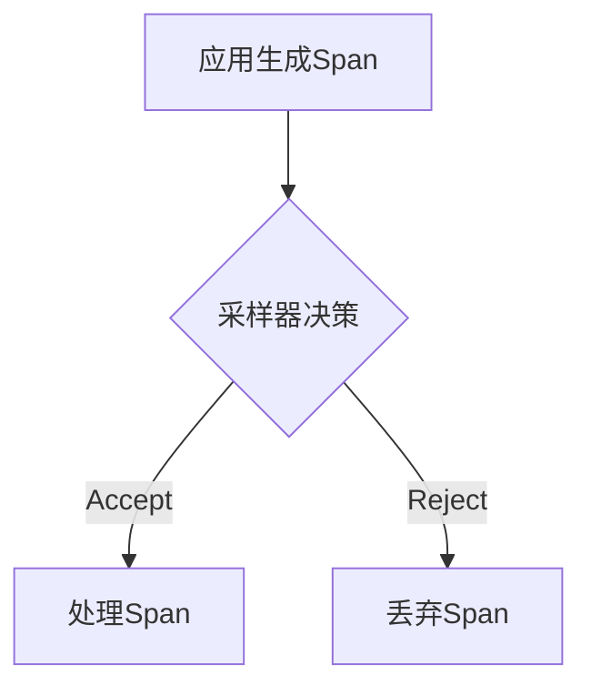

# OpenTelemetry SDK故障排除

## 介绍

OpenTelemetry SDK是用于生成、收集和导出遥测数据（如追踪、指标和日志）的核心工具包。在使用过程中，开发者可能会遇到配置错误、数据丢失或性能问题。本文将帮助你识别常见问题并提供解决方案。

:::note
OpenTelemetry SDK支持多种语言（如Java、Python、Go等），本文示例以Python为主，但概念通用。
:::

---

## 常见问题及解决方案

### 1. SDK初始化失败
**问题现象**：应用启动时报错，提示`Provider`或`Exporter`未正确初始化。

**可能原因**：
- 依赖包版本冲突
- 环境变量未配置（如`OTEL_EXPORTER_OTLP_ENDPOINT`）
- 代码中缺少必要组件

**解决方案**：
```python
from opentelemetry import trace
from opentelemetry.sdk.trace import TracerProvider
from opentelemetry.sdk.trace.export import BatchSpanProcessor
from opentelemetry.exporter.otlp.proto.grpc.trace_exporter import OTLPSpanExporter

# 1. 显式设置TracerProvider
provider = TracerProvider()
trace.set_tracer_provider(provider)

# 2. 检查Exporter配置
exporter = OTLPSpanExporter(endpoint="http://localhost:4317")
processor = BatchSpanProcessor(exporter)
provider.add_span_processor(processor)
```

:::caution
如果使用gRPC exporter，确保端口`4317`可用；HTTP exporter则默认使用`4318`。
:::

---

### 2. 数据未出现在后端
**问题现象**：代码无报错，但Jaeger/Prometheus等后端无数据。

**诊断步骤**：
1. 检查导出器日志：
   ```python
   import logging
   logging.basicConfig(level=logging.DEBUG)  # 启用SDK调试日志
   ```
2. 验证网络连通性：
   ```bash
   curl -v http://localhost:4317/v1/traces
   ```

**实际案例**：
```python
# 错误示例：未设置Service Name
from opentelemetry.sdk.resources import Resource
resource = Resource.create({"service.name": "my-python-app"})  # 必须字段
provider = TracerProvider(resource=resource)
```

---

### 3. 高内存/CPU占用
**优化方案**：
- 调整批处理参数：
  ```python
  from opentelemetry.sdk.trace.export import BatchSpanProcessor
  processor = BatchSpanProcessor(
      exporter,
      max_queue_size=500,       # 默认2048
      schedule_delay_millis=5000 # 默认5000ms
  )
  ```
- 使用采样降低负载：
  ```python
  from opentelemetry.sdk.trace.sampling import TraceIdRatioBased
  provider = TracerProvider(
      sampler=TraceIdRatioBased(0.5)  # 采样50%的请求
  )
  ```



---

## 高级调试技巧

### 分布式追踪上下文丢失
当跨服务调用时，若`traceparent`头部未正确传播：
```python
# 手动注入/提取上下文
from opentelemetry.propagate import inject, extract
headers = {}
inject(headers)  # 发送请求前调用
# ...
context = extract(headers)  # 接收请求时调用
```

### 自定义诊断工具
通过`DiagnosticLogger`记录SDK内部事件：
```python
from opentelemetry.sdk._logs import LogEmitterProvider
provider = LogEmitterProvider()
```

---

## 总结

| 问题类型       | 关键解决步骤                 |
|----------------|-----------------------------|
| 初始化失败     | 检查Provider/Exporter配置    |
| 数据丢失       | 验证网络和字段必填项         |
| 性能问题       | 调整批处理参数或启用采样     |

## 延伸练习
1. 尝试在本地部署Jaeger，并导出追踪数据
2. 模拟网络中断，观察SDK的重试机制
3. 创建一个自定义采样器，仅记录错误请求

:::tip
官方文档资源：
- [OpenTelemetry Python SDK](https://opentelemetry.io/docs/instrumentation/python/)
- [故障排除指南](https://github.com/open-telemetry/opentelemetry-python/issues?q=label%3Abug)
:::