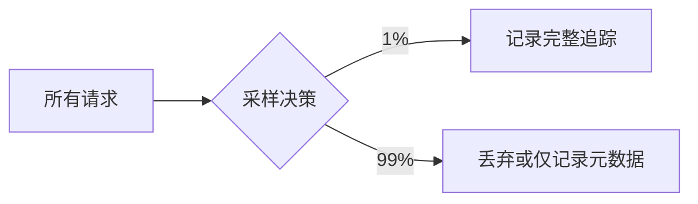

# OpenTelemetry 处理器

## 介绍

OpenTelemetry处理器（Processor）是OpenTelemetry SDK中的核心组件，负责在数据导出前对遥测数据（如追踪、指标、日志）进行过滤、转换或批处理。它们像“流水线上的工人”一样，处理原始数据以提高效率或适配下游系统。

:::tip 为什么需要处理器？
- **减少网络开销**：通过批处理压缩数据。
- **数据清洗**：过滤敏感信息或无效数据。
- **资源优化**：采样可降低存储成本。
:::

## 处理器类型

### 1. 批处理处理器（Batch Processor）
将多个数据项组合成批次后导出，显著减少网络调用。

```javascript
const { BatchSpanProcessor } = require('@opentelemetry/sdk-trace-node');
const { ConsoleSpanExporter } = require('@opentelemetry/sdk-trace-base');

const exporter = new ConsoleSpanExporter();
const processor = new BatchSpanProcessor(exporter, {
  maxQueueSize: 1000,    // 队列最大容量
  maxExportBatchSize: 50 // 单次导出最大批次数
});
```

### 2. 简单处理处理器（Simple Processor）
立即导出每条数据，适合调试但性能较低。

```javascript
const { SimpleSpanProcessor } = require('@opentelemetry/sdk-trace-node');

const processor = new SimpleSpanProcessor(new ConsoleSpanExporter());
```

### 3. 采样处理器（Sampling Processor）
通过采样策略减少数据量，例如只记录1%的请求：



## 实际案例

### 电商应用场景
假设你需要监控一个商品搜索服务：

1. **批处理**：将每秒数千次搜索追踪批量发送。
2. **属性过滤**：移除信用卡号等敏感字段。
3. **错误采样**：确保所有错误请求被记录，正常请求仅采样10%。

```javascript
const { AttributeFilter } = require('@opentelemetry/processor-attributes-filter');

const filter = new AttributeFilter({
  allow: ['http.method', 'http.status_code'],
  deny: ['credit_card_number']
});
```

## 总结

| 处理器类型       | 最佳场景                  | 性能影响 |
|------------------|--------------------------|----------|
| Batch            | 生产环境高吞吐量         | 低延迟   |
| Simple           | 开发/调试                | 高开销   |
| Sampling         | 成本敏感型应用           | 可变     |

:::caution 注意事项
- 批处理可能增加内存消耗，需合理配置队列大小。
- 采样可能丢失关键数据，需谨慎设计策略。
:::

## 延伸练习
1. 创建一个批处理处理器，模拟处理100条追踪数据并导出到控制台。
2. 实现一个自定义处理器，为所有跨度添加`environment=dev`属性。

## 附加资源
- [OpenTelemetry官方文档](https://opentelemetry.io/docs/)
- 书籍《Cloud Native Observability with OpenTelemetry》