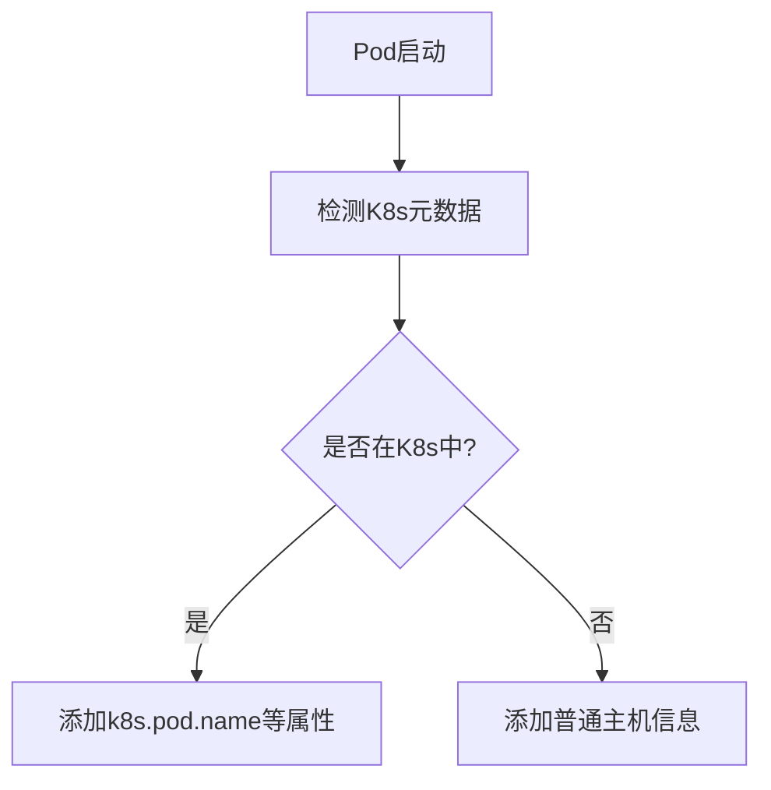

# OpenTelemetry 资源检测器

## 介绍

在分布式系统中，**资源(Resource)**代表生成遥测数据的实体（如服务、主机或容器）。OpenTelemetry的**资源检测器(Resource Detector)**是一种机制，用于自动收集和附加环境信息（如主机名、云提供商、K8s属性等）到遥测数据中。这为问题诊断和系统监控提供了关键上下文。

资源检测器通常用于：
- 标识服务运行环境（开发/生产）
- 追踪跨云/混合云部署
- 关联容器/Kubernetes环境中的指标

## 核心概念

资源由一组键值对（属性）组成，遵循[语义约定](https://opentelemetry.io/docs/reference/specification/resource/semantic_conventions/)。例如：

```python
{
    "service.name": "payment-service",
    "cloud.provider": "aws",
    "cloud.region": "us-west-2"
}
```

### 检测器类型

1. **环境变量检测器**：从`OTEL_RESOURCE_ATTRIBUTES`读取
2. **进程检测器**：收集进程运行时信息
3. **主机检测器**：获取主机名、OS类型等
4. **云提供商检测器**：自动检测AWS/Azure/GCP环境
5. **容器检测器**：收集容器运行时信息
6. **自定义检测器**：用户定义的检测逻辑

## 代码示例

### Python基础使用

```python
from opentelemetry.sdk.resources import Resource, ResourceDetector
from opentelemetry.semconv.resource import ResourceAttributes

# 手动创建资源
resource = Resource.create({
    ResourceAttributes.SERVICE_NAME: "auth-service",
    ResourceAttributes.SERVICE_VERSION: "1.0.0",
    "environment": "staging"
})

# 使用环境变量检测器（设置OTEL_RESOURCE_ATTRIBUTES="key1=value1,key2=value2"）
from opentelemetry.sdk.resources import get_aggregated_resources
resource = get_aggregated_resources()
```

### 自定义检测器示例

```python
from opentelemetry.sdk.resources import ResourceDetector
from opentelemetry.semconv.resource import ResourceAttributes

class CustomDetector(ResourceDetector):
    def detect(self) -> Resource:
        import socket
        return Resource({
            "host.aliases": ",".join([socket.gethostname(), socket.getfqdn()]),
            "deployment.team": "platform-engineering"
        })

# 使用自定义检测器
resource = get_aggregated_resources(ResourceDetector=CustomDetector)
```

## 实际应用场景

### 场景1：Kubernetes环境标识



```python
# 典型K8s资源属性
{
    "k8s.pod.name": "auth-service-5dfd57f96b-2xzjq",
    "k8s.namespace.name": "production",
    "k8s.node.name": "gke-cluster-1-node-1"
}
```

### 场景2：多云环境区分

```python
# AWS EC2实例的资源属性示例
{
    "cloud.provider": "aws",
    "cloud.region": "us-east-1",
    "host.id": "i-1234567890abcdef0"
}

# Azure VM的资源属性示例
{
    "cloud.provider": "azure",
    "cloud.region": "eastus",
    "host.id": "my-azure-vm"
}
```

## 最佳实践

:::tip 资源属性管理
1. **标准化命名**：使用[语义约定](https://opentelemetry.io/docs/reference/specification/resource/semantic_conventions/)的属性名
2. **避免敏感信息**：不要包含密码、API密钥等
3. **控制数据量**：通常保持10-15个关键属性
4. **环境区分**：明确标识`environment=production|staging|dev`
:::

## 总结

OpenTelemetry资源检测器通过自动收集环境上下文，使你的遥测数据具备：
- **可追溯性**：快速定位问题服务所在环境
- **可聚合性**：按环境/区域/版本等维度过滤指标
- **可观测性**：理解服务与基础设施的关系

## 扩展学习

1. [官方资源规范文档](https://opentelemetry.io/docs/reference/specification/resource/)
2. 练习：为你的服务实现一个检测Git Commit ID的自定义检测器
3. 高级话题：研究资源在跨服务传播中的使用（通过Baggage API）

:::note 下一步
尝试将资源检测集成到你的OpenTelemetry初始化代码中，并观察Jaeger/Prometheus等后端如何展示这些属性。
:::