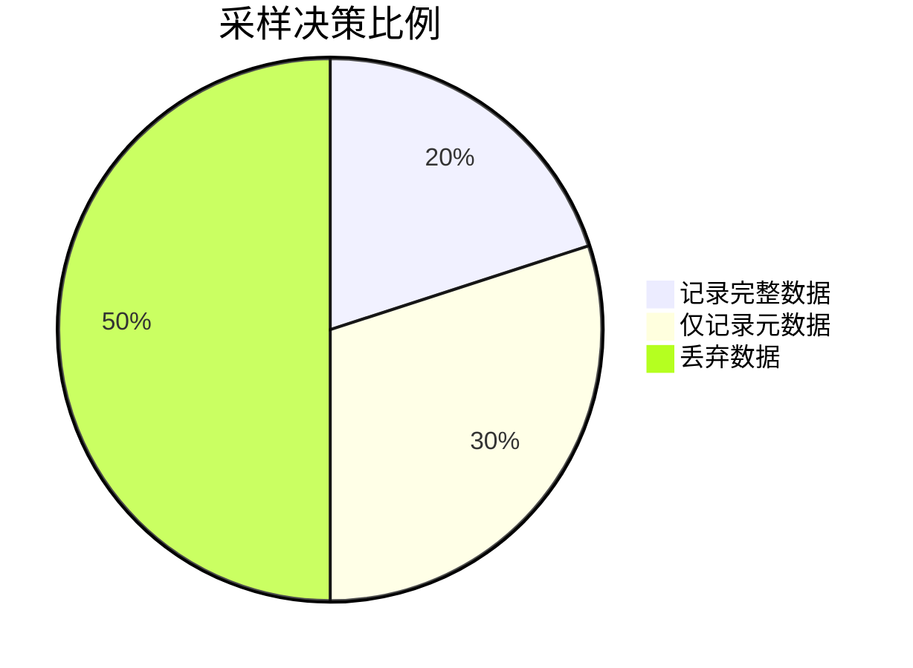
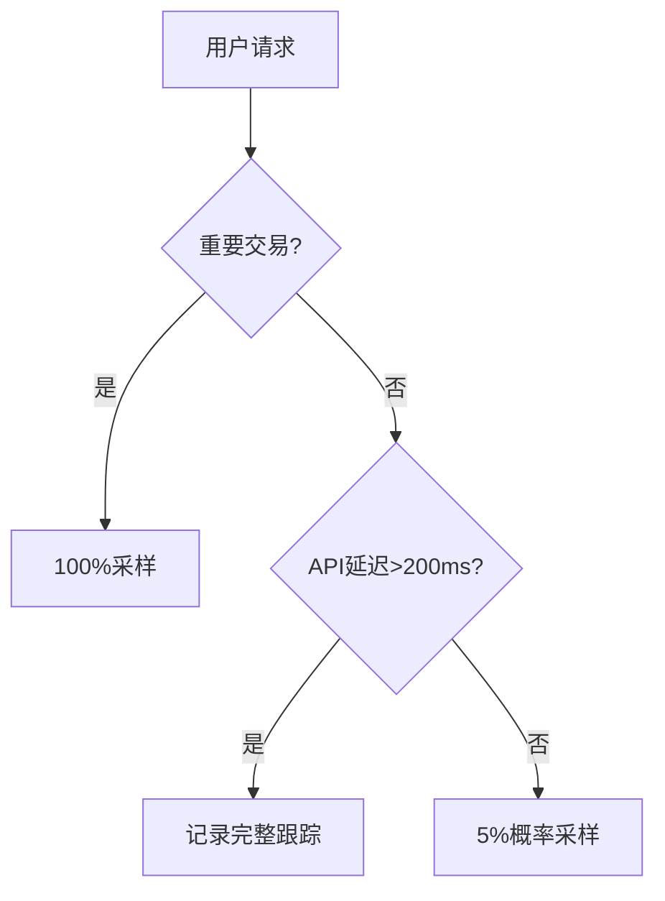

# OpenTelemetry 采样器

## 介绍

采样器（Sampler）是OpenTelemetry中决定是否记录、处理和导出遥测数据（如跟踪、指标和日志）的组件。通过采样，开发者可以在**系统开销**和**观测细节**之间取得平衡——例如在高流量场景下仅采集部分数据，同时仍能保持对系统行为的有效监控。

## 为什么需要采样？

想象一个每秒处理10万请求的电商系统：如果记录每个请求的完整跟踪数据，会导致：
1. 存储成本激增
2. 网络带宽压力
3. 后端处理负载过大

采样器通过智能过滤数据来解决这些问题：



## 采样器类型

OpenTelemetry提供多种内置采样器：

### 1. AlwaysOnSampler
**记录所有数据**，适用于调试环境：
```python
from opentelemetry.sdk.trace.sampling import ALWAYS_ON
sampler = ALWAYS_ON
```

### 2. AlwaysOffSampler
**丢弃所有数据**，适用于性能测试：
```javascript
const { AlwaysOffSampler } = require('@opentelemetry/sdk-trace-base');
const sampler = new AlwaysOffSampler();
```

### 3. TraceIdRatioBasedSampler
按比例采样（如只记录10%的请求）：
```go
import "go.opentelemetry.io/otel/sdk/trace"

sampler := trace.TraceIDRatioBased(0.1) // 10%采样率
```

### 4. ParentBasedSampler
根据父Span的采样决定进行继承，常用于分布式系统：
```java
import io.opentelemetry.sdk.trace.samplers.Sampler;

Sampler sampler = Sampler.parentBased(Sampler.traceIdRatioBased(0.5));
```

## 自定义采样器

通过实现`shouldSample`方法创建自定义逻辑。例如只采样耗时超过100ms的请求：

```python
from opentelemetry.trace import Span, SamplingResult, Decision

class LatencySampler:
    def should_sample(self, context, trace_id, name, attributes, links):
        if attributes.get("duration_ms", 0) > 100:
            return SamplingResult(Decision.RECORD_AND_SAMPLE)
        return SamplingResult(Decision.DROP)
```

## 实际案例

### 电商平台采样策略


### 微服务环境配置
```yaml
# opentelemetry-collector配置示例
processors:
  probabilistic_sampler:
    sampling_percentage: 15
```

## 最佳实践

:::tip 采样策略建议
1. **生产环境**：组合使用`ParentBased`和`TraceIdRatioBased`
2. **关键路径**：对支付、登录等关键操作100%采样
3. **开发环境**：使用`AlwaysOnSampler`获取完整数据
:::

:::warning 注意事项
- 采样决策应在分布式系统的**入口服务**统一做出
- 采样率调整后需要监控存储/性能指标变化
- 错误类Span建议额外提高采样率
:::

## 总结

采样器是OpenTelemetry中控制数据量的关键组件，通过合理配置可以：
- 降低系统资源消耗
- 保持关键业务的可观测性
- 优化监控成本

## 延伸学习

1. 尝试在本地环境比较不同采样率对内存占用的影响
2. 实现一个基于HTTP状态码的自定义采样器（如对5xx错误100%采样）
3. 阅读[OpenTelemetry采样规范](https://opentelemetry.io/docs/concepts/sampling/)