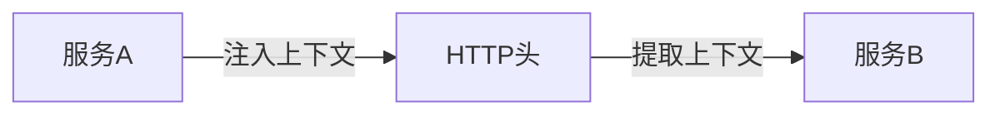
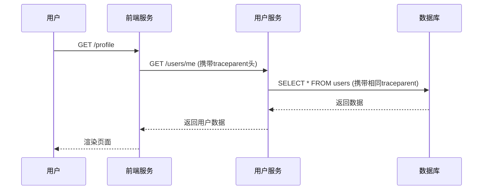

# OpenTelemetry 上下文传播

## 介绍

在分布式系统中，一个请求可能跨越多个服务。**上下文传播(Context Propagation)** 是OpenTelemetry的核心机制，它允许将跟踪信息（如TraceID、SpanID）自动传递到下游服务，从而构建完整的调用链。

想象一个电商订单流程：用户请求 → 订单服务 → 支付服务 → 库存服务。没有上下文传播时，这些服务会生成独立的、无法关联的日志。通过上下文传播，所有服务可以共享相同的跟踪上下文。

## 基本概念

### 什么是上下文？

在OpenTelemetry中，**上下文(Context)** 是一个容器，主要包含两类信息：
1. **Span上下文** - TraceID、SpanID、TraceFlags等
2. **Baggage** - 用户自定义的键值对（如`user_id=123`）

### 传播方式

OpenTelemetry支持三种标准传播格式：
1. **W3C TraceContext** (推荐标准)
2. **B3** (Zipkin格式)
3. **Jaeger**



## 代码示例

### 设置传播器

```javascript
// 初始化时设置W3C传播器
const { NodeTracerProvider } = require('@opentelemetry/sdk-trace-node');
const { W3CTraceContextPropagator } = require('@opentelemetry/core');

const provider = new NodeTracerProvider();
provider.register({
  propagator: new W3CTraceContextPropagator()
});
```

### 手动传播示例

```javascript
const api = require('@opentelemetry/api');
const http = require('http');

// 发送请求时注入上下文
function makeRequest() {
  const span = api.trace.getTracer('example').startSpan('client-span');
  
  api.context.with(api.trace.setSpan(api.context.active(), span), () => {
    const headers = {};
    // 将上下文注入HTTP头
    api.propagation.inject(api.context.active(), headers);
    
    http.get({
      host: 'example.com',
      headers: headers
    }, (response) => {
      // 处理响应
      span.end();
    });
  });
}
```

## 实际应用场景

### 微服务调用链

1. 用户发起HTTP请求到**前端服务**
2. 前端服务调用**用户服务**验证身份
3. 用户服务调用**数据库服务**



:::tip 最佳实践
- 在生产环境中始终使用**W3C TraceContext**标准
- 避免在Baggage中存储大容量数据（通常有长度限制）
- 为异步操作显式传递上下文
:::

## 常见问题

### 上下文丢失的场景

1. **异步操作未传递上下文**:
```javascript
// 错误示范
someAsyncFunction().then(() => {
  // 这里会丢失上下文
});

// 正确做法
api.context.with(api.context.active(), () => {
  someAsyncFunction().then(() => {
    // 保持上下文
  });
});
```

2. **手动创建线程/进程未传播上下文**

## 总结

OpenTelemetry的上下文传播机制是分布式追踪的基石。通过本文你学到了：

✓ 上下文的基本组成和作用<br />
✓ 标准的传播格式<br />
✓ 如何在代码中实现传播<br />
✓ 实际应用场景和常见问题

## 扩展学习

- 官方文档: [OpenTelemetry Context Specification](https://github.com/open-telemetry/opentelemetry-specification/blob/main/specification/context/context.md)
- 练习: 创建一个包含3个服务的演示项目，手动实现上下文传播
- 进阶: 研究Baggage的使用场景和限制