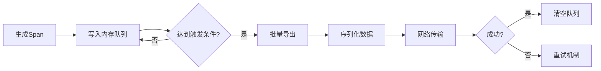

# OpenTelemetry 批处理导出器

## 介绍

OpenTelemetry批处理导出器（Batch Exporters）是OpenTelemetry SDK中的核心组件，用于将收集到的遥测数据（如跟踪、指标、日志）**批量聚合后**统一发送到后端服务。相比逐条导出，批处理能显著减少网络开销，提高数据传输效率，尤其适用于高负载场景。

## 为什么需要批处理？

当应用程序生成大量遥测数据时，频繁的网络请求会导致：
- **资源浪费**：每个请求都有HTTP/TCP开销
- **性能下降**：I/O操作阻塞主线程
- **成本增加**：云服务按请求次数计费

批处理通过以下机制解决这些问题：
1. **内存缓冲**：临时存储数据
2. **定时触发**：达到时间/数量阈值时统一发送
3. **失败重试**：网络异常时自动重试

## 核心配置参数

所有OpenTelemetry批处理导出器都支持以下通用参数（以JavaScript SDK为例）：

```javascript
const { BatchSpanProcessor } = require('@opentelemetry/sdk-trace-base');
const { ConsoleSpanExporter } = require('@opentelemetry/sdk-trace-base');

const batchExporter = new BatchSpanProcessor(new ConsoleSpanExporter(), {
  maxQueueSize: 2048,      // 内存队列最大容量
  maxExportBatchSize: 512, // 单次导出最大条数
  scheduledDelayMillis: 5000, // 定时导出间隔(毫秒)
  exportTimeoutMillis: 30000, // 导出超时时间
});
```

:::tip 参数选择建议
- **生产环境**：`maxQueueSize`应大于预期峰值流量
- **低延迟场景**：减小`scheduledDelayMillis`（但会增加网络负载）
:::

## 工作流程



## 实际案例：电商系统监控

假设我们需要监控一个商品搜索服务的性能：

```javascript
// 初始化批处理导出器
const { OTLPTraceExporter } = require('@opentelemetry/exporter-trace-otlp-http');
const exporter = new OTLPTraceExporter({
  url: 'https://collector.example.com',
});

const batchProcessor = new BatchSpanProcessor(exporter, {
  maxExportBatchSize: 100,
  scheduledDelayMillis: 2000,
});

// 模拟生成Span
for (let i = 0; i < 300; i++) {
  const span = tracer.startSpan(`search-product-${i}`);
  // ...业务逻辑
  span.end();
}

// 实际会分3批导出（100+100+100）
```

:::note 导出触发条件
以下任一条件满足时触发导出：
1. 队列中Span数量达到`maxExportBatchSize`
2. 距离上次导出超过`scheduledDelayMillis`
3. SDK关闭时（确保不丢失数据）
:::

## 最佳实践

1. **队列监控**：通过SDK提供的指标监控队列状态
   ```javascript
   const { metrics } = require('@opentelemetry/api');
   const queueSizeMetric = metrics.getMeter('app').createObservableGauge('queue.size');
   queueSizeMetric.addCallback((result) => {
     result.observe(batchExporter.queue.length);
   });
   ```

2. **错误处理**：注册失败回调
   ```javascript
   exporter.on('error', (err) => {
     console.error('导出失败:', err);
   });
   ```

3. **资源清理**：应用退出时关闭处理器
   ```javascript
   process.on('SIGTERM', () => {
     batchProcessor.shutdown();
   });
   ```

## 总结

批处理导出器通过智能聚合数据，在保证观测数据完整性的同时优化了系统性能。关键要点：
- 通过缓冲减少网络请求次数
- 可配置的触发条件和队列策略
- 内置重试机制提高可靠性

## 扩展学习

1. 对比不同导出器实现：
   - OTLP导出器（推荐）
   - Jaeger导出器
   - Zipkin导出器

2. 性能调优实验：
   - 尝试调整`maxExportBatchSize`并观察CPU/网络变化
   - 模拟网络延迟测试重试机制

3. 官方资源：
   - [OpenTelemetry批处理规范](https://github.com/open-telemetry/opentelemetry-specification/blob/main/specification/trace/sdk.md#batching-processor)
   - SDK源码分析：`@opentelemetry/sdk-trace-base/BatchSpanProcessor`