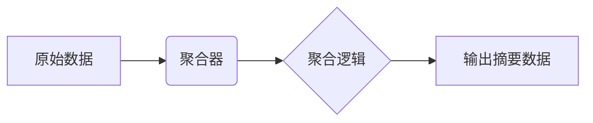

# OpenTelemetry 聚合器

## 简介

OpenTelemetry聚合器（Aggregator）是OpenTelemetry SDK中的一个核心组件，用于**高效处理并汇总遥测数据**（如指标、跟踪和日志）。它通过减少数据传输量并优化存储，帮助开发者在分布式系统中实现高性能监控。

:::note 关键作用
- **数据压缩**：将原始数据点聚合成统计摘要（如平均值、百分位数）。
- **资源优化**：降低网络带宽和存储成本。
- **实时分析**：支持动态计算指标（如请求速率、错误率）。
:::

---

## 核心概念

### 1. 聚合器类型
OpenTelemetry提供多种内置聚合器，适用于不同场景：

| 类型               | 描述                                                                 |
|--------------------|----------------------------------------------------------------------|
| `SumAggregator`    | 累加所有值（如总请求数）。                                             |
| `LastValueAggregator` | 仅保留最新值（如当前活跃连接数）。                                      |
| `HistogramAggregator` | 生成值分布直方图（如响应时间分布）。                                    |

### 2. 工作原理


---

## 代码示例

### 配置SumAggregator（指标）
以下示例展示如何创建一个计数器指标并使用`SumAggregator`：

```javascript
const { MeterProvider, SumAggregator } = require('@opentelemetry/metrics');

const meter = new MeterProvider().getMeter('example-meter');

// 定义使用SumAggregator的计数器
const requestCounter = meter.createCounter('requests', {
  description: 'Total requests',
  aggregator: new SumAggregator() // 显式指定聚合器
});

// 记录数据
requestCounter.add(1, { route: '/home' });
requestCounter.add(3, { route: '/api' });

// 输出示例（聚合后）：
// { route: '/home', value: 1 }
// { route: '/api', value: 3 }
```

:::tip 实际场景
在微服务中，每个实例的请求计数会被`SumAggregator`汇总为全局总量，无需手动累加。
:::

---

## 实际案例：监控API延迟

### 场景描述
假设你需要监控某个API接口的响应时间分布（P50/P90/P99）。

### 实现步骤
1. **创建Histogram聚合器**：
   ```javascript
   const latencyHistogram = meter.createHistogram('api_latency', {
     description: 'API latency distribution',
     boundaries: [0, 50, 100, 200] // 定义直方图桶边界（毫秒）
   });
   ```

2. **记录数据**：
   ```javascript
   latencyHistogram.record(45, { endpoint: '/users' });
   latencyHistogram.record(120, { endpoint: '/users' });
   ```

3. **输出结果**：
   ```json
   {
     "endpoint": "/users",
     "min": 45,
     "max": 120,
     "p50": 50,
     "count": 2
   }
   ```

---

## 总结

### 关键点回顾
- 聚合器通过**数学汇总**替代原始数据，提升系统可观测性效率。
- 根据场景选择合适类型：累加（`Sum`）、最新值（`LastValue`）或分布（`Histogram`）。
- 聚合逻辑通常在SDK内部自动执行，开发者只需配置。

### 延伸练习
1. 尝试修改`HistogramAggregator`的`boundaries`，观察输出变化。
2. 对比`SumAggregator`和`LastValueAggregator`在实时监控中的差异。

### 附加资源
- [OpenTelemetry官方文档：指标聚合](https://opentelemetry.io/docs/concepts/aggregation/)
- GitHub示例库：`opentelemetry-js/examples/aggregators`